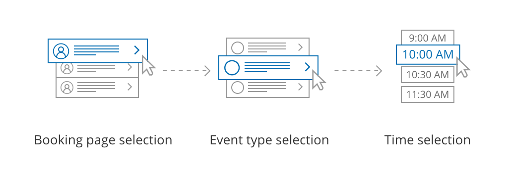
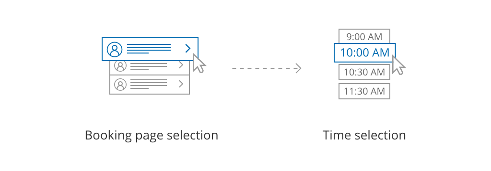

import { Aside } from "@astrojs/starlight/components";

[Master pages](/scheduleonce/master-pages-resource-pools/master-pages/introduction-to-master-pages "Introduction to Master pages") are a flexible tool that you can use to unite your [Booking pages](/scheduleonce/event-types-booking-pages/booking-pages/introduction-to-booking-pages "Introduction to Booking pages") into a single point of access for your Customers. OnceHub offers four different Master page scenarios, providing support for a wide range of scheduling scenarios. The Master page scenario determines the way in which bookings are assigned to Booking pages in your Master page.

## Master page scenario options

The four scenarios you can choose from are:

- [Rule-based assignment](/scheduleonce/master-pages-resource-pools/master-pages/master-page-scenario-team-or-panel-page "Master page scenario: Rule-based assignment")
- [Booking pages first](/scheduleonce/master-pages-resource-pools/master-pages/booking-pages-first-event-types-second "Booking pages first (Event types second)")
- [Event types first](/scheduleonce/master-pages-resource-pools/master-pages/event-types-first-booking-pages-second "Event types first (Booking pages second)")
- [Booking pages only](/scheduleonce/master-pages-resource-pools/master-pages/booking-pages-only-without-event-types "Booking pages only (without Event types)")

When you create a new Master page, you choose which scenario you would like to use. This setting cannot be edited after the page is created, so it is important that you choose the right scenario for your needs.

<Aside type="tip">

If you would like to [generate one-time links](/scheduleonce/sharing-publishing/general-one-time-links/using-one-time-links "Using one-time links with your Master page") which are good for one booking only, you should use a Master page using [Rule-based assignment](/scheduleonce/master-pages-resource-pools/master-pages/master-page-scenario-team-or-panel-page "Master page scenario: Rule-based assignment") with [Dynamic rules](/scheduleonce/master-pages-resource-pools/master-pages/assignment-with-team-or-panel-pages "Rule-based assignment: Dynamic rules").

One-time links eliminate any chance of unwanted repeat bookings. A Customer who receives the link will only be able to use it for the intended booking and will not have access to your underlying [Booking page](/scheduleonce/event-types-booking-pages/booking-pages/introduction-to-booking-pages "Introduction to Booking pages"). One-time links [can be personalized](/scheduleonce/sharing-publishing/personalized-links/using-personalized-links "Using Personalized links"), allowing the Customer to pick a time and schedule without having to fill out the [Booking form](/scheduleonce/event-types-booking-pages/booking-forms-redirect/collecting-customer-data-with-booking-forms "Collecting Customer data with Booking forms"). [Learn more about one-time links](/scheduleonce/sharing-publishing/general-one-time-links/using-one-time-links "Using one-time links with your Master page")

</Aside>

## Master page scenario: Rule-based assignment

Figure 1: Rule-based assignment

With this scenario, Customers first select an [Event type](/scheduleonce/event-types-booking-pages/event-types/introduction-to-event-types "Introduction to Event types") and a meeting time. Bookings are then automatically assigned to Team members according to the rules that you define.

- With Dynamic rules, booking assignment is defined per event type that you offer on your Master page. This allows for flexible setup that can be different per Master page. You can also [generate one-time links](/scheduleonce/sharing-publishing/general-one-time-links/using-one-time-links "Using one-time links with your Master page") which are good for one booking only, eliminating any chance of unwanted repeat bookings.
- With Static rules, bookings are assigned according to global settings. In this case, meeting providers are determined by the [associations you create between Event types and Booking pages](/scheduleonce/event-types-booking-pages/booking-pages/adding-event-types-to-booking-pages "Adding Event types to Booking pages"). This means that you can only offer Event types that are associated with the Booking pages included on your Master page.

[Learn more about Rule-based assignment](/scheduleonce/master-pages-resource-pools/master-pages/master-page-scenario-team-or-panel-page "Rule-Based Assignment")

## Master page scenario: Event types first

Figure 2: Event types first

With this scenario, the Customer first selects which Event type they prefer. They are then presented with the Booking pages that provide that Event type. Once the Customer selects a Booking page, they are presented with the Booking page’s availability and can select a time.

[Learn more about Event types first](/scheduleonce/master-pages-resource-pools/master-pages/event-types-first-booking-pages-second "Event types first (Booking pages second)")

## Master page scenario: Booking pages first

Figure 3: Booking pages first

With this scenario, the Customer first selects the Booking page they prefer. They are presented with the Event types offered by that Booking page. Once they select an Event type, they are presented with the availability of the Booking page they selected and can choose a time.

[Learn more about Booking pages first](/scheduleonce/master-pages-resource-pools/master-pages/booking-pages-first-event-types-second "Booking pages first (Event types second)")

## Master page scenario: Booking pages only

Figure 4: Booking pages only

With this scenario, Customers select a Booking page and are presented with the Booking page’s availability. This option is useful if you do not use Event types and there are no shared settings between your Booking pages.

[Learn more about Booking pages only](/scheduleonce/master-pages-resource-pools/master-pages/booking-pages-only-without-event-types "Booking pages only (without Event types)")
