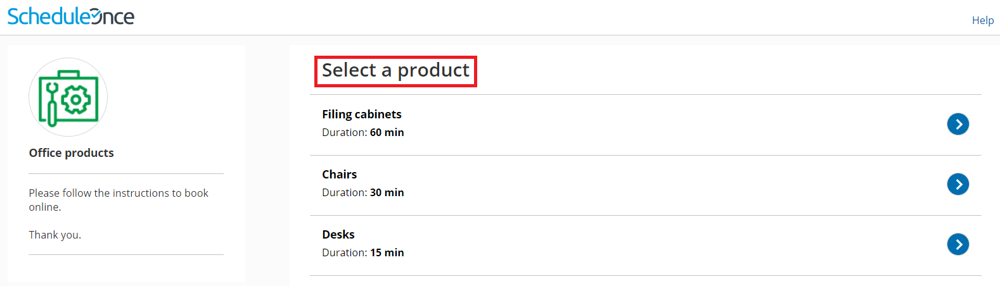

import { Aside } from "@astrojs/starlight/components";

In the Master page **Labels and instructions** section, you can define the public labels for the different entities in your [Master page](/scheduleonce/master-pages-resource-pools/master-pages/introduction-to-master-pages "Introduction to Master pages"). You can also customize instructions that will help your Customers make the right selections during the scheduling process.

You can access this section by going to to **Booking pages** on the left and select the relevant Master page **→** **Labels and instructions**.

<Aside type="note">

The settings vary based on the [Master page scenario](/scheduleonce/master-pages-resource-pools/master-pages/master-page-scenarios "Master page scenarios"), and whether you have public [categories](/scheduleonce/event-types-booking-pages/categories/introduction-to-categories "Introduction to Categories") in your account.

</Aside>

## Public label

Public labels are Customer-facing and are displayed during the scheduling process as the Customer makes selections. They are also used in scheduling confirmation pages and emails. If you have public categories in your account, you can set their labels here as Customers will see them.

For example, if the [Event types](/scheduleonce/event-types-booking-pages/event-types/introduction-to-event-types "Introduction to Event types") in your Master page represent a product (Figure 1), then it will be listed as such in the confirmation page (Figure 2).

Figure 1: Adding a public label to an Event type

Figure 2: Booking confirmation page

## Selection instructions

In this section, you tell Customers what they should select. This section and its contents are different depending on the [scenario](/scheduleonce/master-pages-resource-pools/master-pages/master-page-scenarios "Master page scenarios") you chose for your Master page. Only relevant fields will be displayed.

Specify the instructions to help your Customers understand what they are choosing. These instructions appear in the appropriate steps in the booking process.

For example, if you make the **Selection instructions for Event types** "Select a product" (Figure 3), then the title of the Event type selection step in the Customer scheduling flow will be "Select a product" (Figure 4).

Figure 3: Selection instructions section

Figure 4: Event type selection
