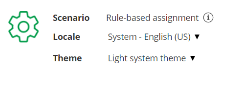
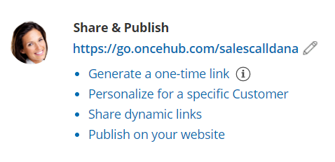
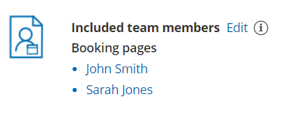
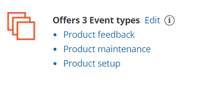

import { Aside } from "@astrojs/starlight/components";

The Master page **Overview** section summarizes the main properties of the specific [Master page](/scheduleonce/master-pages-resource-pools/master-pages/introduction-to-master-pages "Introduction to Master pages"). It includes the Master page's main settings, the [Booking pages](/scheduleonce/event-types-booking-pages/booking-pages/introduction-to-booking-pages "Introduction to Booking pages") and [Event types](/scheduleonce/event-types-booking-pages/event-types/introduction-to-event-types "Introduction to Event types") associated with it, and [Share & Publish](/scheduleonce/sharing-publishing/general-one-time-links/introduction-to-general-and-one-time-links/) options.

Your Master page is enabled to accept bookings by default. You can [disable your Master page](/scheduleonce/master-pages-resource-pools/master-pages/disabling-your-master-page "Disabling your Master page") to stop accepting bookings by clicking the **Accept bookings** toggle in the top right.

Figure 1: Master page Overview section

To switch between the Overview sections of different Master pages without returning to **Booking pages scheduling** **setup**, use the shortcut drop-down in the top right corner of the Overview.

Below you can find out more about the different parts of the Master page Overview section.

## Main settings

Figure 2: Main settings section

- **Scenario**: The selected [Master page scenario](/scheduleonce/master-pages-resource-pools/master-pages/master-page-scenarios "Master page scenarios") will be listed here. The scenario determines the scheduling flow. Master pages can have one of four different flows: [Rule-based assignment](/scheduleonce/master-pages-resource-pools/master-pages/master-page-scenario-team-or-panel-page "Master page scenario: Rule-based assignment"), [Event types first (Booking pages second)](/scheduleonce/master-pages-resource-pools/master-pages/event-types-first-booking-pages-second "Event types first (Booking pages second)"), [Booking pages first (Event types second)](/scheduleonce/master-pages-resource-pools/master-pages/booking-pages-first-event-types-second "Booking pages first (Event types second)"), or [Booking pages only](/scheduleonce/master-pages-resource-pools/master-pages/booking-pages-only-without-event-types "Booking pages only (without Event types)").
- **Locale:** The selected locale determines the date, date format, and language of the page. The Master page locale overrides the locale of any included Booking pages. [Learn more about the Localization editor](/scheduleonce/customization-branding/localization-customer-text/localization-editor "The Localization editor")
- **Theme:** To ensure visual consistency, the Master page [theme](/scheduleonce/customization-branding/theme-designer/system-themes "System themes") overrides the theme applied to each Booking page included in the Master page. The theme applied to the Master page determines the logo, design, and branding.

## Share & Publish

Figure 3: Share & Publish section

- **Public link:** This is your Master page link that your Customers can use to schedule bookings with you. [Learn more about General links](/scheduleonce/sharing-publishing/general-one-time-links/using-general-links "Using General Links")
- **Generate a one-time link:** When you use a Master page using [Rule-based assignment](/scheduleonce/master-pages-resource-pools/master-pages/master-page-scenario-team-or-panel-page "Master page scenario: Rule-based assignment") with [Dynamic rules](/scheduleonce/master-pages-resource-pools/master-pages/assignment-with-team-or-panel-pages "Rule-based assignment: Dynamic rules"), you can generate [one-time links](/scheduleonce/sharing-publishing/general-one-time-links/using-one-time-links "Using one-time links with your Master page") which are good for one booking only. A Customer who receives the link will only be able to use it for the intended booking and will not have access to your underlying [Booking page](/scheduleonce/event-types-booking-pages/booking-pages/introduction-to-booking-pages "Introduction to Booking pages"). One-time links [can be personalized](/scheduleonce/sharing-publishing/personalized-links/using-personalized-links "Using Personalized links"), allowing the Customer to pick a time and schedule without having to fill out the [Booking form](/scheduleonce/event-types-booking-pages/booking-forms-redirect/collecting-customer-data-with-booking-forms "Collecting Customer data with Booking forms"). [Learn more about one-time links](/scheduleonce/sharing-publishing/general-one-time-links/using-one-time-links "Using One-time links with your Master page")
- **Personalize for a specific Customer:** Create a static link for a specific Customer. With this link, your Customer will be able to book without having to fill out their name and email. You create this type of link for each Customer individually. [Learn more about Personalized links for a specific Customer](/scheduleonce/sharing-publishing/personalized-links/using-personalized-links "Using Personalized links")
- **Share dynamic links:** Create a dynamic link which you can share via your CRM or mass email campaign tool.
- **Publish on your website:** Generate code that you can add into your website code so that you can [integrate scheduling into your website](/scheduleonce/sharing-publishing/publishing-on-websites/website-embed).

## Included team members

Figure 4: Included team members

Each [Master page](/scheduleonce/master-pages-resource-pools/master-pages/introduction-to-master-pages "Introduction to Master Pages") provides a single point of access to multiple Booking pages.

- If the Master page scenario is [Event types first](/scheduleonce/master-pages-resource-pools/master-pages/event-types-first-booking-pages-second "Event types first (Booking pages second)"), [Booking pages first](/scheduleonce/master-pages-resource-pools/master-pages/booking-pages-first-event-types-second "Booking pages first (Event types second)"), or [Booking pages only](/scheduleonce/master-pages-resource-pools/master-pages/booking-pages-only-without-event-types "Booking pages only (without Event types)"), then your Customers will manually select the provider on your Master page.
- If the Master page scenario is [Rules-based assignment](/scheduleonce/master-pages-resource-pools/master-pages/master-page-scenario-team-or-panel-page "Master page scenario: Rule-based assignment"), bookings will be automatically assigned to the relevant provider based on the Assignment rules you define.

## Event types offered by the Master page

Figure 5: Event types offered by the Master page

If you offer Event types on your Master page, your Customers can select the type of meeting they require before selecting the date and time. Depending on your [Master page scenario](/scheduleonce/master-pages-resource-pools/master-pages/master-page-scenarios "Master page scenarios"), Event types are added to Master pages either directly in the [Assignment section](/scheduleonce/master-pages-resource-pools/master-pages/master-pages-event-types-and-assignment "Master page: Assignment section"), or indirectly through the [Booking pages they are associated with](/scheduleonce/event-types-booking-pages/booking-pages/adding-event-types-to-booking-pages "Adding Event types to Booking pages").
