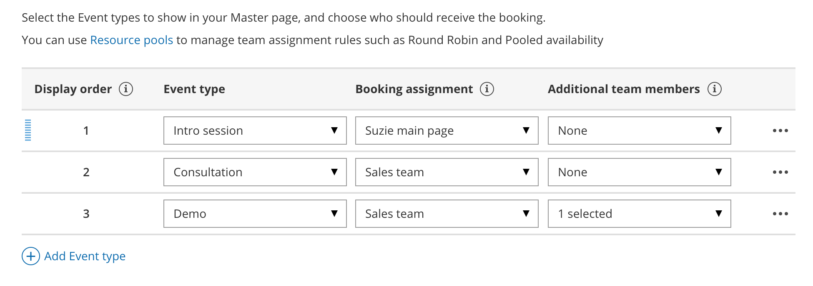

import { Aside } from "@astrojs/starlight/components";

Additional team members are members of your organization who participate in [Panel meetings](/scheduleonce/master-pages-resource-pools/panel-meetings/introduction-to-panel-meetings "Introduction to Panel meetings"). Panel meetings allow you to offer meetings where Customers can meet with multiple members of your organization simultaneously.

Panel meetings have a [Booking owner](/scheduleonce/master-pages-resource-pools/panel-meetings/booking-owners "Booking owner"), who is the Booking assignment team member, and Additional team members who participate as panelists in the meeting. Panel meetings can be set up in [Master pages using a team or panel page](/scheduleonce/master-pages-resource-pools/master-pages/master-page-scenario-team-or-panel-page "Master page scenario: Team or panel pages").

When you create a Panel meeting, you can include any number of Additional team members. Additional team members can be a specific [Booking page](/scheduleonce/event-types-booking-pages/booking-pages/introduction-to-booking-pages "Introduction to Booking pages") or a [Resource pool](/scheduleonce/master-pages-resource-pools/resource-pools/introduction-to-resource-pools "Introduction to ScheduleOnce Resource pools"). If you choose Resource pools, a Team member from each pool will be assigned according to the pool's distribution method. You can choose from [Round robin](/scheduleonce/master-pages-resource-pools/resource-pools/round-robin-distribution-method "Resource pool distribution method: Round robin"), [Pooled availability](/scheduleonce/master-pages-resource-pools/resource-pools/pooled-availability-distribution-method "Resource pool distribution method: Pooled availability"), or [Pooled availability with priority](/scheduleonce/master-pages-resource-pools/resource-pools/resource-pool-distribution-method-pooled-availability-with-priority "Resource pool distribution method: Pooled availability with priority").

When Customers visit your [Master page](/scheduleonce/master-pages-resource-pools/master-pages/introduction-to-master-pages "Introduction to Master pages"), they will only see availability for possible panel combinations. This means that they will only see time slots when all panelists are available, whether the panelists are specific Booking pages or a relevant member of a Resource pool.

## How are Additional team members added to a booking?

If the Booking owner has a calendar connected to OnceHub, Additional team members are added as guests/attendees to the Booking owner’s calendar event.

If the Booking owner is not connected to a calendar and the Additional team members are, OnceHub will create a 'dummy' event in the Additional team members' calendars to ensure that they don't get double booked.

<Aside type="note">

&#x20;When determining busy time for an Additional team member, the system uses the Main calendar specified on their assigned Booking Page. However, any calendar event created during the booking process is saved to their default connected calendar. To ensure consistency, we recommend setting the default connected calendar as the Main calendar on their Booking Page whenever they are assigned as an Additional team member.

</Aside>

## How are the Additional team members updated throughout the booking lifecycle?

The Panel meeting is added as a single shared activity to each Additional team member’s [Activity stream](/scheduleonce/managing-bookings/analytics/activity-stream-viewing-activities "Introduction to the ScheduleOnce Activity stream"), with the Booking owner and Additional team members listed. This means that if there are status changes, they will be updated.

Additional team members are also cc'd on all [notifications](/scheduleonce/event-types-booking-pages/user-notifications/introduction-to-user-notifications "Introduction to User notifications section") sent to the Booking owner, including the initial confirmation, reminders, and updates about schedule changes. This ensures that all Panel members have the meeting details and are updated throughout the booking lifecycle.

## Can Additional team members perform the same actions as the Booking owner?

Yes. Any User who can see a Panel meeting activity in their Activity stream [can cancel it or request to reschedule](/scheduleonce/managing-bookings/cancel-reschedule/user-action-cancelreschedule-for-booking-pages-with-event-types "User action: Cancel/request to reschedule with Event types"). If a User cancels or requests to reschedule, all Panelists will be affected.

## Requirements

To create a Master page and add Additional team members, you must be a [OnceHub Administrator](/account-administration/user-management/user-roles-overview "Differences between Administrator and Member").

## How to add Additional team members to meetings

1. Click **Setup → Booking Page setup** in the top navigation bar.

2. Click the Plus button  in the **Master pages** pane.

3. The **New Master page** pop-up appears (Figure 1). Figure 1: New Master page pop-up

4. In the [Scenario](/scheduleonce/master-pages-resource-pools/master-pages/master-page-scenarios "Master page scenarios") field of the **New Master page** pop-up, select the [Team or panel page](/scheduleonce/master-pages-resource-pools/master-pages/master-page-scenario-team-or-panel-page "Master page scenario: Team or panel pages") scenario (Figure 1).

5. Populate the pop-up with a **Public name**, **Internal label**, **Public link** and an image if you choose. Then, click **Save & Edit**. You'll be redirected to the [Master page Overview section](/scheduleonce/master-pages-resource-pools/master-pages/master-pages-overview "Master page: Overview section") to continue editing your settings.

6. Go to the [Event types and assignment section](/scheduleonce/master-pages-resource-pools/master-pages/master-pages-event-types-and-assignment "Master Page: Assignment section") of the Master page.

   <Aside type="note">

   **Tip**When you use a Master page with team or panel pages, you can also [generate one-time links](/scheduleonce/sharing-publishing/general-one-time-links/using-one-time-links "Using One-time links with your Master page") which are good for one booking only, eliminating any chance of unwanted repeat bookings. A Customer who receives the link will only be able to use it for the intended booking and will not have access to your underlying [Booking page](/scheduleonce/event-types-booking-pages/booking-pages/introduction-to-booking-pages "Introduction to Booking pages"). One-time links [can be personalized](/scheduleonce/sharing-publishing/personalized-links/using-personalized-links "Using Personalized links"), allowing the Customer to pick a time and schedule without having to fill out the [Booking form](/scheduleonce/event-types-booking-pages/booking-forms-redirect/collecting-customer-data-with-booking-forms "Collecting Customer data with Booking forms").

   </Aside>

7. In the **Event-based rules** section, click **Add Event type**.

8. Select which Event types will be offered in your Master page (Figure 3). For each Event type you want to add, you'll need to add a new rule. Master pages with Dynamic rules can only include Event types configured to [Automatic booking](/scheduleonce/event-types-booking-pages/scheduling-options/automatic-booking-or-booking-with-approval "Automatic booking or Booking with approval") and Single session. [Learn more about conflicting settings when using team or panel pages](/scheduleonce/master-pages-resource-pools/master-pages/conflicting-settings-when-using-team-or-panel-pages "Conflicting settings when using team or panel pages") Figure 2: Add Event types

9. Under [Booking assignment](/scheduleonce/master-pages-resource-pools/panel-meetings/booking-owners "Booking owner"), choose a Booking page or Resource pool from which the Booking owner will be assigned.

10. Under **Additional team members**, select additional Booking pages and Resource pools to participate in the meeting. You can select an unlimited number of Additional team members.

11. Click **Save.**

<Aside type="note">

The [existing associations between Booking pages and Event types](/scheduleonce/event-types-booking-pages/booking-pages/adding-event-types-to-booking-pages "Adding Event types to Booking pages") do not affect choosing an Additional team member. Any Booking page can be selected as an Additional team member to participate in your Panel meeting.

</Aside>
