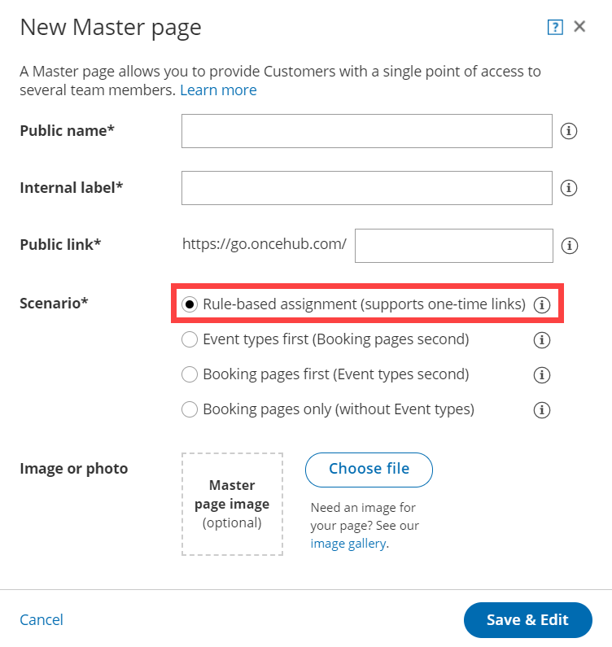
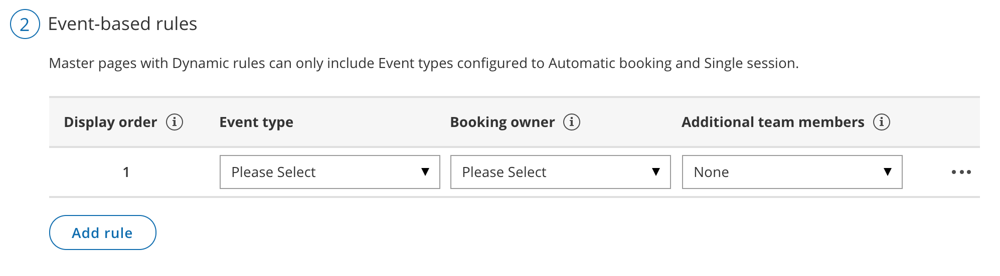

import { Aside } from "@astrojs/starlight/components";

Each Dynamic rule you create in a [Rule-based assignment](/scheduleonce/master-pages-resource-pools/master-pages/master-page-scenario-team-or-panel-page "Master page scenario: Rule-based assignment") Master page must have a Booking owner. The Booking owner is the member who receives the booking.

You can define a Booking owner either by specifying a [Booking page](/scheduleonce/event-types-booking-pages/booking-pages/introduction-to-booking-pages "Introduction to Booking pages") or by specifying a [Resource pool](/scheduleonce/master-pages-resource-pools/resource-pools/introduction-to-resource-pools "Introduction to ScheduleOnce Resource pools"). If you choose a Resource pool as the Booking owner, bookings will be assigned to a Booking page within the Resource pool according to the pool's distribution method. You can choose from [Round robin](/scheduleonce/master-pages-resource-pools/resource-pools/round-robin-distribution-method "Resource pool distribution method: Round robin"), [Pooled availability](/scheduleonce/master-pages-resource-pools/resource-pools/pooled-availability-distribution-method "Resource pool distribution method: Pooled availability"), or [Pooled availability with priority](/scheduleonce/master-pages-resource-pools/resource-pools/resource-pool-distribution-method-pooled-availability-with-priority "Resource pool distribution method: Pooled availability with priority").

If your Dynamic rule also includes [Additional team members](/scheduleonce/master-pages-resource-pools/panel-meetings/additional-team-members "Additional Team members"), the meeting then becomes a [Panel meeting](/scheduleonce/master-pages-resource-pools/panel-meetings/introduction-to-panel-meetings "Introduction to Panel meetings"). In the case of a Panel meeting, the Booking owner owns the calendar event and determines settings including the [location](/scheduleonce/event-types-booking-pages/booking-pages/booking-pages-location-settings "Booking page: Location settings section"), the [booking form](/scheduleonce/customization-branding/booking-forms-editor/creating-and-editing-booking-form "Creating a Booking form"), the post-scheduling flow, [notifications](/scheduleonce/event-types-booking-pages/user-notifications/introduction-to-user-notifications "Introduction to User notifications section"), and [third-party integrations](/integrations "Third-party integrations").

## Requirements

To create a Master page and add a Booking owner, you must be a [OnceHub Administrator](/account-administration/user-management/user-roles-overview "Differences between Administrator and Member").

## How to select a Booking owner

1. Click **Setup → Booking Page setup** in the top navigation bar.

2. Click the Plus button  in the **Master pages** pane.

3. In the [Scenario](/scheduleonce/master-pages-resource-pools/master-pages/master-page-scenarios "Master page scenarios") field of the **New Master page** pop-up, select the [Rule-based assignment](/scheduleonce/master-pages-resource-pools/master-pages/master-page-scenario-team-or-panel-page "Master page scenario: Rule-based assignment") scenario (Figure 1). Figure 1: New Master page pop-up

4. Populate the pop-up with a **Public name**, **Internal label**, **Public link** and an image if you choose. Then, click **Save & Edit**. You'll be redirected to the [Master page Overview section](/scheduleonce/master-pages-resource-pools/master-pages/master-pages-overview "Master page: Overview section") to continue editing your settings.

5. Go to the [Assignment section](/scheduleonce/master-pages-resource-pools/master-pages/master-pages-event-types-and-assignment "Master Page: Assignment section") of the Master page.

6. In the **Rule types** section, select **Dynamic** (Figure 2). Figure 2: Select Dynamic as the Rule type

   <Aside type="tip">

   **Tip**

   When you use a Master page using Rule-based assignment with Dynamic rules, you can also [generate one-time links](/scheduleonce/sharing-publishing/general-one-time-links/using-one-time-links "Using One-time links with your Master page") which are good for one booking only, eliminating any chance of unwanted repeat bookings. A Customer who receives the link will only be able to use it for the intended booking and will not have access to your underlying [Booking page](/scheduleonce/event-types-booking-pages/booking-pages/introduction-to-booking-pages "Introduction to Booking pages"). One-time links [can be personalized](/scheduleonce/sharing-publishing/personalized-links/using-personalized-links "Using Personalized links"), allowing the Customer to pick a time and schedule without having to fill out the [Booking form](/scheduleonce/event-types-booking-pages/booking-forms-redirect/collecting-customer-data-with-booking-forms "Collecting Customer data with Booking forms").

   </Aside>

7. In the **Event-based rules** section, click **Add rule**.

8. Select which Event types will be offered in your Master page (Figure 3). For each Event type you want to add, you'll need to add a new rule. Master pages with Dynamic rules can only include Event types configured to [Automatic booking](/scheduleonce/event-types-booking-pages/scheduling-options/automatic-booking-or-booking-with-approval "Automatic booking or Booking with approval") and Single session. [Learn more about conflicting settings when using Dynamic rules](/scheduleonce/master-pages-resource-pools/master-pages/conflicting-settings-when-using-team-or-panel-pages "Conflicting settings when using Dynamic rules") Figure 3: Add an event-based rule

9. Under **Booking owner**, choose a Booking page or Resource pool from the dropdown. You can only select one Booking owner.

10. Click **Save**.

You're all set! The Event type in your Master page now has a Booking owner. If your Master page includes multiple Event types, you can select a different Booking owner for each one. You can also [add Additional team members](/scheduleonce/master-pages-resource-pools/panel-meetings/additional-team-members "Additional team members") if required.

<Aside type="note">

The [existing associations between Booking pages and Event types](/scheduleonce/event-types-booking-pages/booking-pages/adding-event-types-to-booking-pages "Adding Event types to Booking pages") do not affect choosing a Booking owner. Any Booking page can be selected as a Booking owner to provide any Event type.

</Aside>
