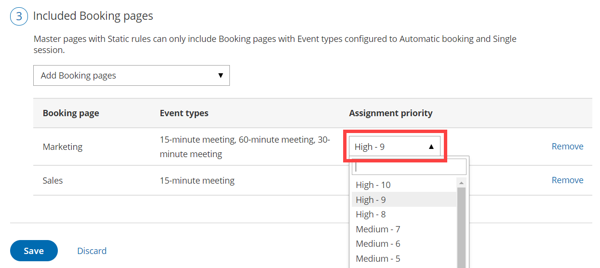

import { Aside } from "@astrojs/starlight/components";

Pooled availability with priority combines the availability of multiple Team members and displays it to Customers as a single booking calendar. When a Customer selects a time, the booking is automatically assigned to the Team member with the highest Assignment priority. Pooled availability with priority is a hybrid distribution method which provides Customers with the maximum number of time slots while also giving priority to specific Team members. You can set up Pooled availability with priority in a [Rule-based assignment Master page](/scheduleonce/master-pages-resource-pools/master-pages/master-page-scenario-team-or-panel-page "Master page scenario: Rule-based assignment") using Static rules.

## How are bookings assigned with Pooled availability with priority?

When a Customer selects a time on your Master page, OnceHub first checks which Team members are available at the time selected by the Customer. Then, out of the available Booking pages, the booking is assigned to the Team member with the highest Assignment priority.

If there are multiple Team members with the same priority ranking, the booking is assigned to the Team member with [the longest idle time](/scheduleonce/master-pages-resource-pools/resource-pools/pooled-availability-algorithm-longest-idle-time "The Pooled availability algorithm: Longest idle time"). This is the Team member who has not received a booking for the longest amount of time.

## Using Pooled availability with priority with Static rules:

1. [Create a Booking page](/scheduleonce/event-types-booking-pages/booking-pages/creating-booking-page "Creating a Booking page") for each member, resource, or any other entity that you would like to automatically assign. Don't configure any Booking page settings yet.

2. To use Pooled availability with priority, you must use at least one [Event type](/scheduleonce/event-types-booking-pages/event-types/introduction-to-event-types "Introduction to Event types"). You can use multiple Event types or a single Event type if you only have one meeting type. If you use one Event type, it will be automatically selected for your Customers.

   <Aside type="note">

   **Note** All Event types used in Pooled availability with priority must use [Automatic booking mode](/scheduleonce/event-types-booking-pages/scheduling-options/automatic-booking-or-booking-with-approval "Automatic booking or Booking with approval"). Pooled availability with priority is not possible in Booking with approval mode.

   </Aside>

3. [Associate your Event types with your Booking pages](/scheduleonce/event-types-booking-pages/booking-pages/adding-event-types-to-booking-pages "Adding Event types to Booking pages") in the **Event types** section of the Booking page (Figure 1). If you've created just one Event type, all the Booking pages that are used with Pooled availability with priority should be linked to this Event type. Figure 1: Event types section

4. You can now configure the rest of the settings on the Booking pages and the Event types.

   <Aside type="note">

   **Note**If you have Booking pages with different time zones, the **Time zone conversion** setting for displaying time slots in your Customer's local time must be enabled in the [Time slots section](/scheduleonce/event-types-booking-pages/timeslot-settings/introduction-to-time-slot-settings "Introduction to Time slot settings").

   </Aside>

5. Go back to **OnceHub** **setup** and [create a new Master page](/scheduleonce/master-pages-resource-pools/master-pages/creating-master-page "Creating a Master Page").

6. Select [Rule-based assignment](/scheduleonce/master-pages-resource-pools/master-pages/master-page-scenario-team-or-panel-page "Master page scenario: Rule-based assignment") as the [Master page scenario](/scheduleonce/master-pages-resource-pools/master-pages/master-page-scenarios "Master page scenarios").

7. In your newly created Master page go to the **Assignment** section and follow these steps:

   - In the **Rule types** section, select **Static**.
   - In the **Distribution method** section, select **Pooled availability with priority**.
   - Finally, in the **Included Booking pages** section, select the Booking pages whose availability you would like to combine into one single booking calendar.

8. Each Booking page you include has an **Assignment priority** that you can set (Figure 2). By default, this is set to **Medium - 5**. To assign specific Team members a higher or lower priority, use the drop-down menu to select a priority from **Low - 1** (lowest) to **High - 10** (highest). Figure 2: Assignment priority drop-down menu

9. Next, go to the [Labels and instructions](/scheduleonce/master-pages-resource-pools/master-pages/master-pages-labels-and-instructions "Master page: Labels and instructions section") section and define the Public labels that your Customers will see. Here, you can also define selection instructions for your Customers.

You're all set! You can test the page by clicking the Customer link in the **Share & Publish** section of the the Master page's [Overview section](/scheduleonce/master-pages-resource-pools/master-pages/master-pages-overview "Master Page: Overview section").

<Aside type="note">

You can also use Pooled availability with priority with Resource pools. [Learn more about Resource pools with Pooled availability with priority distribution](/scheduleonce/master-pages-resource-pools/resource-pools/resource-pool-distribution-method-pooled-availability-with-priority "Resource pool distribution method: Pooled availability with priority")

</Aside>
