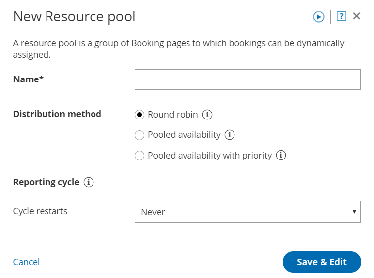
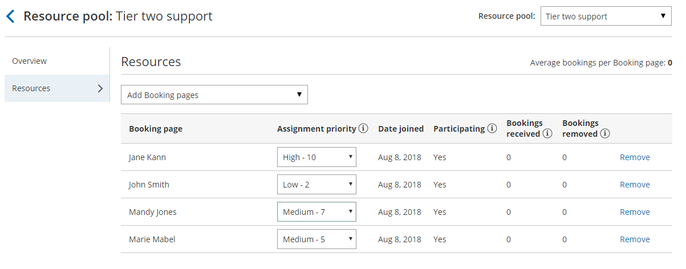

import { Aside } from "@astrojs/starlight/components";

Resource pools allow you to dynamically distribute bookings among a group of Team members in the same department, location, or with any other shared characteristic. Each Resource pool has its own method for distributing bookings, such as [Round robin](/scheduleonce/master-pages-resource-pools/resource-pools/round-robin-distribution-method "Resource pool distribution method: Round robin"), [Pooled availability](/distribution-method---pooled-availability "Distribution method - Pooled availability"), or Pooled availability with priority.

In this article, you'll learn about the Pooled availability with priority distribution method and how to set up a Resource pool with Pooled availability with priority.

## When should I use Pooled availability with priority?

Pooled availability with priority is a hybrid distribution method. It provides Customers with the maximum amount of time slots while also giving priority to specific Team members.

For example, you might choose to use Pooled availability with priority to distribute bookings to your tier-two support representatives. You want to provide maximum availability to Customers in need of tier-two support, while also ensuring that your most qualified support representatives conduct the meetings.

## How are bookings assigned with Pooled availability with priority?

To distribute bookings among Team members in your pool using Pooled availability with priority, you must [add the Resource pool](/scheduleonce/master-pages-resource-pools/resource-pools/adding-resource-pools-to-master-pages "Adding Resource pools to Master pages") to a [Master page](/scheduleonce/master-pages-resource-pools/master-pages/introduction-to-master-pages "Introduction to Master pages"). When a Customer visits your Master page, they will see your entire team's combined availability. Once they select a time, the booking is automatically assigned to the available Team member with the highest priority.

If there are multiple Team members with the same priority ranking, the booking is assigned to the Team member with the longest idle time. This is the Team member who has not received a booking for the longest amount of time.

## How do I create a Resource pool that uses Pooled availability with priority?

1. Go to **Booking pages** in the bar on the left.
2. Select **Resource pools** on the left (Figure 1). Figure 1: Resource pools
3. Click the **Add a Resource pool** button to [create a new Resource pool](/scheduleonce/master-pages-resource-pools/resource-pools/creating-resource-pool "Creating a Resource pool in ScheduleOnce").
4. The **New Resource pool** pop-up appears (Figure 2). Figure 2: New Resource pool pop-up
5. Name your Resource pool.
6. In the **Distribution method** section, select **Pooled availability with priority**.
7. Select a [Reporting cycle](/scheduleonce/master-pages-resource-pools/resource-pools/resource-pools-reporting-cycle "ScheduleOnce Resource pool: Reporting cycle").
8. Click **Save & Edit**. You'll be redirected to the Resource pool Overview section.
9. Go to the Resources section and select which Booking pages to include in the drop-down. Assign a priority to each Booking page in your pool (Figure 3). _Figure 3: Resource section&#x20;_
10. Make sure to [add your Resource pool to a Master page](/scheduleonce/master-pages-resource-pools/resource-pools/adding-resource-pools-to-master-pages "Adding Resource pools to Master pages"). Bookings will not be distributed to pool members until the Resource pool is included in a Master page.
