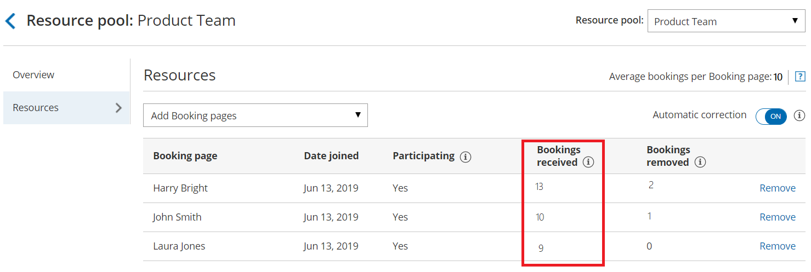

import { Aside } from "@astrojs/starlight/components";

[Resource pools](/scheduleonce/master-pages-resource-pools/resource-pools/introduction-to-resource-pools "Introduction to ScheduleOnce Resource pools") allow you to dynamically distribute bookings among a group of Team members in the same department, location, or with any other shared characteristic.

**Bookings received** is a metric provided for each Booking page you've included in a [Resource pool](/scheduleonce/master-pages-resource-pools/resource-pools/introduction-to-resource-pools "Introduction to ScheduleOnce Resource pools"). **Bookings received** is the number of bookings that a specific [Booking page](/scheduleonce/event-types-booking-pages/booking-pages/introduction-to-booking-pages "Introduction to Booking pages") has received to date, within the [Reporting cycle](/scheduleonce/master-pages-resource-pools/resource-pools/resource-pools-reporting-cycle "ScheduleOnce Resource pool: Reporting cycle").

In this article, you'll learn about viewing and understanding the Bookings received metric.

## Requirements

To view the **Bookings received** metric, you must be a [OnceHub Administrator](/account-administration/user-management/user-roles-overview "Differences between Administrator and Member").

## Viewing the Bookings received metric

1. Go to **Booking pages** in the bar on the left.
2. Select **Resource pools** on the left (Figure 1). 

   Figure 2: Resource pools

3. Select the specific Resource pool you would like to view **Bookings received** for.&#x20;
4. Go to the **Resources** section of the Resource pool (Figure 2). 

   Figure 2: Bookings received

## Understanding the Bookings received metric

If the specific [Resource pool is included in multiple Master pages](/scheduleonce/master-pages-resource-pools/resource-pools/adding-resource-pools-to-master-pages "Adding Resource pools to Master pages"), the **Bookings received** metric for each Booking page is the total number of bookings received by that Booking page across all Master pages.

Bookings can be received via direct scheduling, rescheduling, or reassignment.

- **Bookings received via direct scheduling:** This happens when a Customer schedules on a Master page that includes the specific Resource pool, and the booking is assigned to the specific Booking page.
- **Bookings received via rescheduling:** This happens when a Customer reschedules a booking and the booking is assigned to a different Booking page from the original Booking page that was assigned. In this case, the **Bookings received** counter will go up by one for the new Booking page that the Customer rescheduled with. The [Bookings removed](/scheduleonce/master-pages-resource-pools/resource-pools/resource-pool-statistics-bookings-removed "ScheduleOnce Resource pool statistics: Bookings removed") counter will go up by one for the original Booking page that the booking was rescheduled from.
- **Bookings received via reassignment:** This happens when a User reassigns a booking from one Booking page to another. In this case, the **Bookings received** counter will go up by one for the new Booking page the User reassigned the booking to. The **Bookings removed** counter will go up by one for the original Booking page that the booking was reassigned from.
