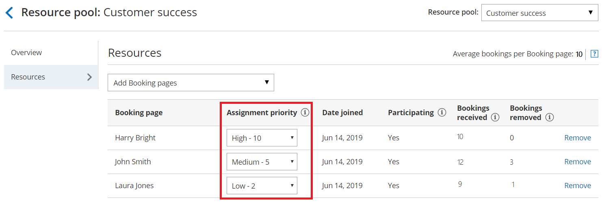
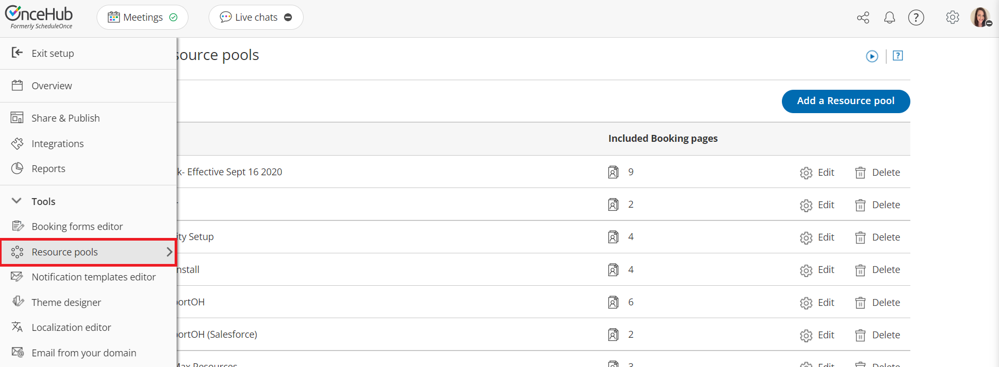

import { Aside } from "@astrojs/starlight/components";

You can assign an Assignment priority to [Booking pages](/scheduleonce/event-types-booking-pages/booking-pages/introduction-to-booking-pages "Introduction to Booking pages") within a [Resource pool](/scheduleonce/master-pages-resource-pools/resource-pools/introduction-to-resource-pools "VIDEO: Introduction to Resource pools") that uses [Pooled availability with priority](/scheduleonce/master-pages-resource-pools/resource-pools/pooled-availability-with-priority "Distribution method - Pooled availability with priority") as the distribution method. The Assignment priority determines which Booking page will receive a booking when multiple Booking pages are available at the time selected by the Customer.

Figure 1: Resource pool Assignment priority

In this article, you'll learn about using Assignment priority.

## How Assignment priority works

When a Customer selects a time to schedule a meeting, OnceHub first checks which Booking pages are available. Then, the booking is assigned to the available Booking page with the highest Assignment priority.

If there are multiple Booking pages with the same Assignment priority, the booking is assigned to the Booking page with the longest idle time. This is the Booking page which has not received a booking for the longest amount of time.

## Requirements

To edit the Assignment priority of Booking pages in a Resource pool, you must be a OnceHub Administrator.

## Defining Assignment priority for Booking pages in a Resource pool

1. Go to **Booking pages** in the bar on the left.

2. Select **Resource pools** on the left (Figure 1).

3. 

   Figure 1: Resource pools

4. Select the specific Resource pool you'd like to define **Assignment priority** for.

   <Aside type="note">

   **Note**Assignment priority is only relevant for Resource pools using Pooled availability with priority as the distribution method.

   </Aside>

5. In the **Resources** section, use the **Assignment priority** drop-down menu next to each Booking page to change its priority. By default all pages have an Assignment priority of **Medium - 5**.
