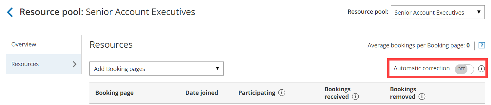

import { Aside } from "@astrojs/starlight/components";

OnceHub uses a smart Automatic correction distribution algorithm to ensure that [Resource pools](/scheduleonce/master-pages-resource-pools/resource-pools/introduction-to-resource-pools "Introduction to ScheduleOnce Resource pools") that use [Round robin](/scheduleonce/master-pages-resource-pools/resource-pools/round-robin-distribution-method "Resource pool distribution method: Round robin") distribution achieve an equal booking distribution across your Team members at all times.

Figure 1: Round robin Resource pool with Automatic correction

In this article, you'll learn about using Automatic correction with your Round robin Resource pool.

## Why use Automatic correction?

With [Round robin](/scheduleonce/master-pages-resource-pools/resource-pools/round-robin-distribution-method "Resource pool distribution method: Round robin") distribution, each new booking is assigned to the next Team member in line. This ensures that the number of bookings received per [Booking page](/scheduleonce/event-types-booking-pages/booking-pages/introduction-to-booking-pages "Introduction to Booking pages") is equal. However, if schedule changes such as cancellations by customers are not taken into consideration, the distribution may become uneven.

The Automatic correction algorithm ensure that any bookings that are removed are compensated for, meaning that any Team member who falls behind will be automatically moved to the front of the line until they have caught up. The Automatic correction distribution algorithm is turned **ON** by default for all new Resource pools that use Round robin distribution. If for any reason you would like to stop compensating for bookings that were removed, follow the steps below to turn Automatic correction off.

## Requirements

To edit a Resource pool, you must be a [OnceHub Administrator](/account-administration/user-management/user-roles-overview "Differences between Administrator and Member").

## Using the Automatic correction algorithm in a Resource pool

1. Go to **Booking pages** in the bar on the left.

2. Select **Resource pools** on the left (Figure 2).

   Figure 2: Resource pools

3. Select the specific Resource pool you would like to turn Automatic correction off for.

   <Aside type="note">

   **Note**The Automatic correction algorithm is only available for Resource pools using Round robin as the distribution method.

   </Aside>

4. Once you select the relevant Resource pool, you'll be redirected to the Resource pool [Overview section](/scheduleonce/master-pages-resource-pools/resource-pools/resource-pools-overview "ScheduleOnce Resource pools: Overview section").

5. Go to the **Resources** section of the Resource pool.

6. Set the **Automatic correction** toggle to **OFF** (Figure 3). From this point onwards, bookings that are removed will not be compensated for. 

   Figure 3: Set Automatic correction to OFF
