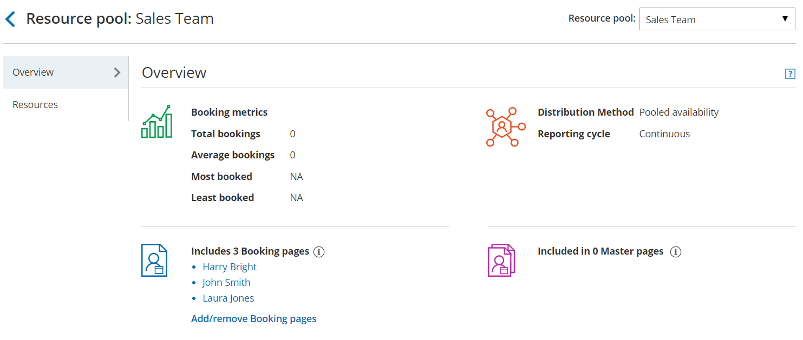
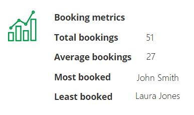
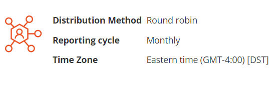
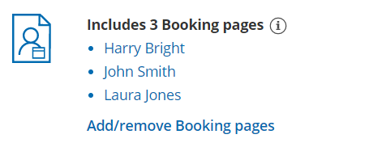

import { Aside } from "@astrojs/starlight/components";
import YouTubeEmbed from "~/components/YouTubeEmbed.astro";

<YouTubeEmbed id="OgiXNojqhxo" title="Resource pools: Overview" />

[Resource pools](/scheduleonce/master-pages-resource-pools/resource-pools/introduction-to-resource-pools "Introduction to ScheduleOnce Resource pools") allow you to dynamically distribute bookings among a group of Team members in the same department, location, or with any other shared characteristic.

The Resource pool **Overview** section summarizes the main properties of the selected Resource pool and provides real-time visibility into booking metrics of the Resource pool.

Figure 1: Resource Pool Overview section

## Booking metrics

Figure 2: Booking metrics

The **Booking metrics** section (Figure 2) gives you quick access to the pool's statistics. All metrics are real-time and show the state of the pool within the current [Reporting cycle](/scheduleonce/master-pages-resource-pools/resource-pools/resource-pools-reporting-cycle "ScheduleOnce Resource pool: Reporting cycle").

- **Total bookings:** The total number of bookings that Team members in the Resource pool have received to date, within the Reporting cycle period.
- **Average bookings:** The average number of bookings that each Team member in the Resource pool has received to date, within the existing Reporting cycle.
- **Most booked:** The Team member in the Resource pool who has received the highest number of bookings to date, within the existing Reporting cycle.
- **Least booked:** The Team member in the Resource pool who has received the least number of bookings to date, within the existing Reporting cycle.

## Main settings

Figure 3: Resource pool main settings

The **Main settings** section (Figure 3) shows the following:**&#x20;**

- **Distribution method:** The selected Distribution method is listed here. The Distribution method determines how bookings are assigned across Team members within the Resource pool. Resource pools can use [Round robin](/scheduleonce/master-pages-resource-pools/resource-pools/round-robin-distribution-method "Resource pool distribution method: Round robin"), [Pooled availability](/scheduleonce/master-pages-resource-pools/resource-pools/pooled-availability-distribution-method "Resource pool distribution method: Pooled availability"), or [Pooled availability with priority](/scheduleonce/master-pages-resource-pools/resource-pools/resource-pool-distribution-method-pooled-availability-with-priority "Resource pool distribution method: Pooled availability with priority").
- [**Reporting cycle**](/scheduleonce/master-pages-resource-pools/resource-pools/resource-pools-reporting-cycle "ScheduleOnce Resource pool: Reporting cycle"): The selected Reporting cycle is listed here. The Reporting cycle determines how often the statistics for your Resource pool will be reset.
- **Time zone**: If the Reporting cycle of the Resource pool is set to Monthly or Quarterly, the Time zone that determines when the statistics for your pool are reset is listed here.

## Included Booking pages

Figure 4: Booking pages included in the Resource pool

Each Resource pool groups Booking pages together according to characteristics you define. Here, you will see a list of all the Booking pages that are included in the specific Resource pool.

## Included in Master pages

Figure 5: Master pages that the Resource pool is included in

Resource pools are only active once you [add them to Master pages using team or panel pages](/scheduleonce/master-pages-resource-pools/resource-pools/adding-resource-pools-to-master-pages "Adding Resource pools to Master pages"). When Customers schedule on Master pages that include a Resource pool, the booking will be assigned to a pool member according to the Resource pool's Distribution method. A single Resource pool can be included across multiple rules within a single Master page and can be included across multiple Master pages.
