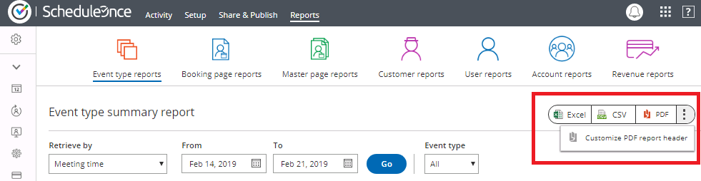
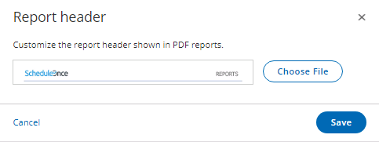

import { Aside } from "@astrojs/starlight/components";

ScheduleOnce is used by many event organizers to facilitate meetings between hosts and attendees at conferences, trade shows and many other events.

The solution described here is managed by the event organizer only—hosts or attendees do not need to be involved. The event organizer creates the scheduling pages and attendees use these pages to schedule their meetings. When scheduling is completed, the event organizer can hand the schedules to each participant so they know when and with whom they will be meeting. [See a live demo](http://go.oncehub.com/show)

In this scenario, it is recommended that you use ScheduleOnce without a connected calendar because there is no need to factor in busy time from other events that are not related to the scheduled conference or trade show.

<Aside type="tip">

&#x20;If you have more complex scheduling requirements, such as the need to automatically reserve a room for each meeting, we recommend that you **work with a connected calendar**. This will provide greater flexibility and additional features. For example, [learn about making booking conditional on the availability of a single resource](/scheduleonce/recommended-configuration/multi-user-scenarios/booking-conditional-on-availability-of-single-resource "Booking conditional on the availability of a single resource")**.**

</Aside>

## How to set up the scheduling page

1. [Create a Booking page](/scheduleonce/event-types-booking-pages/booking-pages/creating-booking-page "Creating a Booking page") for each host.
2. In the [**Scheduling options**](/scheduleonce/event-types-booking-pages/scheduling-options/introduction-to-scheduling-options "Introduction to the Scheduling options section") section of each Booking page, set it to [Automatic booking mode](/scheduleonce/event-types-booking-pages/scheduling-options/automatic-booking-or-booking-with-approval "Automatic booking or Booking with approval") (recommended). You can also work in [Booking with approval mode](/scheduleonce/event-types-booking-pages/scheduling-options/automatic-booking-or-booking-with-approval "Automatic booking or Booking with approval"), in which case you will have to approve each appointment before it is created in the Activity stream (this is not recommended if you have many meetings).
3. In the [**Recurring availability**](/scheduleonce/event-types-booking-pages/booking-pages/booking-pages-recurring-availability "Booking page: Recurring availability section") section, you should erase all Recurring availability and click **save**. Then go into the [**Date-specific availability**](/scheduleonce/event-types-booking-pages/booking-pages/booking-pages-date-specific-availability "Booking page: Date-specific availability section") section and only highlight the days and times for the event.
4. If you want to notify hosts on each individual booking, the email address of each host should be added to their Booking page so that they get scheduling confirmation emails.
5. In the Booking page [**Public content**](/scheduleonce/event-types-booking-pages/booking-pages/booking-pages-public-content "Booking page: Public content section") section, you may add [**tags**](/scheduleonce/master-pages-resource-pools/master-pages/using-booking-page-tags-in-master-pages "Using Booking page tags in Master Pages") for each host. Attendees will be able to filter hosts by using tags on the Booking page. This additional filter enables attendees to find the host with whom they need to book time in a fast and efficient manner.
6. Complete the rest of the Booking page settings.
7. [Create a Master page](/scheduleonce/master-pages-resource-pools/master-pages/creating-master-page "Creating a Master page").
8. Select the Booking pages to include on the Master page in the **Assignment** section.
9. In the [**Labels and instructions**](/scheduleonce/master-pages-resource-pools/master-pages/master-pages-labels-and-instructions "Master Page: Labels and Instructions section") section of the Master page, customize the selection of text and labels. If you added tags to Booking pages, the tags added to each Booking page will be displayed. Note that you should ensure that all Booking pages included on the Master page have tags, so your Booking page can offer your Customers a fully functional tag filtering experience.
10. Add details to your Master page in the [**Public content**](/scheduleonce/master-pages-resource-pools/master-pages/master-pages-public-content "Master Page: Public Content section") section. These will be the details of your event, as this page will represent your event and list all hosts that can accept bookings.
11. Test your Master page by clicking on the live link in the [Overview section](/scheduleonce/master-pages-resource-pools/master-pages/master-pages-overview "Master Page: Overview section") of the Master page. This is the link that you will share with attendees. Alternatively, you can [publish the Master page](/scheduleonce/sharing-publishing/publishing-on-websites/website-embed "Introduction to Publishing options") on your event website.
12. When the booking is completed, all appointments will be in your ScheduleOnce [Activity stream](/scheduleonce/managing-bookings/analytics/activity-stream-viewing-activities "Introduction to the ScheduleOnce Activity stream"). Using [ScheduleOnce Reports](/scheduleonce/reporting/introduction-to-reports "Introduction to ScheduleOnce reports"), you can generate a schedule for the conference for each host, as well as a meeting schedule for each attendee. Each host should receive their corresponding Booking page report, listing the times and details of meetings with each attendee. Each attendee can be given a Customer report, listing the times of meetings with their selected hosts.

The reports can be created in an Excel spreadsheet, a CSV file or as a PDF. Your [custom report header](/scheduleonce/reporting/report-header "Report header") can be added to PDF reports only. To upload your own branded report header, follow the steps below.

1. Click on **Reports** and select any report type.
2. Click the action menu (three dots) on the right, as shown in Figure 1 below.

   Figure 1: Reports page

3. Click **Customize PDF report header**.
4. In the **Report header** pop-up, click **Choose File** to upload your own header (See Figure 2).
5. When you've finished, click **Save**.

   Figure 2: Report header pop-up

<Aside type="note">

The recommended dimensions for a Report header are 840 pixels wide and 70 pixels high.

</Aside>
