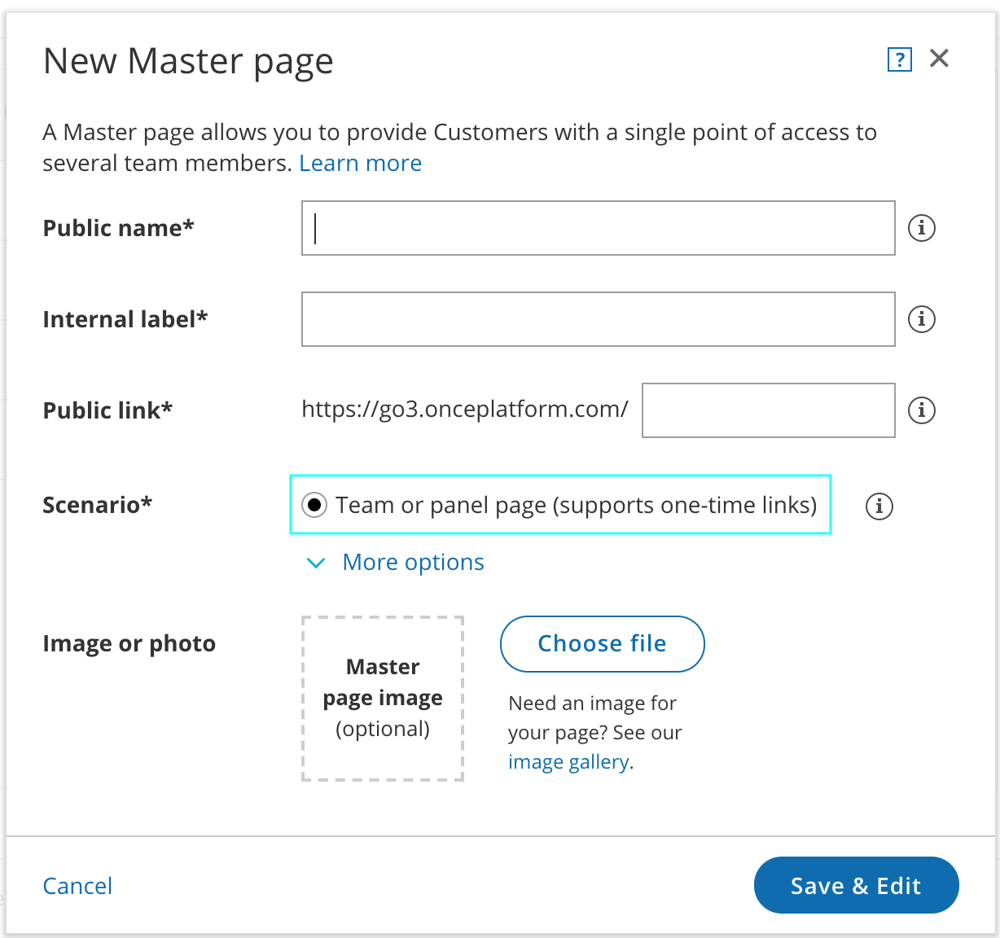

import { Aside } from "@astrojs/starlight/components";

You can accept bookings for multiple Team members with [multiple Event types](/scheduleonce/event-types-booking-pages/event-types/introduction-to-event-types "Introduction to Event types"). Team members can be accessed via one [Master page](/scheduleonce/master-pages-resource-pools/master-pages/introduction-to-master-pages "Introduction to Master Pages"), or independently through their individual Booking pages. [Learn more about User management](/account-administration/user-management/user-management-and-seats "Introduction to User Management")

Bookings made on a Master page can be either automatically assigned to Team members according to rules you define, or assigned based on the Customer’s selection. In this article, we will talk about [team and panel pages](/scheduleonce/master-pages-resource-pools/master-pages/master-page-scenario-team-or-panel-page "Master page scenario: Team or panel pages").

## Requirements

You must be a [OnceHub Administrator](/account-administration/user-management/user-roles-overview "Differences between Administrator and Member") to set up this scenario.

## How to set up

1. [Create the Event types](/scheduleonce/event-types-booking-pages/event-types/creating-an-event-type "Creating an Event type") you require. If you want to work in [Automatic booking mode](/scheduleonce/event-types-booking-pages/scheduling-options/automatic-booking-or-booking-with-approval "Automatic booking or Booking with approval"), make sure to select it in the Scheduling options section of each Event type. You can also work in [Booking with approval mode](/scheduleonce/event-types-booking-pages/scheduling-options/automatic-booking-or-booking-with-approval "Automatic booking or Booking with approval").

   <Aside type="note">

   **Note:**&#x49;f you want to automatically assign bookings, you must use Automatic booking mode.

   </Aside>

2. Click on your profile image or initials in the top right corner, select **Profile settings**, and go to the **Users** page.

3. [Create a User account](/account-administration/user-management/user-management-and-seats "Adding Users") for each Team member.

4. You can [create a Booking page](/scheduleonce/event-types-booking-pages/booking-pages/creating-booking-page "Creating a Booking page") for each Team member and [make the Team member the Owner of the page](/scheduleonce/event-types-booking-pages/booking-pages/booking-page-ownership "Booking page ownership"). Alternatively, you can leave it to the Team members to create their own Booking pages.

5. Once you're done with the settings, [create a Master page](/scheduleonce/master-pages-resource-pools/master-pages/creating-master-page "Creating a Master page"). Select [Team or panel page](/scheduleonce/master-pages-resource-pools/master-pages/master-page-scenario-team-or-panel-page "Master page scenario: Team or panel pages") in the **New Master page** pop-up (Figure 1). Figure 1: New Master page pop-up

6. Click **Save & Edit**.

7. You'll be redirected to the Master page [Overview section](/scheduleonce/master-pages-resource-pools/master-pages/master-pages-overview "Master Page: Overview section"). This section gives you a summary of your Master page’s main properties. Here you can edit the Master page’s **Theme** and **Locale**, as well as access its **Share & Publish** options.

8. Go to the [Event types and assignment](/scheduleonce/master-pages-resource-pools/master-pages/master-pages-event-types-and-assignment "Master Page: Event types and assignment section") section. This is where you create rules to determine how bookings will be assigned to Booking pages.

9. Customize the page's [Labels and instructions](/scheduleonce/master-pages-resource-pools/master-pages/master-pages-labels-and-instructions "Master Page: Labels and Instructions section") and [Public content](/scheduleonce/master-pages-resource-pools/master-pages/master-pages-public-content "Master Page: Public Content section").

You’re all set! To test your Master page, go to the [Master page Overview](/scheduleonce/master-pages-resource-pools/master-pages/master-pages-overview "Master page: Overview section") and make a test booking by using the public link in the **Share & Publish** section.&#x20;

<Aside type="tip">

When you use a Master page using [team or panel pages](/scheduleonce/master-pages-resource-pools/master-pages/master-page-scenario-team-or-panel-page "Master page scenario: Team or panel pages"), you can [generate one-time links](/scheduleonce/sharing-publishing/general-one-time-links/using-one-time-links "Using One-time links with your Master page") which are good for one booking only.

One-time links eliminate any chance of unwanted repeat bookings. A Customer who receives the link will only be able to use it for the intended booking and will not have access to your underlying [Booking page](/scheduleonce/event-types-booking-pages/booking-pages/introduction-to-booking-pages "Introduction to Booking pages"). One-time links [can be personalized](/scheduleonce/sharing-publishing/personalized-links/using-personalized-links "Using Personalized links"), allowing the Customer to pick a time and schedule without having to fill out the [Booking form](/scheduleonce/event-types-booking-pages/booking-forms-redirect/collecting-customer-data-with-booking-forms "Collecting Customer data with Booking forms").

[Learn more about using one-time links](/scheduleonce/sharing-publishing/general-one-time-links/using-one-time-links "Using one-time links with your Master page")

</Aside>
