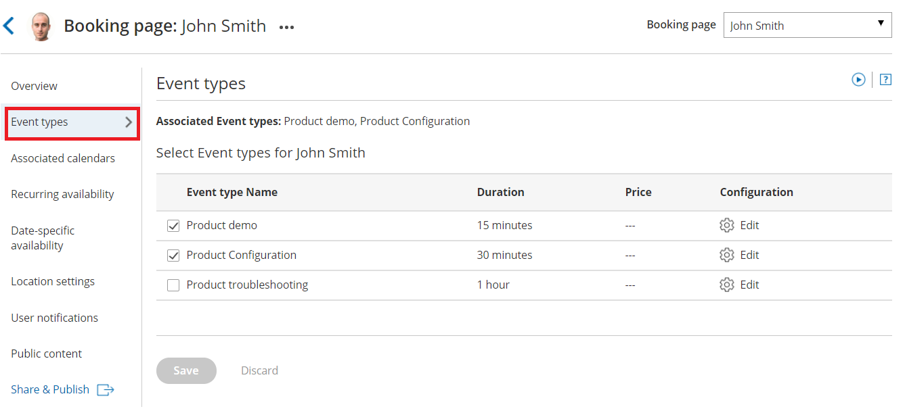

import { Aside } from "@astrojs/starlight/components";

If you offer multiple meeting types which all have the same availability and same location, you can set up one [Booking page](/scheduleonce/event-types-booking-pages/booking-pages/introduction-to-booking-pages "Introduction to Booking pages") with multiple [Event types](/scheduleonce/event-types-booking-pages/event-types/introduction-to-event-types "Introduction to Event types") linked to it. Follow these steps to offer different appointment types on your Booking page.

1. [Create the Event types](/scheduleonce/event-types-booking-pages/event-types/creating-an-event-type "Creating an Event type") you need and define the settings for each Event type.

2. In the settings for the relevant Booking page, go to the **Event types** section and [add your Event types](/scheduleonce/event-types-booking-pages/booking-pages/adding-event-types-to-booking-pages "Adding Event types to Booking pages") to your Booking page (Figure 1). Figure 1: Event types section of the Booking page

3. Click **Save**.

   <Aside type="note">

   **Note** The [Scheduling options](/scheduleonce/event-types-booking-pages/scheduling-options/introduction-to-scheduling-options "Introduction to the Scheduling options section"), [Time slots](/scheduleonce/event-types-booking-pages/timeslot-settings/introduction-to-time-slot-settings "Introduction to Time slot settings"), [Booking form](/scheduleonce/event-types-booking-pages/booking-forms-redirect/introduction-to-booking-form-and-redirect "Introduction to the Booking form and redirect section"), [Customer notifications](/scheduleonce/event-types-booking-pages/customer-notifications/introduction-to-customer-notifications "The Customer notifications section") and [Cancel/reschedule](/scheduleonce/event-types-booking-pages/event-types/payment-and-rescheduling "Event type: Payment and cancel/reschedule policy section") sections will move from your Booking page and are now located on your Event types.

   </Aside>

To test your Booking page with Event types, go to the [Booking page Overview](/scheduleonce/event-types-booking-pages/booking-pages/booking-pages-overview "Booking page: Overview section") and make a test booking by using the public link in the **Share & Publish** section.

## Using a Master page

If you would like to have more control over text and labels seen by your Customers, you can use a [Master page](/scheduleonce/master-pages-resource-pools/master-pages/introduction-to-master-pages "Introduction to Master Pages"). This provides you with more flexibility to customize the selection instructions and the public labels.

1. [Create a new Master page](/scheduleonce/master-pages-resource-pools/master-pages/creating-master-page "Creating a Master page") and add your personal details in the [Public content](/scheduleonce/master-pages-resource-pools/master-pages/master-pages-public-content "Master Page: Public Content section") section.
2. In the [Assignment](/scheduleonce/master-pages-resource-pools/master-pages/master-pages-event-types-and-assignment "Master Page: Assignment section") section, add your Booking pages to the Master page.
3. In the [Labels and instructions](/scheduleonce/master-pages-resource-pools/master-pages/master-pages-labels-and-instructions "Master page: Labels and instructions section") section, customize the public labels and selection instructions.

To test your Master page, go to the [Master page Overview](/scheduleonce/master-pages-resource-pools/master-pages/master-pages-overview "Master page: Overview section") and make a test booking by using the public link in the **Share & Publish** section.&#x20;

<Aside type="tip">

If you would like to [generate one-time links](/scheduleonce/sharing-publishing/general-one-time-links/using-one-time-links "Using one-time links with your Master page") which are good for one booking only, you should use a Master page using [Rule-based assignment](/scheduleonce/master-pages-resource-pools/master-pages/master-page-scenario-team-or-panel-page "Master page scenario: Rule-based assignment") with [Dynamic rules](/scheduleonce/master-pages-resource-pools/master-pages/assignment-with-team-or-panel-pages "Rule-based assignment: Dynamic rules").

One-time links eliminate any chance of unwanted repeat bookings. A Customer who receives the link will only be able to use it for the intended booking and will not have access to your underlying [Booking page](/scheduleonce/event-types-booking-pages/booking-pages/introduction-to-booking-pages "Introduction to Booking pages"). One-time links [can be personalized](/scheduleonce/sharing-publishing/personalized-links/using-personalized-links "Using Personalized links"), allowing the Customer to pick a time and schedule without having to fill out the [Booking form](/scheduleonce/event-types-booking-pages/booking-forms-redirect/collecting-customer-data-with-booking-forms "Collecting Customer data with Booking forms"). [Learn more about using one-time links](/scheduleonce/sharing-publishing/general-one-time-links/using-one-time-links "Using one-time links with your Master page")

</Aside>
