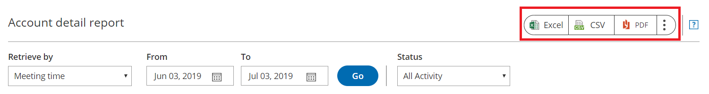

import { Aside } from "@astrojs/starlight/components";

OnceHub Account reports and [Revenue reports](/scheduleonce/reporting/revenue-reports "Revenue reports") can be used to see a global view of all account activity and all revenue details.

In this article, you'll learn about Account reports. Access your Account reports by going to Setup -> OnceHub setup -> Hover over the left sidebar -> Reports -> Account reports.

## Account detail reports

Account reports show all OnceHub booking activity across your account. These reports are a useful way to measure business performance.

The Account report is only available as a Detail report. You can see the total number of activities in account that have been **Scheduled**, **Rescheduled**, **Completed**, **Canceled**, or set to **No-Show** at the top of the Account report page.

<Aside type="note">

If you move an activity to the Trash, it will be included in reports until deleted. The activity will display as being **(In Trash)**. After they are permanently deleted, any fields related to this deleted activity will not show up in reports. [Learn more](/scheduleonce/managing-bookings/analytics/activity-stream-managing-activities)

Account reports can include activities from deleted [Booking pages](/scheduleonce/event-types-booking-pages/booking-pages/introduction-to-booking-pages "Introduction to Booking pages") and deleted Users. The relevant activity date and time must be within the reporting date range to show in the report.

</Aside>

By default, activities in the Account report are sorted by **Meeting date and time in Owner's time zone**, meaning the activity with the earliest Meeting time will be at the top of the list. To change how the report is sorted, click any of the column headers.

<Aside type="note">

To customize the display columns in the detail report, click the **Display columns** button. Any changes you make to the reporting dimensions are reflected in your exported Account report.

[Learn more about Detail report columns](/scheduleonce/reporting/complete-list-of-detail-report-columns "Complete list of Detail report columns")

</Aside>

## Exporting Account reports

You can export an Account report as an Excel, CSV, or PDF file. To export a report, click on the **Excel**, **CSV** or **PDF** button in the top right corner of the report page (Figure 1).

Figure 1: Export report buttons
