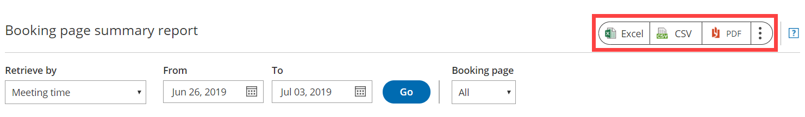

import { Aside } from "@astrojs/starlight/components";

OnceHub reports cover all booking activity. Reports can be generated based on different dimensions: [by Customer](/scheduleonce/reporting/customer-reports "Customer reports"), by Booking page, [by Event type](/scheduleonce/reporting/event-type-reports "Event type reports"), [by Master page](/scheduleonce/reporting/master-page-reports "Master page reports"), and [by User](/scheduleonce/reporting/user-reports "User reports").

In this article, you'll learn about Booking page reports. Access your Booking page reports by going to Setup -> OnceHub setup -> Hover over the left sidebar -> Reports -> Booking page reports.

## Booking page summary report

Booking page summary reports help you understand booking activity by [Booking page](/scheduleonce/event-types-booking-pages/booking-pages/introduction-to-booking-pages "Introduction to Booking pages"). For each Booking page, you can see how many bookings have been **Scheduled**, **Rescheduled**, **Completed**, **Canceled**, or set to **No-Show**. This gives you insight into overall Booking page activity and how it is divided between the different Booking pages.

By default, Booking pages in the summary report are sorted by **All activities**, meaning the Booking with the highest number of activities will be at the top of the list. To change how the report is sorted, click any of the column headers.

<Aside type="note">

If you move an activity to the Trash, it will be included in reports until deleted. The activity will display as being **(In Trash)**. After they are permanently deleted, any fields related to this deleted activity will not show up in reports. [Learn more](/scheduleonce/managing-bookings/analytics/activity-stream-managing-activities)

If a Booking page was deleted, the Booking page report will still show all the activities that were generated from this Booking page, provided they were generated during the reporting date range. The deleted Booking page will be shown in gray text with **\[deleted]** next to it.

</Aside>

## Booking page detail report

To view a detailed report of the booking activity for a specific Booking page, click on the Booking page in the **Booking page** column. Here, you can see a complete booking log for the specific Booking page.

By default, the bookings are sorted by **Meeting date** **and time**. To change how the report is sorted, click any of the column headers.

<Aside type="note">

To customize the display columns in the detail report, click the **Display columns** button. [Learn more about Detail report columns](/scheduleonce/reporting/complete-list-of-detail-report-columns "Complete list of Detail report columns")

</Aside>

## Exporting a Booking page report

You can export a Booking page report as an Excel, CSV, or PDF file. To export a report, click on the **Excel**, **CSV** or **PDF** button in the top right corner of the report page (Figure 1).

Figure 1: Export report buttons
