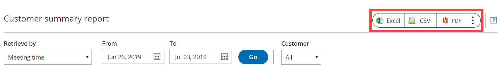

import { Aside } from "@astrojs/starlight/components";

OnceHub reports cover all booking activity. Reports can be generated based on different dimensions: by Customer, [by Booking page](/scheduleonce/reporting/booking-page-reports "Booking page reports"), [by Event type](/scheduleonce/reporting/event-type-reports "Event type reports"), [by Master page](/scheduleonce/reporting/master-page-reports "Master page reports"), and [by User](/scheduleonce/reporting/user-reports "User reports").

In this article, you'll learn about Customer reports. Access your Customer reports by going to Setup -> OnceHub setup -> Hover over the left sidebar -> Reports -> Customer reports.

## Customer summary report

Customer reports help you understand booking activity by Customer. For each Customer, you can see how many bookings have been **Scheduled**, **Rescheduled**, **Completed**, **Canceled**, or set to **No-Show**. This gives you insight into how many bookings and cancellations took place during a period of time.

Customers are grouped by their email address and name. If the Customer uses different names with the same email address, each email-name combination will be displayed separately.

By default, Customers in the summary report are sorted by **All activities**, meaning the Customer with the highest number of activities will be at the top of the list. To change how the report is sorted, click any of the column headers.

<Aside type="note">

If you move an activity to the Trash, it will be included in reports until deleted. The activity will display as being **(In Trash)**. After they are permanently deleted, any fields related to this deleted activity will not show up in reports. [Learn more](/scheduleonce/managing-bookings/analytics/activity-stream-managing-activities)

</Aside>

## Customer detail report

To view a detailed report of the booking activity for a specific Customer, click on the Customer in the **Customer** column. Here, you can see a complete booking log for the specific Customer.

A Customer detail report may be useful for billing purposes, or to provide a schedule report to a Customer when they need to meet multiple providers.

By default, the bookings are sorted by **Meeting date and time**. To change how the report is sorted, click any of the column headers.

<Aside type="note">

To customize the display columns in the detail report, click the **Display columns** button. [Learn more about Detail report columns](/scheduleonce/reporting/complete-list-of-detail-report-columns "Complete list of Detail report columns")

</Aside>

## Exporting a Customer report

You can export a Customer report as an Excel, CSV, or PDF file. To export a report, click on the **Excel**, **CSV** or **PDF** button in the top right corner of the report page (Figure 1).

Figure 1: Export report buttons
