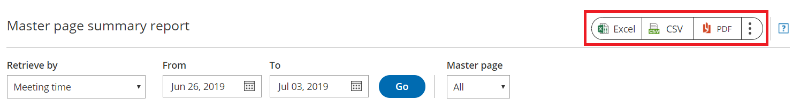

import { Aside } from "@astrojs/starlight/components";

OnceHub reports cover all booking activity. Reports can be generated based on different dimensions: [by Customer](/scheduleonce/reporting/customer-reports "Customer reports"), [by Booking page](/scheduleonce/reporting/booking-page-reports "Booking page reports"), by Event type, [by Master page](/scheduleonce/reporting/master-page-reports "Master page reports"), and [by User](/scheduleonce/reporting/user-reports "User reports").

In this article, you'll learn about Event type reports. Access your Event type reports by going to Setup -> OnceHub setup -> Hover over the left sidebar -> Reports -> Event type reports.

## Event type summary report

Event type summary reports help you understand booking activity by [Event type](/scheduleonce/event-types-booking-pages/event-types/introduction-to-event-types "Introduction to Event types"). For each Event type, you can see how many bookings have been **Scheduled**, **Rescheduled**, **Completed**, **Canceled**, or set to **No-Show**. This gives you insight into which Event types sell and which don't.

By default, Event types in the Summary report are sorted by **All activities**, meaning the Event type with the highest number of activities will be at the top of the list. To change how the report is sorted, click any of the column headers.

## Event type detail report

To view a detailed report of the booking activity for a specific Event type, click on the Event type in the **Event type** column. Here, you can see a complete booking log for the specific Event type.

By default, the bookings are sorted by **Meeting date and time**. To change how the report is sorted, click any of the column headers.

<Aside type="note">

To customize the display columns in the detail report, click the **Display columns** button. [Learn more about Detail report columns](/scheduleonce/reporting/complete-list-of-detail-report-columns "Complete list of Detail report columns")

</Aside>

## Exporting an Event type report

You can export an Event type report as an Excel, CSV, or PDF file. To export a report, click on the **Excel**, **CSV** or **PDF** button in the top right corner of the report page (Figure 1).

Figure 1: Export report buttons
