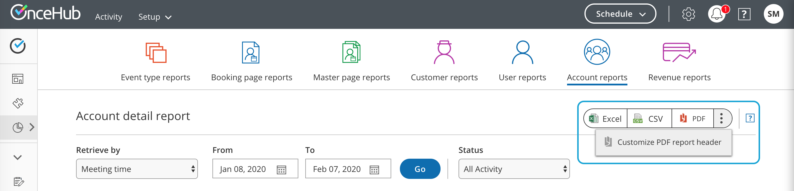

import { Aside } from "@astrojs/starlight/components";

[Reports](/scheduleonce/reporting/introduction-to-reports "Introduction to ScheduleOnce reports") generated by OnceHub can also be used externally with Customers or other stakeholders. For example, you may have a Customer who asks you to provide a schedule report when they need to meet multiple providers. In this case, you could generate a [Customer detail report](/scheduleonce/reporting/customer-reports "Customer reports") to send to the Customer.

By default, the OnceHub report header is displayed in PDF reports. However, you may want to use your own branded report header for reports that are sent to external stakeholders.

In this article, you'll learn how to upload your own branded report header to use in PDF reports.

## Uploading your own branded report header

1. From OnceHub setup, go to the lefthand sidebar and click on **Reports**.
2. Select any report type.
3. Click the action menu (three dots) on the right of the page (Figure 1).Figure 1: Customize PDF report header option
4. Click **Customize PDF report header**.
5. In the **Report header** popup, click **Choose File** to choose your own header and upload it (Figure 2). The recommended dimensions for a report header are 840 pixels wide and 70 pixels high.
6. After you've selected the header you want to upload, click **Save**.

<Aside type="note">

The report header will only show in PDF reports. Click the PDF button to generate a report for your current report view.

</Aside>
