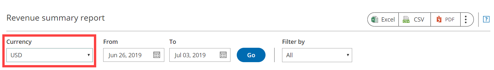

import { Aside } from "@astrojs/starlight/components";

OnceHub [Account reports](/scheduleonce/reporting/account-reports "Account reports") and Revenue reports can be used to see a global view of all account activity and all revenue details.

In this article, you'll learn about Revenue reports. Access your Revenue reports by going to Setup -> OnceHub setup -> Hover over the left sidebar -> Reports -> Revenue reports.

## Revenue summary reports

Revenue reports show overall revenue from bookings for a given period of time. You can see which [Event types](/scheduleonce/event-types-booking-pages/event-types/introduction-to-event-types "Introduction to Event types") bring in the most and least revenue, and which Customers bring in the most and least revenue. It also gives you an insight into how the overall revenue is divided between the different [Booking pages](/scheduleonce/event-types-booking-pages/booking-pages/introduction-to-booking-pages "Introduction to Booking pages").

The Revenue report is only available as a Detail report. Transactions can be filtered by **Customer**, **Booking page**, **Event type**, **Owner**, **Master page**, **Transaction type**, and **Transaction status**.

The **Revenue**, **Amount refunded**, and **Amount** presented in the mini dashboard at the top of the report are updated based on dates chosen, the currency selected, and the filter dimensions chosen.

<Aside type="note">

If you move an activity to the Trash, it will be included in reports until deleted. The activity will display as being **(In Trash)**. After they are permanently deleted, any fields related to this deleted activity will not show up in reports. [Learn more](/scheduleonce/managing-bookings/analytics/activity-stream-managing-activities)

Deleting activities is a new feature being rolled out gradually. If you do not see this option in your Activity stream and it's necessary for your account management, please [contact us](/contact-feedback) and we'd be happy to turn it on for you.

Revenue reports can include revenue from bookings from deleted Booking pages and deleted Users. The relevant activity date and time must be within the reporting date range to show in the report.

</Aside>

Use the **Currency** drop-down menu to select the currency to display in the Revenue report (Figure 1). Only transactions in the currency selected are displayed.

The currency drop-down menu in the Revenue report includes currencies that you may not necessarily be using to accept payments for your bookings. If you select a currency from the drop-down menu which you do not use to accept payments, then no transactions will be displayed.

Figure 1: Currency drop-down menu By default, activities in the Revenue report are sorted by **Payment transaction date**. Only transactions within the selected date range are displayed. To change how the report is sorted, click any of the column headers.

<Aside type="note">

To customize the display columns in the Detail report, click the **Display columns** button. Any changes you make to the reporting dimensions are reflected in your exported Revenue report. Payment data system fields can only be added to Revenue reports.

[Learn more about Detail report columns](/scheduleonce/reporting/complete-list-of-detail-report-columns "Complete list of Detail report columns")

</Aside>

## Exporting Revenue reports

You can export a Revenue report as an Excel, CSV, or PDF file. To export a report, click on the **Excel**, **CSV** or **PDF** button in the top right corner of the report page (Figure 1).

Figure 1: Export report buttons
