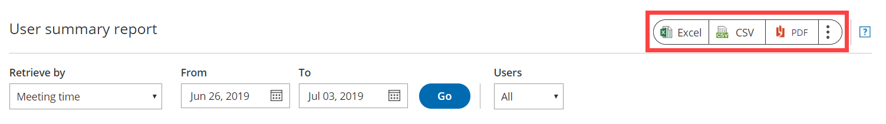

import { Aside } from "@astrojs/starlight/components";

OnceHub reports cover all booking activity. Reports can be generated based on different dimensions: [by Customer](/scheduleonce/reporting/customer-reports "Customer reports"), [by Booking page](/scheduleonce/reporting/booking-page-reports "Booking page reports"), [by Event type](/scheduleonce/reporting/event-type-reports "Event type reports"), [by Master page](/scheduleonce/reporting/master-page-reports "Master page reports"), and by User. User reports are used for [multi-user accounts](/account-administration/user-management/user-management-and-seats "Introduction to User Management") to show multiple system Users and their booking activity.

In this article, you'll learn about User reports. Access your User reports by going to **Booking Pages** in the lefthand menu -> **Reports** -> **User Reports**.

## User summary report

User reports help you understand booking activity by User. For each User, you can see how many bookings have been **Requested,** **Scheduled**, **Rescheduled**, **Completed**, **Canceled**, or set to **No-Show**. This gives you insight into overall booking activity and how it is divided between the different Users.

Users are grouped by their User name and email address. The User name and email address of the User are those set in the [Personal details section ](/profile-management/managing-your-profile-in-oncehub "Profile: Overview section")of the User's profile. A [OnceHub Administrator](/account-administration/user-management/user-roles-overview "Differences between Administrator and Member") can also see these details for each User in the **Users** section of their OnceHub Account. [Learn more about User management](/account-administration/user-management/user-management-and-seats "Introduction to User management")

An activity will display for a given User if the User was the [Owner of the Booking page](/scheduleonce/event-types-booking-pages/booking-pages/booking-page-access-permissions "Booking page access permissions") at the time that the booking was created. If the Booking page is assigned to a different User at some stage in the future, the activity will still belong to the original User.

By default, Users in the summary report are sorted by **All activities**, meaning the User with the highest number of activities will be at the top of the list. To change how the report is sorted, click any of the column headers.

## User detail report

To view a detailed report of the booking activity for a specific User, click on the User in the **User** column. Here, you can see a complete booking log for the specific User. The User can be [the Owner](/scheduleonce/event-types-booking-pages/booking-pages/booking-page-access-permissions "Booking page access permissions") of multiple [Booking pages](/scheduleonce/event-types-booking-pages/booking-pages/introduction-to-booking-pages "Introduction to Booking pages").

A User detail report may be useful as an agenda report so that the User can see all of their bookings.

By default, the bookings are sorted by **Meeting date and time**. To change how the report is sorted, click any of the column headers.

<Aside type="note">

To customize the display columns in the detail report, click the **Display columns** button. [Learn more about Detail report columns](/scheduleonce/reporting/complete-list-of-detail-report-columns "Complete list of Detail report columns")

</Aside>

## Exporting a User report

You can export a User report as an Excel, CSV, or PDF file. To export a report, click on the **Excel**, **CSV** or **PDF** button in the top right corner of the report page (Figure 1).

Figure 1: Export report buttons
