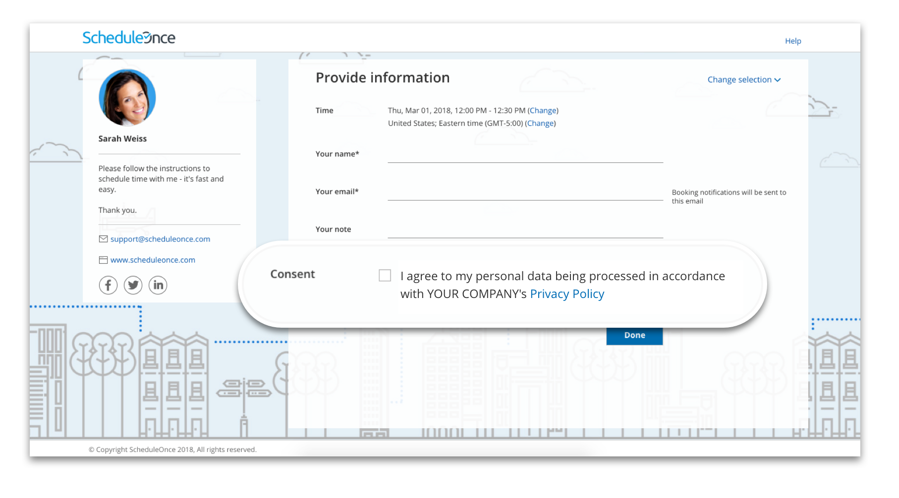
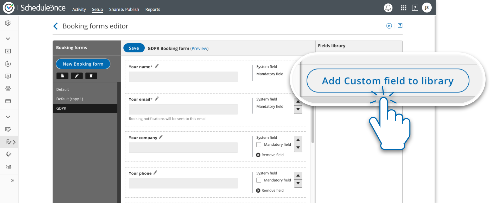
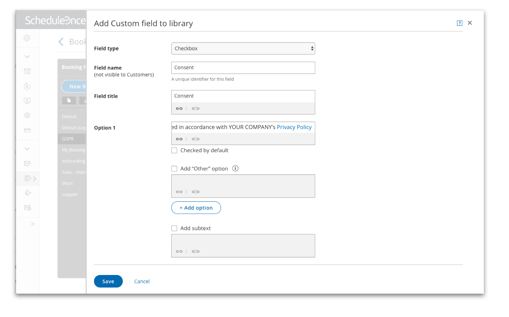
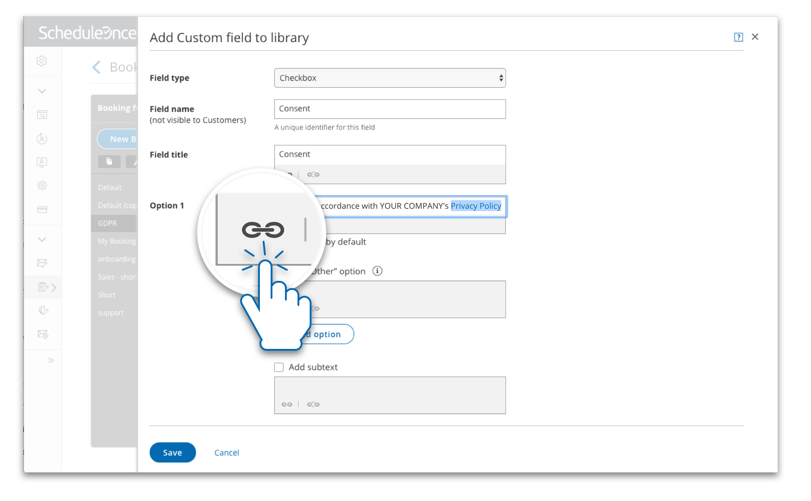
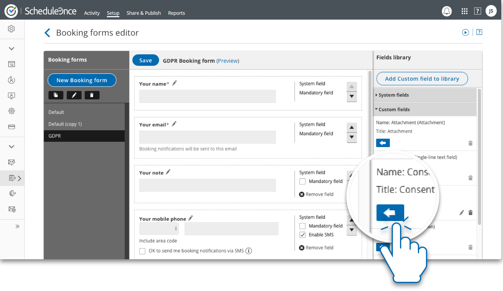
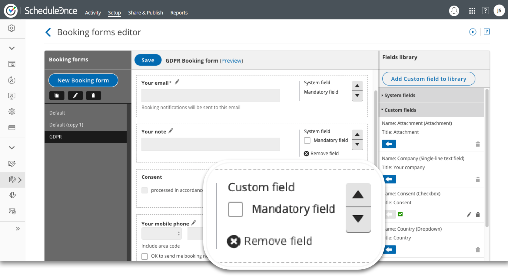

import { Aside } from "@astrojs/starlight/components";

The General Data Protection Regulation (GDPR) requires organizations to establish a lawful basis for processing data. A lawful basis for processing means that your organization has a legal right for collecting, storing, or accessing data belonging to a specific person. Often, a lawful basis for processing relies on consent from the Customer. With online scheduling, you may or may not need to obtain consent from Customers who book with you online.

Scheduling is customarily initiated by Customers. By this nature alone, you may not need consent to process information. However, if your organization processes sensitive data, it is recommended that you obtain explicit consent at the time of scheduling. This most likely applies to organizations in the healthcare industry, but other organizations may be affected as well. Data that is considered sensitive includes any information related to racial or ethnic origin, political opinions, religious or philosophical beliefs, trade union memberships, genetic or biometric data, health information, or a person’s sex life or sexual orientation. [Learn more about establishing a lawful basis for processing](/security-compliance/privacy/establishing-lawful-basis-for-processing-under-gdpr "Establishing a lawful basis for processing under the GDPR")

## Obtaining consent

The GDPR defines consent as “freely given, specific, informed, and unambiguous indication of the data subject’s wishes by which he or she, by a statement or by a clear affirmative action, signifies agreement to the processing of personal data relating to him or her.” Controllers that process on the basis of consent must clearly request consent and enable data subjects to withdraw consent at any time. The GDPR also states that if your request for consent occurs in the context of other matters, you should ensure that the request for consent is distinguishable from the other matters.

In order to obtain clear consent for OnceHub to process the data, it is recommended that you [add a field](/scheduleonce/customization-branding/booking-forms-editor/introduction-to-booking-forms-editor "Introduction to the Booking forms editor") in your OnceHub [Booking form](/scheduleonce/event-types-booking-pages/booking-forms-redirect/introduction-to-booking-form-and-redirect "Introduction to the Booking form and redirect section") to request consent (See Figure 1).

Figure 1: Consent requested in the Booking form

## How to add a consent field to your Booking form

1\. Go to the [Booking forms editor](/scheduleonce/customization-branding/booking-forms-editor/introduction-to-booking-forms-editor "Introduction to the Booking forms editor") and click **Add Custom field to library** (See Figure 2).

Figure 2: The Booking forms editor

2\. Create the Custom field by selecting the **Field type**, **Field name**, **Field title** and **Option**. We recommend using a Checkbox as the Field type, and creating one option allowing users to provide consent (See Figure 3).

__&#x46;igure 3: Add Custom field to library

3\. When creating your custom field, we recommend linking to your organization’s privacy policy. This ensures your Customers understand the processing activities to which they are agreeing. To link to the field, highlight the words you want to link and select the link icon (See Figure 4).

Figure 4: Link to your company’s privacy policy

4\. Input the link to your privacy policy and press **Save**.

5\. Once you have created the field, add it to your Booking form by locating the field in the custom fields library and clicking the arrow to add it to the form (See Figure 5).

Figure 5: Add the field to the booking form

6\. Next, you can determine the position of the field and whether or not it will be mandatory for Customers to check. It is recommended that this field be mandatory (See Figure 6).

Figure 6: Determine the position and whether the field is mandatory

You are all set! Your Booking form now requests consent for processing data. Be sure to attach this Booking form to the relevant Booking pages or Event types. [Learn more about adding the Booking form to your Booking page and Event types](/scheduleonce/event-types-booking-pages/booking-forms-redirect/collecting-customer-data-with-booking-forms "Introduction to Booking forms")
