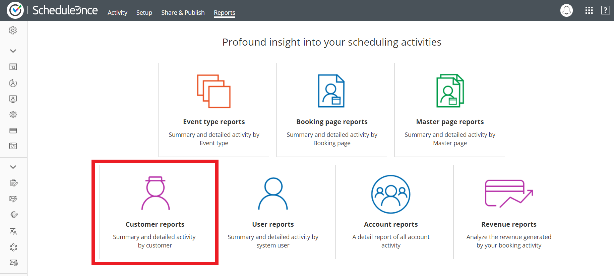
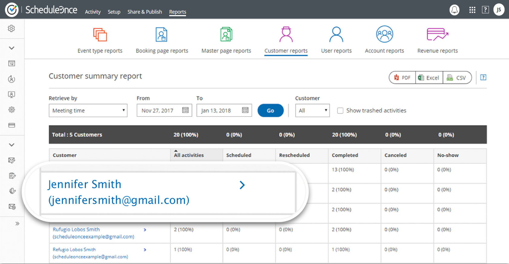
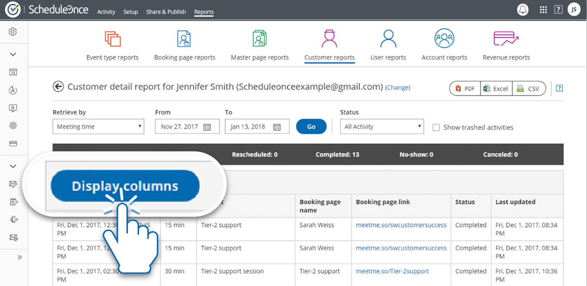
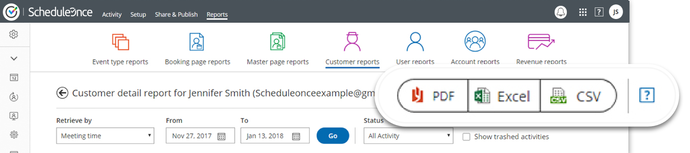

import { Aside } from "@astrojs/starlight/components";

The General Data Protection Regulation (GDPR) grants new privacy rights to data subjects. The aim of these rights is to provide transparency to individuals about how their data is being used and to give them control over the use of their own personal data.

[Chapter 3 of the GDPR](https://gdpr-info.eu/chapter-3/) defines the rights of the data subject. Some of the rights should be considered when you are using OnceHub, including:

- The right to access data
- The right to rectification
- The right to erasure

Controllers must be ready to comply with these rights and answer any requests from data subjects. Several of these rights may require you to access, or edit data collected via OnceHub. OnceHub provides tools to help you fulfill these rights, and is available to assist you in fulfilling any requests from data subjects. The following sections explain how to respond to certain data subject rights.

## The right to access data

Under the GDPR, data subjects have the right to know what data belonging to them is being processed by the controller ([Article 15 of the GDPR](https://gdpr-info.eu/art-15-gdpr/)). Upon request, controllers must be able to provide data subjects with the following information:

- A report of all processed data
- Purpose of processing
- Categories of personal data
- Recipients or categories of recipients who have, or have had access to the data
- The expected period of time for which the data will be stored
- If the data was not collected from the data subject, the source of the information
- Any information regarding profiling or automated decision-making used upon the data

Should you receive a data access request from a data subject who scheduled with you via OnceHub, you can provide a report of all data processed by OnceHub by using our reports feature.

## Create a report for data access requests

1\. In **OnceHub**, go to **Reports** and select **Customer reports** (See Figure 1).

_&#x20;_&#x46;igure 1: Customer reports

2\. Select whether you want the data sorted by by **Meeting time** or **Activity creation** and select the date range of the data you want to view. To ensure you are providing a comprehensive report, your date range should start at the time you started using OnceHub.

3\. Next, select the specific Customer to create a detailed report (See Figure 2).

Figure 2: Customer summary report

4\. Once you select the customer, you will see a detail report of all the Customer’s booking activity. You can click the **Display columns** button to add any field that you use in your Booking forms to the report (see Figure 3).

Figure 3: Customer detail report

5\. When you have finished defining, you can export the report in order to provide it to your Customers. You can export the report to a PDF, Excel, or CSV file (See Figure 4).

Figure 4: Export the report

You’re all set! You have now created a report that you can share with a data subject. [Learn more about OnceHub reports](/scheduleonce/reporting/introduction-to-reports "Introduction to ScheduleOnce reports")

## The right to rectification

Data subjects have the right to request that you correct any of their data that is inaccurate or incomplete ([Article 16 of the GDPR](https://gdpr-info.eu/art-16-gdpr/)). Should a data subject exercise their right to rectification, contact OnceHub and we will correct the data as soon as reasonably possible.

## The right to erasure

Data subjects may request that their data be erased or deleted ([Article 17 of the GDPR](https://gdpr-info.eu/art-17-gdpr/)). Controllers must comply with this request as long as the data is no longer required for the purpose for which it was collected. Should a data subject exercise their right to erasure, you can do this in the Activity stream. [Learn more about deleting activities](/scheduleonce/managing-bookings/analytics/activity-stream-managing-activities)
