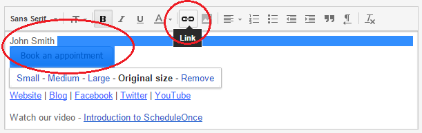
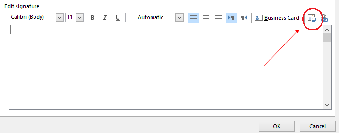
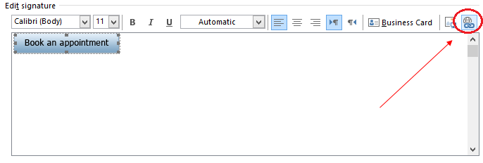

import { Aside } from "@astrojs/starlight/components";
import YouTubeEmbed from "~/components/YouTubeEmbed.astro";

<YouTubeEmbed
  id="BSm8elfiMMM"
  title="Add a Scheduling button to your email signature"
/>

A schedule button in your email is a great call-to-action, whether in your daily interactions with Customers or when running email campaigns. [See our full Email button gallery](/scheduleonce/sharing-publishing/general-one-time-links/scheduling-buttons-gallery "Scheduling Buttons Gallery")

In this article, you'll learn the two ways to insert a button into your email signature. The method you choose will depend on your settings.

## Insert via URL

You can insert a button without downloading the image to your computer. Most web-based email programs allow you to do this, including Gmail.

1. Review the buttons in our [scheduling buttons gallery](/scheduleonce/sharing-publishing/general-one-time-links/scheduling-buttons-gallery "Scheduling buttons gallery").
2. Copy one of the button links on the right.
3. In your email signature editor, click the insert picture icon (Figure 1) and paste the link in the URL field. Figure 1: Picture icon in email signature editor
4. In the editor pane, select the newly-added button image to highlight it.
5. Click the Add link icon and add your Booking page link (Figure 2). Figure 2: Add a link to your button

## Insert by uploading a button image

You can also insert a button by downloading the image to your computer and then uploading it to your email program. Follow these steps if you use Outlook or another desktop email program.

1. Review the buttons in our [scheduling buttons gallery](/scheduleonce/sharing-publishing/general-one-time-links/scheduling-buttons-gallery "Scheduling buttons gallery").
2. Select the one you want
3. Save the button to your computer by right-clicking on the button and selecting **Save image as...**
4. In the email signature editor, click the Upload image icon (Figure 3) and select the file you've just saved. Figure 3: Upload image icon
5. In the editor pane, select the newly-added button image to highlight it.
6. Click the Add link icon (Figure 4) to add your Booking page link to the image.Figure 4: Add link icon

<Aside type="note">

Every email program is different and the images used in this article may not match your email client’s interface exactly.

</Aside>

[See our full Email button gallery](/scheduleonce/sharing-publishing/general-one-time-links/scheduling-buttons-gallery "Scheduling Buttons Gallery")
