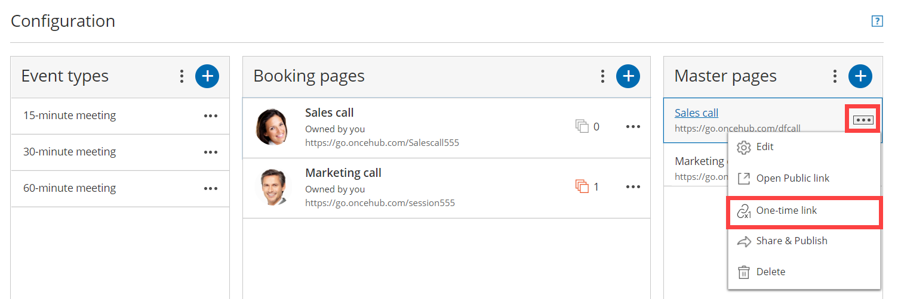

import { Aside } from "@astrojs/starlight/components";

<Aside type="note">

One-time links are only available for [Master pages](/scheduleonce/master-pages-resource-pools/master-pages/introduction-to-master-pages "Introduction to Master pages") using [Rule-based assignment](/scheduleonce/master-pages-resource-pools/master-pages/master-page-scenario-team-or-panel-page "Master page scenario: Rule-based assignment") with [Dynamic rules](/scheduleonce/master-pages-resource-pools/master-pages/assignment-with-team-or-panel-pages "Rule-based assignment: Dynamic rules").

</Aside>

With OnceHub, you can generate one-time links which are good for one booking only, eliminating any chance of unwanted repeat bookings. A Customer who receives the link will only be able to use it for the intended booking and will not have access to your underlying [Booking page](/scheduleonce/event-types-booking-pages/booking-pages/introduction-to-booking-pages "Introduction to Booking pages").

When you create a one-time link, it's automatically copied to your clipboard with one click, allowing you to quickly generate multiple one-time links that can be sent to different Customers. One-time links [can be personalized](/scheduleonce/sharing-publishing/personalized-links/using-personalized-links "Using Personalized links"), allowing the Customer to pick a time and schedule without having to fill out the [Booking form](/scheduleonce/event-types-booking-pages/booking-forms-redirect/collecting-customer-data-with-booking-forms "Collecting Customer data with Booking forms").

Customers can make bookings as normal using the one-time link, and Users and Customers can cancel and reschedule as usual based on your [Cancel/reschedule policy](/scheduleonce/managing-bookings/cancel-reschedule/customer-cancelreschedule-policy "The Customer Cancel/reschedule policy"). Bookings made using one-time links will also appear as normal bookings in your [Activity stream](/scheduleonce/managing-bookings/analytics/activity-stream-viewing-activities "Introduction to the ScheduleOnce Activity stream") and [reports](/scheduleonce/reporting/introduction-to-reports "Introduction to ScheduleOnce reports").

In this article, you'll learn how to generate a one-time link.

## Requirements

To create a Rule-based assignment Master page with Dynamic rules, you must be a OnceHub Administrator.

## Generating a one-time link

You generate a one-time link for your booking links by following the steps below:

1. Click on **Booking Pages** in the left-hand menu.
2. Click on **Share** near the top-right.
3. Select the Booking page or Master page you want to share from the dropdown menu.
4. Toggle the **One-time link** option to ON
5. Click on **Copy & close** to save it to you clipboard.

You can also generate a one-time link in the **Overview** section of the relevant Master page:

1. Go to **Setup** in the top navigation bar.

2. Select the relevant Master page that you would like to generate a one-time link for.

3. In the [Master page Overview](/scheduleonce/master-pages-resource-pools/master-pages/master-pages-overview "Master page: Overview section") section, click **Generate a one-time link** in the **Share & Publish** section (Figure 1). Figure 1: Generating a one-time link in the Master page Share & Publish section

4. The **One-time link** pop-up will appear (Figure 2). Figure 2: One-time link pop-up

5. Toggle **Personalize link** to ON if you would like to personalize the one-time link for a Customer (Figure 3). Enter a **Customer name** and **Customer email**. Figure 3: Personalize link enabled

   <Aside type="note">

   **Note** When you personalize a one-time link, the [Booking form](/scheduleonce/event-types-booking-pages/booking-forms-redirect/collecting-customer-data-with-booking-forms "Collecting Customer data with Booking forms") step will be skipped. Skipping the Booking form step allows for a quicker booking process for your Customers. You can choose to show the Booking form by changing the **Skip** URL parameter to "\&skip=0". [Learn more about using OnceHub URL parameters](/scheduleonce/sharing-publishing/personalized-links/url-parameters-syntax-and-processing-rules "OnceHub URL parameters and processing rules")

   </Aside>

6. Click **Copy & close** to copy the one-time link to your clipboard and close the pop-up. You can then paste the one-time link into an email or instant message and send it to your Customer.

You can also generate a one-time link from the **Booking page scheduling setup** (Figure 4). Click the action menu (three dots) next to the Master page that you would like to generate a one-time link for. Then, select **One-time link**.

<Aside type="note">

One-time links are only available for [Rule-based assignment](/scheduleonce/master-pages-resource-pools/master-pages/master-page-scenario-team-or-panel-page "Master page scenario: Rule-based assignment") Master pages with [Dynamic rules](/scheduleonce/master-pages-resource-pools/master-pages/assignment-with-team-or-panel-pages "Rule-based assignment: Dynamic rules").

</Aside>

Figure 4: Generating a one-time link from the Booking page scheduling setup

<Aside type="tip">

You can generate a one-time link for an individual Booking page by creating a new Master page with Dynamic rules and selecting this Booking page as the [Primary team member](/scheduleonce/master-pages-resource-pools/panel-meetings/booking-owners "Primary team members") for every Event-based rule you add. [Learn more about generating a one-time link for an individual Booking page](/scheduleonce/recommended-configuration/multi-user-scenarios/scheduling-one-off-meetings-using-one-time-links "Scheduling one-off meetings using one-time links")

</Aside>

## Changing the Master page Rule type

If you change the Rule type of your Master page from Dynamic to Static, Customers will not be able to use any one-time link that you previously generated.

If a Customer used the one-time link to make a booking **before** you changed the Rule type from Dynamic to Static, that booking can be cancelled but not rescheduled.
