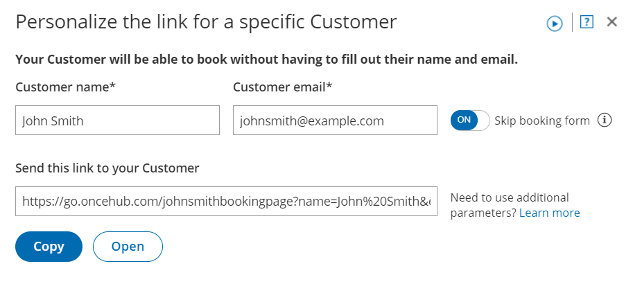

import { Aside } from "@astrojs/starlight/components";
import YouTubeEmbed from "~/components/YouTubeEmbed.astro";

<YouTubeEmbed
  id="CCTNDyI7zdk"
  title="Creating a Personalized link for a specific Customer"
/>

You can build a static [Personalized link](/scheduleonce/sharing-publishing/personalized-links/using-personalized-links "Using Personalized links") that includes a Customer's personal details. Personalized links for a specific Customer are based on [URL parameters](/scheduleonce/sharing-publishing/personalized-links/url-parameters-syntax-and-processing-rules "ScheduleOnce URL parameters and processing rules") and are best used when you want to send a single email to a particular Lead or Customer. These links are different from dynamic links that are used when you want to send [Personalized links to a large group of leads or Customers](/scheduleonce/sharing-publishing/personalized-links/personalizing-with-dynamic-url-parameters "Creating a Personalized link using URL parameters") as part of an email campaign.

For example, a Sales Representative wants to send an email to a specific lead named "John". They want to include a personalized "Book time with me" link in the body of the email. This link will take John straight to a Booking page where he can choose a date and time for the meeting without needing to enter any personal information such as name and email.

The Sales Representative can create a Personalized link that looks like this:[ https://go.oncehub.com/dana?name=John&email=john@example.com\&skip=1](https://go.oncehub.com/dana?name=John&email=john@example.com&skip=1)

<Aside type="note">

When you use Personalized links with Booking pages that don't have Event types, it's recommended that you provide the **Subject field** of your Booking form.

To add a Subject field to your Booking form, go to **Booking pages** on the left **→** relevant Booking page **→ Booking form → Meeting subject.** Select the **Meeting subject is set by the owner** option and enter the desired **Meeting subject** specific to your business case. [Learn more about the Subject field](/scheduleonce/event-types-booking-pages/booking-forms-redirect/introduction-to-booking-form-and-redirect "Introduction to the Booking form and redirect section")

</Aside>

## Creating a Personalized link specific for a Customer

1. Go to **Booking pages** on the left.

2. Select the relevant Booking page or Master page.

3. In the [Overview section](/scheduleonce/event-types-booking-pages/booking-pages/booking-pages-overview "Booking page: Overview section") of the selected page, click **Personalize for a specific Customer** (Figure 1).Figure 1: Booking page Overview section

4. In the **Personalize the link for a specific Customer** pop-up, enter the **Customer name** and **Customer email** (Figure 2).

   - By default, the **Skip booking form** field will be toggled **ON** once you've entered your Customer details. Skipping the Booking form step allows for a quicker booking process for your Customers.
   - If you want to disable skipping the booking form, toggle the **Skip booking form** field to **OFF**.Figure 2: Personalize the link for a specific Customer pop-up

5. To test the link, click the **Open** button.

6. Click the **Copy** button to copy the link to your clipboard.

7. Finally, paste the link into your email.

<Aside type="note">

If required, you can include additional fields in the URL. [Learn more about OnceHub URL parameters](/scheduleonce/sharing-publishing/personalized-links/url-parameters-syntax-and-processing-rules "OnceHub URL parameters and processing rules")

</Aside>
