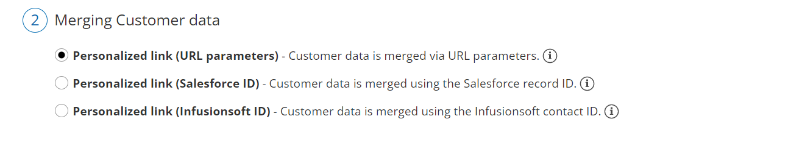
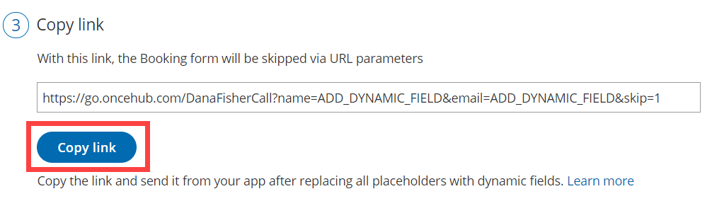

import { Aside } from "@astrojs/starlight/components";

Personalized links using [URL parameters](/scheduleonce/sharing-publishing/personalized-links/url-parameters-syntax-and-processing-rules "ScheduleOnce URL parameters and processing rules") are [Booking page](/scheduleonce/event-types-booking-pages/booking-pages/introduction-to-booking-pages "Introduction to Booking pages") links that contain Customer information and [Booking form](/scheduleonce/customization-branding/booking-forms-editor/introduction-to-booking-forms-editor "Introduction to the Booking forms editor") data. With **Personalized links (URL parameters)**, prospects and Customers click on your Booking page link and pick a time, without having to provide any information that is already known to you.

The Booking form can either be [prepopulated with their details](/scheduleonce/event-types-booking-pages/booking-forms-redirect/prepopulated-booking-forms "Prepopulated Booking forms") or skipped altogether. You can also add [source tracking](/scheduleonce/managing-bookings/analytics/using-oncehub-with-utm-tracking "Using ScheduleOnce with source tracking (UTM tags)") tags to personalized Booking page links, letting you analyze where your bookings come from.

<Aside type="note">

&#x20;When you use Personalized links with Booking pages that are [not associated with any Event types](/scheduleonce/event-types-booking-pages/booking-pages/adding-event-types-to-booking-pages "Adding Event types to Booking pages"), it is highly recommended you provide the **Subject** field of your Booking form.

You can do this by going to **Booking pages** on the left **→** Relevant Booking pag&#x65;**→** **Booking form and redirect**. In the **Meeting subject** section, select **Meeting subject is set by the _Owner_ (you)**. You can then enter a meeting subject for your specific business case.

[Learn more about the Subject field](/scheduleonce/event-types-booking-pages/booking-forms-redirect/introduction-to-booking-form-and-redirect "Introduction to the Booking form and redirect section")

</Aside>

## Creating a Personalized link (URL parameters)

1. Go to **Booking** **pages** in the bar on the left → **Booking page → Share & Publish**.

2. Select the **Mail merge** tab.

3. Select the relevant Booking page in the drop-down menu (Figure 1). 

   Figure 1: Select a Booking page drop-down menu

4. In the **Customer data** step (Figure 2), select **Personalized link (URL parameters)**. 

   Figure 2: Customer data step

5. In the **Booking form** **step**, you can select one of the two options below:

   - **Skip the Booking form:** Skipping the Booking form helps you maximize your booking conversions and provides your Customers with a quicker booking process.
   - **Prepopulate the Booking form:** If you select this option, the booking data is visible in the Booking form and can be edited by the Customer before submission. [Learn more about prepopulated Booking forms](/scheduleonce/event-types-booking-pages/booking-forms-redirect/prepopulated-booking-forms "Prepopulated Booking forms")

6. In the **Copy link** step, click **Copy link** to copy the Personalized link to your clipboard (Figure 3). Figure 3: Copy link step

## Adding your own URL parameters

If you need to replace the **ADD_DYNAMIC_FIELD** placeholders (Figure 4) with your own parameters, you can copy the link to a notepad. [Learn more about supported OnceHub URL parameters](/scheduleonce/sharing-publishing/personalized-links/url-parameters-syntax-and-processing-rules "OnceHub URL parameters and processing rules")

Merged values must be properly encoded in order to be passed in the URL. Some characters like at (@), period (.), dash (-) and underscore (\_) are OK, but all URL invalid characters like plus (+) or space ( ) must be URL encoded.

Figure 4: ADD_DYNAMIC_FIELD placeholders

For example, if you use [MailChimp](/scheduleonce/sharing-publishing/personalized-links/personalized-links-in-email-marketing-apps "Using Personalized links (URL parameters) in email marketing apps"), the link might look like this:

\*https://go.oncehub.com/dana?name=\*|NAME|\*&email=\*|EMAIL|\**

In this example, the **\*|NAME|\*** and **\*|EMAIL|\*** fields are merge fields which are replaced with a single Customer name and email respectively during the email campaign, creating a personalized email for each lead in your list.
