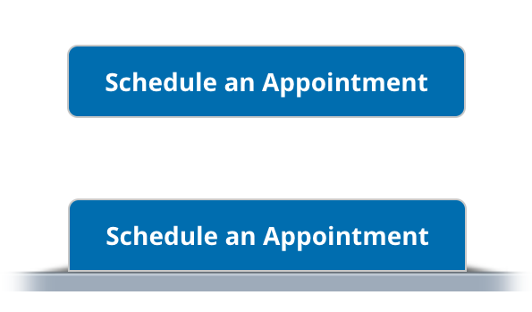

import { Aside } from "@astrojs/starlight/components";
import YouTubeEmbed from "~/components/YouTubeEmbed.astro";

The Website button publishing option can be added to any page on your website, allowing your Customers to schedule without leaving your website. This scheduling method creates an effective call to action, motivating your leads and prospects to schedule with you. The button [text and design can be customized](/scheduleonce/sharing-publishing/publishing-on-websites/website-button-customization "Website button customization") and the scheduling lightbox is fully brandless.

In this article, you'll learn about the Website button publishing option.

<YouTubeEmbed id="1sq8XJhvymI" title="Website button" />

## When should I use a Website button?

Embedding a scheduling pane is an effective solution for several business flows, including:

- Offering scheduling to any site visitor.
- Offering scheduling only to prospects who [fill out your web form](/scheduleonce/sharing-publishing/web-form-integration/introduction-to-web-form-integration "Introduction to Webform Integration").
- Offering scheduling only to top prospects based on specific criteria.

[Learn more about using the Website button business scenarios](/scheduleonce/sharing-publishing/publishing-on-websites/website-button-business-scenarios "Website button - business scenarios")

## Requirements

To embed a scheduling pane on your website, you must be a webmaster for your company's website, or have direct access to your company website’s code.

## Adding a Website button to your website

1. Go to **Booking** **pages** in the bar on the left → **Booking page → Share & Publish**.

2. Select the **Website button** tab (Figure 1).

3. Figure 1: Share icon in top navigation menu

4. In the **Select a button type** step, there are two types of buttons to choose from (Figure 2).

5. - **Add a button anywhere on your page**: The width is determined by the button text. The height is 40px. This button is a standard HTML button and can be positioned anywhere on the page.
   - **Add a floating button**: The width is determined by the button text. This button is a standard HTML button with a fixed position. When you paste the code in an unrestricted location, it should show in the bottom right corner of your web page. 

     Figure 3: Standard button and floating button

6. In the **Configure** step, you can edit the **Button text** and select the **Button color**.

7. In the **Select a Booking page** step, select the [Booking page](/scheduleonce/event-types-booking-pages/booking-pages/introduction-to-booking-pages "Introduction to Booking pages") or [Master page](/scheduleonce/master-pages-resource-pools/master-pages/introduction-to-master-pages "Introduction to Master pages") you want to create the website button for.

8. In the **Customer data** step (Figure 3), select to have Customers fill out the Booking form, or select a [web form integration](/scheduleonce/sharing-publishing/web-form-integration/introduction-to-web-form-integration "Introduction to Webform Integration") option. If you select a [web form integration option](/scheduleonce/sharing-publishing/web-form-integration/introduction-to-web-form-integration "Introduction to Web form integration"), you can select to **Skip the Booking form** or **Prepopulate the Booking form**. Figure 4: Customer data step

9. From the **Button code** step, choose the **Display type**. There are two types of display:

   - **Open in a lightbox:** The Booking page will be displayed in a lightbox on top of your web page.

   - **Open in a new page:** The Booking page will be displayed in a new browser tab.

     <Aside type="note">

     **Note**If you change any Website button settings, you must replace the Website button code you added to your web pages. However, you can always edit the [Booking page settings](/scheduleonce/event-types-booking-pages/booking-pages/introduction-to-booking-pages "Introduction to Booking pages"), [Master page settings](/scheduleonce/master-pages-resource-pools/master-pages/introduction-to-master-pages "Introduction to Master Pages"), and the [theme design](/scheduleonce/customization-branding/theme-designer/introduction-to-theme-designer "The Theme Designer") without updating the code on your web pages.

     </Aside>

10. Click the **Copy code** button to the copy the code to your clipboard.

11. Paste into your website in the following locations, depending on the button type you selected:

    - **The standard website button**: Copy and paste the button code into your web page where you want the button to show.
    - **The floating button**: Copy and paste the button code into your web page just before the closing `</body>` tag.

If you have some basic understanding of CSS, you can apply [further customization](/scheduleonce/sharing-publishing/publishing-on-websites/website-button-customization "Website button customization") (button design and lightbox height) on top of the core settings.

OnceHub handles the lightbox height in one of two ways:

- **Fixed height**: This is the default option and height is set to 580 pixels. You can change the default height to any number you want by changing the height property in the code.
- **Responsive height**: This will automatically adjust the height to the frame content. To use this method, you must delete the height property in the code.

[Learn more about customizing the Website button](/scheduleonce/sharing-publishing/publishing-on-websites/website-button-customization "Website button customization")

## Restrictions for the Website button

- The button and lightbox are an HTML 5 app and are not supported on old browsers, including Microsoft Internet Explorer. [Learn more about our System requirements](/getting-started/introduction-oncehub/oncehub-service-and-support-information "System requirements")
- The button code contains JavaScript, which might be blocked by some low-cost web hosting providers. In this case, you will not be able to embed a booking page on this website.
