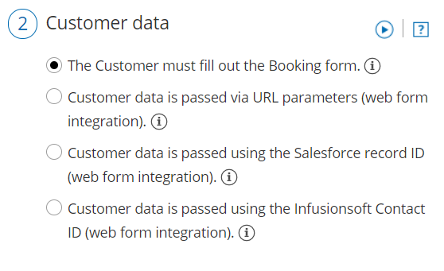

import { Aside } from "@astrojs/starlight/components";

The [Website embed](/scheduleonce/sharing-publishing/publishing-on-websites/website-embed "Website embed") publishing option can be placed on any of your web pages as a call-to-action for your Customers to schedule with you. The design and layout of the embedded scheduling pane can be customized to ensure it fits perfectly on your website. Many embed settings can be customized on the **Share & Publish** page before you copy the code.

For more advanced customization, you can modify properties directly in the code. You can also [collect booking data from an embedded Booking page](https://developers.oncehub.com/docs/client-side-api/collecting-data-from-embedded-booking-page/) for [client-side API use cases](https://developers.oncehub.com/docs/client-side-api/introduction/#use-cases) such as creating a custom confirmation page, enabling client-side integrations, or enriching Customer data profiles.

In this article, you'll learn about customizing the Website embed publishing option.

<Aside type="note">

This article describes customizing the size of the Website embed. The design of the scheduling process itself is determined by the [Theme](/scheduleonce/customization-branding/theme-designer/introduction-to-theme-designer "The Theme Designer") applied on the Overview section of the embedded [Booking page](/scheduleonce/event-types-booking-pages/booking-pages/booking-pages-overview "Booking page: Overview section") or [Master page](/scheduleonce/master-pages-resource-pools/master-pages/master-pages-overview "Master Page: Overview section").

</Aside>

## Requirements

To embed a scheduling pane on your website, you must be a webmaster for your company's website, or have direct access to your company website’s code.

## Customization steps

1. Go to **Booking pages** in the bar on the left → **Booking page → Share & Publish**.
2. Select the **Website embed** tab (Figure 1). 

   Figure 1: Website button tab

3. Select the [Booking page](/scheduleonce/event-types-booking-pages/booking-pages/introduction-to-booking-pages "Introduction to Booking pages") or [Master page](/scheduleonce/master-pages-resource-pools/master-pages/introduction-to-master-pages "Introduction to Master pages") you want to embed on your website.
4. Use the **Width** drop-down menu to select the width of the Scheduling pane outer border.
5. Use the **Color** option to change the color of the border.
6. In the **Customer data** step (Figure 2), select to have Customers fill out the Booking form, or select a [web form integration](/scheduleonce/sharing-publishing/web-form-integration/introduction-to-web-form-integration "Introduction to Webform Integration") option. If you select a [web form integration option](/scheduleonce/sharing-publishing/web-form-integration/introduction-to-web-form-integration "Introduction to Web form integration"), you can select to **Skip the Booking form** or **Prepopulate the Booking form**.

   Figure 2: Customer data step

7. Click the **Copy** button to the copy the code to your clipboard.
8. Paste the code into the relevant location on your website.

After you've pasted the code, you can follow the steps below to modify the embed height and embed width.

## Embed height

- **Fixed height**: This is the default option. The height is set to 550 pixels. You can change the default height to any number you want by changing the height property in the code. When the content is longer, a vertical scroll bar will be added automatically. When the element containing the embed on your website has a height setting, we highly recommend setting the OnceHub height attribute to the same number of pixels as the height setting.
- **Responsive height**: This will automatically adjust the height to the frame content. To use this method you must delete the height property in the code. In this case the height will adapt to the content of each step in the scheduling process. Please note that this **does not effect** the time slot selection step of the booking process. This means that a vertical scroll bar will be added automatically if you have a large amount of times slots available for a given day.

`<!-- ScheduleOnce embed START -->`

`
``
`

``

`<!-- ScheduleOnce embed END -->`

### Embed height recommendations

- For most cases, the default height is the recommended option.
- Modify the Embed height if the content of the steps in your scheduling process is consistently shorter or longer than the default height specified.
- Modify the Embed height to match the height set for the element containing the embed.
- Remove the Embed height attribute completely if you want your Customers to scroll using the external browser scroll bar, rather than the internal embed scroll bar.

## Embed width

The embedded frame width is responsive in the 290–900 pixels range. It automatically adjusts for desktop and mobile devices. Because the embed is fully responsive, it will adjust to the maximum width of its wrapping container element (up to 900 pixels wide).

To ensure the embed remains responsive, we recommend that you don't change the width of the code. If you want to limit the responsiveness of the embed, we recommend wrapping the embed with another element on your page. This can be done by adding a wrapping container around the code:

`
`

`<!-- ScheduleOnce embed START -->`

`
``
`

``

`<!-- ScheduleOnce embed END -->`

`
`

## Add personalized field parameters to the embed

If you've identified your website visitor through marketing campaign tracking, a signed-in customer portal, or any other method, you may already have their details, such as name, email, company, and any other custom data you require from them. In this case, you can autopopulate these fields from a data source on your end (requires additional development) so they don't have to fill out a form with all necessary details you require for that scheduled meeting.

You can send these required field parameters to your embed if you've added the attribute **data-so-qry-prm** to your embed code, along with all relevant fields and their values.

Example of added attribute and field parameters:

data-so-qry-prm="name=ADD%20NAME\&email=ADDEMAIL%40DOMAIN.COM\&mycustomfield=12345"

In the above case, the parameters are specifying a name, email, and a custom field. For instance, the custom field could be a record ID, fetched through a cookie or other communication with your database.

If you'd prefer one of the fields, such as a record ID, be hidden from the Customer in their booking notifications, you can configure it as a [hidden Custom field](/scheduleonce/customization-branding/booking-forms-editor/hiding-fields-on-booking-form).

[Learn more about the syntax for added parameters](/scheduleonce/sharing-publishing/personalized-links/url-parameters-syntax-and-processing-rules)
