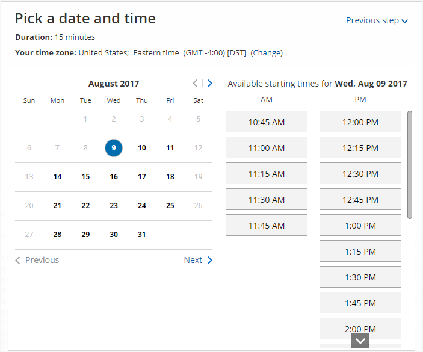

import { Aside } from "@astrojs/starlight/components";

Your Customers can schedule without ever leaving your website if you use our Website embed publishing option. This creates an effective call to action that motivates your leads and prospects to schedule with you. The embedded pane fits into any web page and doesn't show any OnceHub branding.

In this article, you'll learn about the Website embed publishing option.

<iframe
  src="https://www.youtube.com/embed/GZzsZrwCYAw?wmode=opaque&rel=0"
  width="100%"
  height="400"
  frameborder="0"
  allowfullscreen
></iframe>

## When should I use Website embed?

Embedding a scheduling pane is an effective solution for several business flows, including:

- Offering scheduling to any site visitor.
- Offering scheduling only to prospects who [fill out your web form](/scheduleonce/sharing-publishing/web-form-integration/introduction-to-web-form-integration "Introduction to Webform Integration").
- Offering scheduling only to top prospects based on specific criteria.

[Learn more about Website embed business scenarios](/scheduleonce/sharing-publishing/publishing-on-websites/website-embed-business-scenarios "Website embed: Business scenarios")

## Requirements

To embed a scheduling pane on your website, you must be a webmaster for your company's website, or have direct access to your company website’s code.

## Embedding your page onto your website

1. Go to **Booking** **pages** in the bar on the left → **Booking page → Share & Publish**.
2. Select the **Website embed** tab (Figure 1). Figure 1: Website embed
3. Select the [Booking page](/scheduleonce/event-types-booking-pages/booking-pages/introduction-to-booking-pages "Introduction to Booking pages") or [Master page](/scheduleonce/master-pages-resource-pools/master-pages/introduction-to-master-pages "Introduction to Master pages") you want to embed on your website (Figure 1).
4. Use the **Width** drop-down menu to select the width of the Scheduling pane outer border.
5. Use the **Color** option to change the color of the border.
6. In the **Customer data** step (Figure 2), select to have Customers fill out the Booking form, or select a [Web form integration](/scheduleonce/sharing-publishing/web-form-integration/introduction-to-web-form-integration "Introduction to Webform Integration") option. If you select a [web form integration option](/scheduleonce/sharing-publishing/web-form-integration/introduction-to-web-form-integration "Introduction to Web form integration"), you can select to **Skip the Booking form** or **Prepopulate the Booking form**.
7. Click the **Copy code** button to the copy the code to your clipboard.
8. Paste the code into the relevant location on your website.

<Aside type="note">

If you change any Website embed settings, you must replace the Website embed code that you previously added to your web pages.

However, you can edit [Booking page settings](/scheduleonce/event-types-booking-pages/booking-pages/introduction-to-booking-pages "Introduction to Booking pages"), [Master page settings](/scheduleonce/master-pages-resource-pools/master-pages/introduction-to-master-pages "Introduction to Master Pages"), and the [theme design](/scheduleonce/customization-branding/theme-designer/introduction-to-theme-designer "The Theme Designer") without updating the code you added to your web pages.

</Aside>

## Customizing the embedded scheduling pane

If you have a basic understanding of CSS, you can apply [advanced customization](/scheduleonce/sharing-publishing/publishing-on-websites/website-embed-customization "Website embed customization") (embed frame height and width) on top of the core settings. The height can be fixed or responsive.

- **Fixed height**: This is the default option. The height is set to 550 pixels. You can change the default height to any number you want by changing the height property in the code.
- **Responsive height**: This will automatically adjust the height to the frame content. To use this method, you must delete the height property in the code.

[Learn more about customization](/scheduleonce/sharing-publishing/publishing-on-websites/website-embed-customization "Website embed customization")

### The embedded frame layout when width is between 900–541 pixels

### Figure 4: Embedded frame layout when width is between 900–541 pixels

### The embedded frame layout when width is between 540–320 pixels

Figure 5: Embedded frame layout when width is between 540–320 pixels

## Restrictions for Website embed

- The embedded interface is a HTML 5 app and is not supported on old browsers, including Microsoft Internet Explorer. [Learn more about our System requirements](/getting-started/introduction-oncehub/oncehub-service-and-support-information "System requirements")
- The embed code contains JavaScript, which might be blocked by some low-cost web hosting providers. In this case, you will not be able to embed a booking page on this website.
