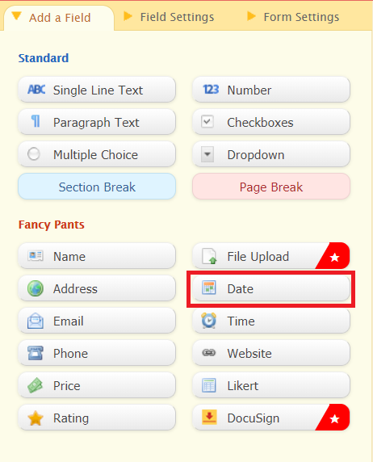

import { Aside } from "@astrojs/starlight/components";

If you don't want your OnceHub Booking page to be available to the general public, you can put a form in front of your [Booking page](/scheduleonce/event-types-booking-pages/booking-pages/introduction-to-booking-pages "Introduction to Booking pages") to act as a "gatekeeper". When your Customers access the Booking page, they will be prompted to provide a password before the form is displayed.

Some third-party forms and custom forms can require a password. To protect your Booking page with a password, ensure that you’re using [web form integration](/scheduleonce/sharing-publishing/web-form-integration/introduction-to-web-form-integration "Introduction to Webform Integration") and that your lead generation form provides this functionality.

In this article, you'll learn about creating a password-protected Booking page.

## Why would I need to create a password-protected Booking page?

You may offer appointments to a specific company and don’t want non-employees to be able to schedule. By protecting your Booking page with a password, you can selectively provide the password only to those Customers who should be allowed to access it.

Password protection also acts as an additional layer of security.

## Creating a password-protected Booking page

In this example, your [Wufoo form](http://www.wufoo.com/) will act as the “gatekeeper” to your Booking page.

1. [Integrate OnceHub with your Wufoo form using URL parameters](/scheduleonce/sharing-publishing/web-form-integration/integrating-web-forms-using-url-parameters "Integrating your Web form with ScheduleOnce using URL parameters")
2. In Wufoo, create a new form or edit an existing form. Ensure that your Wufoo form includes the **Customer name** and **Email** fields.
3. Use [Wufoo’s templating feature](http://help.wufoo.com/articles/en_US/SurveyMonkeyArticleType/Templating) to pass the field content to OnceHub.
4. In the Wufoo **Form Manager**, hover over your form and click the **Set password** button (Figure 1).Figure 1: Wufoo Form Manager
5. Enter a password for the page and save the changes.

Your Wufoo form is now configured to ask Customers for a password before the form can be displayed.

You should use one of the Wufoo sharing options to invite your Customers to schedule. Make sure to provide your Customers with the password.

Your Customers will be able to enter the password, fill out the form, and make a booking without having to fill out the OnceHub Booking form.

<Aside type="caution">

Don’t share the OnceHub Booking page directly with your Customers as this will bypass the additional logic from the Wufoo form step.

</Aside>
