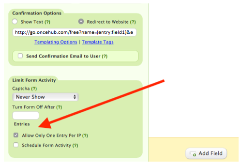

import { Aside } from "@astrojs/starlight/components";

In some cases, you may want to ensure that Customers can only make a single booking. For example, you may offer a free consultation to new prospects, but you don’t want people to exploit this and request multiple bookings. By restricting Customers to a single booking, you can control the time and resources you spend with each of your prospects and prevent accidental duplicate bookings.

In this article, you'll learn about using web forms to allow only one booking per Customer.

## Using your web form as a gatekeeper

When you place a web form at the beginning of the scheduling process before your [Booking page](/scheduleonce/event-types-booking-pages/booking-pages/introduction-to-booking-pages "Introduction to Booking pages"), you can use the form as a gatekeeper. The form will filter out Customers that have already made a booking and prevent them from continuing to OnceHub. Customers who are making their first booking won’t have to provide any details that they have already provided on the form. [Learn more about web form integration](/scheduleonce/sharing-publishing/web-form-integration/introduction-to-web-form-integration "Introduction to Webform Integration")

Different third-party forms and custom forms provide this logic in different ways. Typically, the form can filter customers based on a duplicate Customer email address, custom field, or an IP address. We'll look at a typical solution using [Wufoo forms](http://www.wufoo.com/).

## Requirements

To integrate your web form with OnceHub, you must ensure that the web form can [pass URL parameters to the OnceHub Booking page](/scheduleonce/sharing-publishing/web-form-integration/integrating-web-forms-using-url-parameters "Integrating your Web form with ScheduleOnce using URL parameters").

In the examples below, your Wufoo form will act as the gatekeeper to your Booking page. Your web form should include the Customer name and email fields and pass their content to OnceHub using [Wufoo’s templating feature](http://help.wufoo.com/articles/en_US/SurveyMonkeyArticleType/Templating).

## Restricting bookings based on a Customer email address

1. In Wufoo, select the webform that you want to edit.
2. Select the **Field settings** tab.
3. In the preview pane on the right, select the **Email** field.
4. In the **Field settings** pane on the left, check the box marked **No Duplicates** (Figure 1). 

   Figure 1: No Duplicates option

5. Click **Save**.

If required, you can also use the **No Duplicates** option on other fields such as the **Phone Number** field.

## Restrict bookings based on a Customers IP address

1. In Wufoo, select the webform that you want to edit.
2. Select the **Form settings** tab.
3. In the **Limit Form Activity** section, check the box marked **Allow Only One Entry Per IP** (Figure 2). 

   Figure 2: Allow Only One Entry Per IP option

4. Click **Save**.

Your Wufoo form is now configured to allow one booking per Customer. Next, you can use one of the [Wufoo sharing options](http://help.wufoo.com/articles/en_US/SurveyMonkeyArticleType/Share) to invite your Customers to schedule. You should not share your OnceHub Booking page link directly with your Customers as this will bypass the Wufoo form step.
