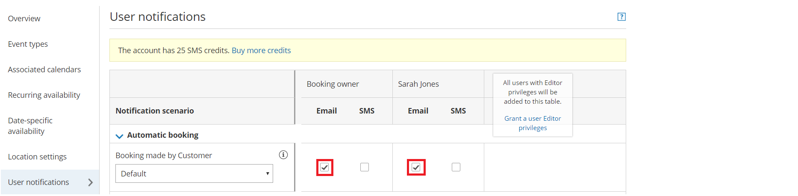

import { Aside } from "@astrojs/starlight/components";

This article is relevant to Users who have difficulty [connecting to their domain mailbox](/corporate-email-account) and in cases where the feature has suddenly stopped working.

## Setup troubleshooting

If one of your email details was entered incorrectly you will receive the following message: “Unable to connect to your mail server. Please check your details and try again.”

Be sure that the following fields are entered correctly, then try connecting again.

- Email address
- Password
- SMTP server
- Email port

### Internally hosted email servers

If your mail server is hosted in-house behind a firewall, you will need to update your firewall settings to allow OnceHub to access your mail server. Please [contact us](/contact-us/) for more information on how to update your firewall settings.

### Incorrect password

When you use G Suite 2-step verification, you'll need to generate an app-specific password in the Google Account and use it as your password in the **Corporate Email** page.

[Learn more about G Suite passwords](https://support.google.com/accounts/answer/185833?hl=en)

If you don't use G Suite 2-step verification, but you're still experiencing password issues, you'll need to enable basic authentication for your Google Account.

[Learn more about enabling basic authentication for your Google account](/scheduleonce/user-integrations/google-calendar-connection/troubleshooting/connection-error-email-from-your-google-email-server "Unable to connect to the Google email server in Email from your domain")

## Delivery troubleshooting

### Emails have never been received

Hover over the lefthand menu and go to the Booking pages icon → Booking pages → your [Booking page](/scheduleonce/event-types-booking-pages/booking-pages/introduction-to-booking-pages "Introduction to Booking pages"). Check the [User notifications](/scheduleonce/event-types-booking-pages/user-notifications/introduction-to-user-notifications "Introduction to User notifications section") and [Customer notifications](/scheduleonce/event-types-booking-pages/customer-notifications/introduction-to-customer-notifications "The Customer notifications section") sections to ensure that the email checkboxes are selected for the notifications you wish to receive (Figure 2). If you're using [Event types](/scheduleonce/event-types-booking-pages/event-types/introduction-to-event-types "Introduction to Event types"), the [Customer notifications will be in each Event type](/scheduleonce/event-types-booking-pages/customer-notifications/introduction-to-customer-notifications "The Customer notifications section").

Figure 2: User notifications section

The emails could also be going to the SPAM folders of the receivers. You can verify this by sending yourself a test email and then checking your SPAM folder to see if the email is there. To send a test email, click the gear icon in the top right -> **Security (and Compliance)** -> **Corporate Email** -> enter your email address in **Test your email** -> click on **Send**.

Another issue could be that your email or domain has been blacklisted by the receiver’s email service provider. Email service providers sometimes blacklist emails that they consider to be problematic. To avoid this, don’t use your email account for activities that might be considered spamming.

### Emails are no longer being received from your connected domain and are received from OnceHub Mailer

If you stopped receiving emails from your connected email domain and you're receiving emails from the OnceHub Mailer instead, some settings on your email domain may have changed.

<Aside type="note">

Connection errors may be encountered when emails are sent from your domain. In such cases, an automatic fallback sends emails from the OnceHub mailer until the connection is restored. This ensures that Users and Customers will continue to receive booking-related notifications.

</Aside>

- If you've changed your email password, you'll need to disconnect and reconnect your [Corporate Email](/corporate-email-account).
- If you've recently set up G Suite 2-step verification, you should generate an App password via Google and enter this in the password field under the [Corporate Email](/corporate-email-account) settings. [Learn more about G Suite passwords](https://support.google.com/accounts/answer/185833?hl=en)
- You might be over the daily sending quota for your connected mailbox that is allowed by your email service provider. Check with your email service provider.
- The emails could be going into SPAM. This can be verified by sending a test email and checking the SPAM folder to see if the email is there. To send a test email, go to the **Corporate Email** page.
- Your email or domain may have been blacklisted by the receiver’s email service provider. Email service providers sometimes blacklist emails that they consider to be problematic. To avoid this, don’t use your email account for activities that might be considered spamming.
