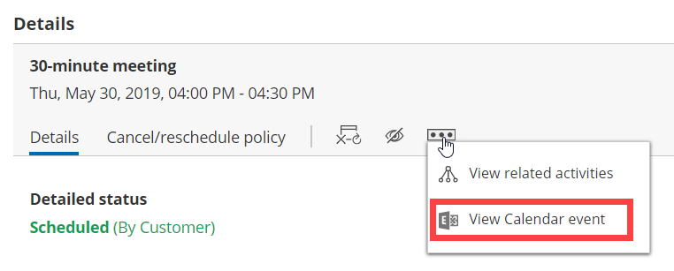

import { Aside } from "@astrojs/starlight/components";

This article describes potential issues with [Exchange/Outlook Calendar](/scheduleonce/user-integrations/exchange-outlook-calendar-connection/managing-your-oncehub-integration-with-microsoft-exchange-calendar "Connecting to your personal Exchange Calendar") integration and how these issues can be fixed.

## Unable to connect to the Exchange server

The [Exchange/Outlook Calendar connection wizard](/scheduleonce/user-integrations/exchange-outlook-calendar-connection/managing-your-oncehub-integration-with-microsoft-exchange-calendar "Connecting to your personal Exchange Calendar") will take you through the shortest and easiest way to connection. You will first be asked for your Outlook email and password, and then additional fields may be required.

- **Email:** Verify that you entered your Outlook email address correctly.

- **Password:** Verify that you entered your Outlook password correctly. Test that your password is valid by connecting to your OWA (Outlook Web App) in your browser. The password is correct only if you succeed. If your Exchange account is [set up with 2-step verification](https://support.office.com/en-us/article/set-up-2-step-verification-for-office-365-ace1d096-61e5-449b-a875-58eb3d74de14), you must [create an app password](https://support.microsoft.com/en-us/account-billing/manage-app-passwords-for-two-step-verification-d6dc8c6d-4bf7-4851-ad95-6d07799387e9) first, and then use this special password to connect your OnceHub Account to your Exchange/Outlook Calendar.

- **EWS URL:** Verify that you entered the correct URL. [Learn how to determine your EWS URL](/user-integrations/exchange-outlook-calendar-connection/how-to-determine-ews-url "How to determine the EWS URL")

- **Domain\UserName:** Depending on the Exchange configuration, this field may be left blank OR require your Windows Domain\UserName:

  - **Domain:** This can be the Windows domain that you log into when entering internal systems or your PC. Try searching your organization’s instructions about connecting your email client or mobile phone to your mailbox. It can be any name selected by your system administrators. The domain may not be required, depending on your server's configuration.
  - **Backslash:** Make sure you are using a backslash (the symbol \ and not /) between the domain and the user name. If you don't need to include the domain in your credentials, you won't need a backslash.
  - **User name:** This is usually the ID you use to access internal systems. Use your internal ID, with which you log into internal systems (Windows Active Directory name or User Principal Name).

If you verified that all values are correct and were entered exactly in the required format, and are still not able to connect, this means the connection is failing due to either a firewall issue or some Exchange setting or configuration. Contact your IT support to troubleshoot and resolve the issue.

<Aside type="note">

You can test your credentials using the [Microsoft Remote Connectivity Analyzer](/user-integrations/exchange-outlook-calendar-connection/testing-exchange-connectivity "Testing Exchange connectivity"). This is a useful tool for verifying the availability of Exchange Web Services (EWS) connection and the connectivity of the Exchange server.

</Aside>

## Connection errors after a successful connection

Once a successful connection is established, it may fail due to the reasons described below.

<Aside type="caution">

During a connection failure, **OnceHub Booking pages cannot accept bookings**. This measure is taken to prevent the possibility of double bookings.

</Aside>

To re-enable bookings and meetings, you must either restore the connection by reconnecting, or disconnect your calendar by clicking the **Disconnect** link and then reconnect again.

Possible connection failure reasons include:

- **Change of password:** If your Exchange/Outlook password was changed or your [app password](https://support.office.com/en-us/article/create-an-app-password-for-office-365-3e7c860f-bda4-4441-a618-b53953ee1183 "Connect to Office 365 calendar with app-specific password") was deleted, you will need to reconnect. Sign in to your OnceHub Account, go to the left sidebar and click **Profile** **→&#x20;**&#x20;**Calendar connection**, then click the **Reconnect your Exchange/Outlook Calendar** button.
- **Change of Exchange or network configuration:** Your administrator may have changed the Exchange settings, firewall settings, or access permissions. Contact your IT support to find out about such changes.
- **Temporary disconnection:** Sometimes a connection may be temporarily lost, for example during network maintenance. Once the issue is resolved, the connection is restored automatically.

## Configuration issues in OnceHub

### Busy time in Exchange/Outlook Calendar is not blocking my availability in OnceHub

If busy time is not blocking your availability, you can check the following settings:

- On the relevant Booking page **→ Associated calendars**: Make sure that you're retrieving busy time from this calendar. [Learn more about the Associated calendars section](/scheduleonce/event-types-booking-pages/booking-pages/booking-pages-associated-calendars "Booking page: Associated calendars section")

- On the relevant Booking page **→ Scheduling options → One-on-one or Group sessions**: Make sure you haven't set the option to [Group sessions with multiple or unlimited bookings per slot](/scheduleonce/event-types-booking-pages/scheduling-options/one-on-one-or-group-sessions "One-on-One or Group session").

  <Aside type="note">

  **Note**If you're using [Event types](/scheduleonce/event-types-booking-pages/event-types/introduction-to-event-types "Introduction to Event types"), the [Scheduling options section](/scheduleonce/event-types-booking-pages/scheduling-options/location-of-scheduling-options "Location of the Scheduling options section") is located on the Event type. In this case, you will need to review the **One-on-one or Group sessions** setting in all Event types.

  </Aside>

- If you are working in [Booking with approval mode](/scheduleonce/event-types-booking-pages/scheduling-options/automatic-booking-or-booking-with-approval "Automatic booking or Booking with approval"), make sure that you did not approve two separate bookings in the same time slot.

- In your connected calendar, open the event that is not blocking your availability and check that the status of the event is not set to "Free". Only events with a status of "Busy" block your availability. [Learn more about when Exchange/Outlook Calendar events are treated as busy time in OnceHub](/scheduleonce/user-integrations/exchange-outlook-calendar-connection/managing-your-oncehub-integration-with-microsoft-exchange-calendar "When are Exchange Calendar events treated as busy in OnceHub?")

### New bookings are not added to my Exchange/Outlook Calendar

1. Hover over the lefthand menu and go to the Booking pages icon → Booking pages → your Booking page → **Associated calendars**.
2. Make sure your calendar is marked as the **Main booking calendar** or an **Additional booking calendar**. [Learn more about the Associated calendars section](/scheduleonce/event-types-booking-pages/booking-pages/booking-pages-associated-calendars "Booking page: Associated calendars section")

### I cannot see my scheduled booking in my Exchange/Outlook Calendar

In your Exchange/Outlook Calendar, make sure that you've selected the calendar that your meeting was scheduled in. Find it in the calendar list in the left bar and click it to select it.

In OnceHub, you can also select the activity in the [Activity stream](/scheduleonce/managing-bookings/analytics/activity-stream-viewing-activities "Introduction to the ScheduleOnce Activity stream"), then click the action menu (three dots) in the right-hand pane and select **View Calendar event** (Figure 1).

Figure 1: View Calendar event

## Other issues

[Contact OnceHub support](/contact-us/) if you experience other issues.
