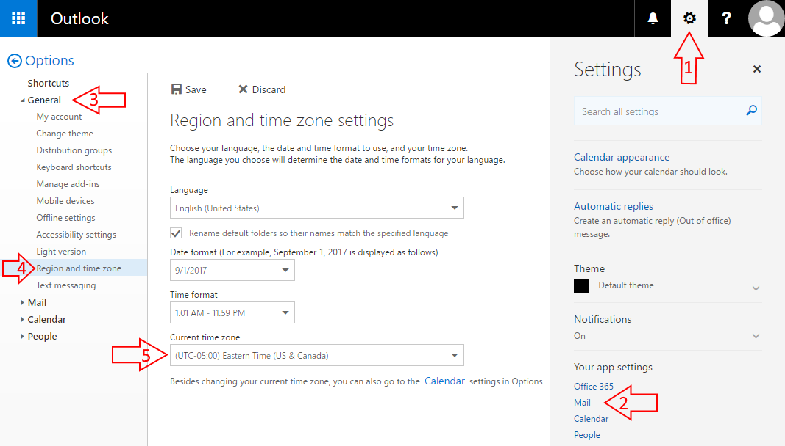

import { Aside } from "@astrojs/starlight/components";

If busy times appear in wrong hours on OnceHub or in your Outlook Calendar, there may be a time zone difference between your Outlook's time zone and the time zone on your [Booking page](/scheduleonce/event-types-booking-pages/booking-pages/introduction-to-booking-pages "Introduction to Booking pages"). To change the time zone:

- Go to the relevant Booking page. In the **Overview** section, select the new time zone and save.

* **In your Outlook client:** To change the time zone in Outlook, click on **File → Options → Calendar settings**. In the time zone area, select the new time zone and save. Note: The time zone of Outlook client is the same as your PC. Reload/refresh the OnceHub page to reflect the change.

* **In your web Outlook via the browser** (Figure 2)**:** Figure 2: Outlook calendar region and time zone section

  1. Click **settings icon**.
  2. Click **Mail**.
  3. Click **General**.
  4. Click **Region and time zone**.
  5. Set **your time zone**.
