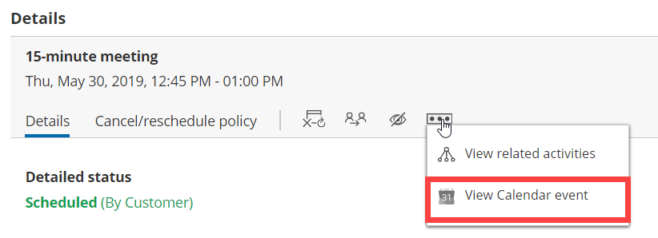

import { Aside } from "@astrojs/starlight/components";

This article describes potential issues with [Google Calendar](/user-integrations/google-calendar-connection/connect-oncehub-to-your-google-workspace "Connecting and configuring your Google Calendar") integration and how these issues can be fixed.

## I cannot connect - what should I do?

This may be due to temporary communication problems with the Google Calendar API. Please try the following:

1. Make sure cookies are enabled on your browser
2. Verify that you can log in to your G Suite account
3. Try to connect again from OnceHub. In your OnceHub account, go to **Profile → User Integrations → Google Workspace** and click **Connect**.

## Connection errors after a successful connection

<Aside type="caution">

During a connection failure, **OnceHub Booking pages cannot accept bookings**. This measure is taken to prevent the possibility of double bookings.

</Aside>

Once a successful connection was established, it may fail because of Google token expiration. The [Google token](https://developers.google.com/identity/protocols/OAuth2#expiration) might expire for one of the following reasons:

- Your password is no longer valid and the token must be renewed. It might be because you updated the password in your Google account.
- There were no activities in the past 6 months with your Google Calendar. As a result, the token wasn't used for 6 months and expired.
- You might have additional tokens used for other applications and your Google account has exceeded the limit of token requests. Therefore, the OnceHub token has expired.

In all cases, the OnceHub access to your Google Calendar has been revoked and you must renew your connection. Sign in to your OnceHub Account, go to the left sidebar and click **Profile → User Integrations → Google Workspace** and click **Reconnect**.

## Why do my busy times appear in wrong hours?

This might be due to differences between the time zone in your connected Google Calendar and the time zone in the User profile of your OnceHub account. Both must be the same.

In OnceHub, click on your profile image or initials in the top right corner and select **My profile**. In the **Date and time** section, edit the time zone.

In Google Calendar, click the settings icon, then choose Settings. Update the time zone under "Primary time zone".

## Configuration issues in OnceHub

### Busy time in Google Calendar is not blocking my availability

If busy time is not blocking your availability, you can check the following settings:

- On the relevant Booking page **→ Associated calendars**: Make sure that you're retrieving busy time from this calendar. [Learn more about the Associated calendars section](/scheduleonce/event-types-booking-pages/booking-pages/booking-pages-associated-calendars "Booking page: Associated calendars section")

- On the relevant Booking page **→ Scheduling options → One-on-one or Group sessions**: Make sure you haven't set the option to [Group sessions with multiple or unlimited bookings per slot](/scheduleonce/event-types-booking-pages/scheduling-options/one-on-one-or-group-sessions "One-on-One or Group session").

  <Aside type="note">

  **Note**If you're using [Event types](/scheduleonce/event-types-booking-pages/event-types/introduction-to-event-types "Introduction to Event types"), the [Scheduling options section](/scheduleonce/event-types-booking-pages/scheduling-options/location-of-scheduling-options "Location of the Scheduling options section") is located on the Event type. In this case, you will need to review the **One-on-one or Group sessions** setting in all Event types.

  </Aside>

- If you are working in [Booking with approval mode](/scheduleonce/event-types-booking-pages/scheduling-options/automatic-booking-or-booking-with-approval "Automatic booking or Booking with approval"), make sure that you did not approve two separate bookings in the same time slot.

- In your connected calendar, open the event that is not blocking your availability and check that the status of the event is not set to "Free". Only events with a status of "Busy" block your availability. [Learn more about when Google Calendar events are treated as busy time in OnceHub](/user-integrations/google-calendar-connection/managing-your-oncehub-integration-with-google-workspace "When are Google events treated as busy in OnceHub?").

### New bookings are not added to your Google Calendar

1. Hover over the lefthand menu and go to the Booking pages icon → Booking pages → your Booking page → **Associated calendars**.
2. Make sure your calendar is marked as the **Main booking calendar** or an **Additional booking calendar**. [Learn more about the Associated calendars section](/scheduleonce/event-types-booking-pages/booking-pages/booking-pages-associated-calendars "Booking page: Associated calendars section")

### I cannot see my scheduled booking in my Google Calendar

In your Google Calendar, make sure that the calendar in which your meeting was scheduled is selected. Find it in the calendar list in the left bar and click it to select it.

In OnceHub, you can also select the activity in the [Activity stream](/scheduleonce/managing-bookings/analytics/activity-stream-viewing-activities "Introduction to the ScheduleOnce Activity stream"), then click the action menu (three dots) in the right-hand pane and select **View Calendar event** (Figure 1).

Figure 1: View Calendar event

### Why do my busy times appear in wrong hours?

This might be due to differences between the time zone in your connected Google Calendar and the time zone on your Booking page. Both must be the same.

Hover over the lefthand menu and go to the Booking pages icon → Booking pages → your Booking page → **Overview**, and edit the time zone.

In Google Calendar, click the settings icon, then choose Settings. Update the time zone under "Primary time zone".
