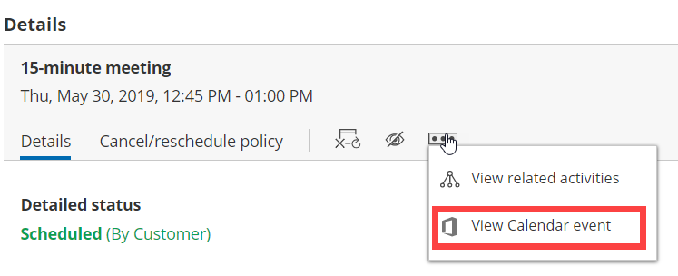

import { Aside } from "@astrojs/starlight/components";

This article describes potential issues with your [Office 365 Calendar via OAuth 2.0 connection](/user-integrations/ms-office365-calendar-connection/connect-oncehub-to-your-microsoft-office-365 "Connecting to Office 365 Calendar with OAuth 2.0") and how these issues can be fixed.

## I cannot connect. What should I do?

This may be due to temporary communication problems with the Office 365 API. Please try the following:

1. Make sure cookies are enabled on your browser.
2. Verify that you can log in to your Office 365 account.
3. Try to connect again from your OnceHub account.

## Connection errors after a successful connection

Once a successful connection was established, it may fail due to reasons described below.

<Aside type="caution">

During a connection failure, **OnceHub Booking pages cannot accept bookings**. This measure is taken to prevent the possibility of double bookings.

</Aside>

To re-enable bookings and meetings, you must either restore the connection by reconnecting, or [disconnect your calendar](/user-integrations/basics-user-integrations/what-you-need-to-know-before-disconnecting-your-calendar "Disconnecting a calendar") by clicking the **Disconnect** link and then reconnect again.

Possible connection failure reasons include:

- **Change of Office 365 or network configuration:** Your administrator may have changed the Office 365 settings, firewall settings, or access permissions. Contact your IT support to find out about such changes.
- **Temporary disconnection:** Sometimes a connection may be temporarily lost, for example during network maintenance. Once the issue is resolved, the connection is restored automatically.

## Configuration issues in OnceHub

### Busy time in Office 365 Calendar is not blocking my availability in OnceHub

If busy time is not blocking your availability, you can check the following settings:

- On the relevant Booking page **→ Associated calendars**: Make sure that you're retrieving busy time from this calendar. [Learn more about the Associated calendars section](/scheduleonce/event-types-booking-pages/booking-pages/booking-pages-associated-calendars "Booking page: Associated calendars section")

- **On the** relevant Booking page **→ Scheduling options → One-on-one or Group sessions**: Make sure you haven't set the option to [Group sessions with multiple or unlimited bookings per slot](/scheduleonce/event-types-booking-pages/scheduling-options/one-on-one-or-group-sessions "One-on-One or Group session").

  <Aside type="note">

  **Note**If you're using [Event types](/scheduleonce/event-types-booking-pages/event-types/introduction-to-event-types "Introduction to Event types"), the [Scheduling options section](/scheduleonce/event-types-booking-pages/scheduling-options/location-of-scheduling-options "Location of the Scheduling options section") is located on the Event type. In this case, you will need to review the **One-on-one or Group sessions** setting in all Event types.

  </Aside>

- If you are working in [Booking with approval mode](/scheduleonce/event-types-booking-pages/scheduling-options/automatic-booking-or-booking-with-approval "Automatic booking or Booking with approval"), make sure that you did not approve two separate bookings in the same time slot.

- In your connected calendar, open the event that is not blocking your availability and check that the status of the event is not set to "Free". Only events with a status of "Busy" block your availability.

### New bookings are not added to my Office 365 Calendar

1. Hover over the lefthand menu and go to the Booking pages icon → Booking pages → your Booking page → **Associated calendars**.
2. Make sure your calendar is marked as the **Main booking calendar** or an **Additional booking calendar**. [Learn more about the Associated calendars section](/scheduleonce/event-types-booking-pages/booking-pages/booking-pages-associated-calendars "Booking page: Associated calendars section")

### I cannot see my scheduled meeting in my Office 365 Calendar

In your Office 365 Calendar, make sure that you've selected the calendar that your meeting was scheduled in. Find it in the calendar list in the left bar and click it to select it.

In OnceHub, you can also select the activity in the [Activity stream](/scheduleonce/managing-bookings/analytics/activity-stream-viewing-activities "Introduction to the ScheduleOnce Activity stream"), then click the action menu (three dots) in the right-hand pane and select **View Calendar event** (Figure 1).

Figure 1: View Calendar event
