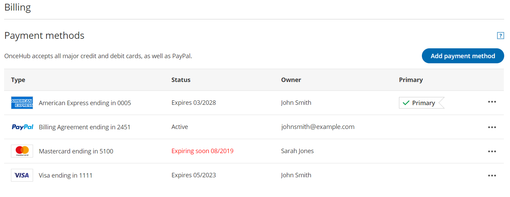
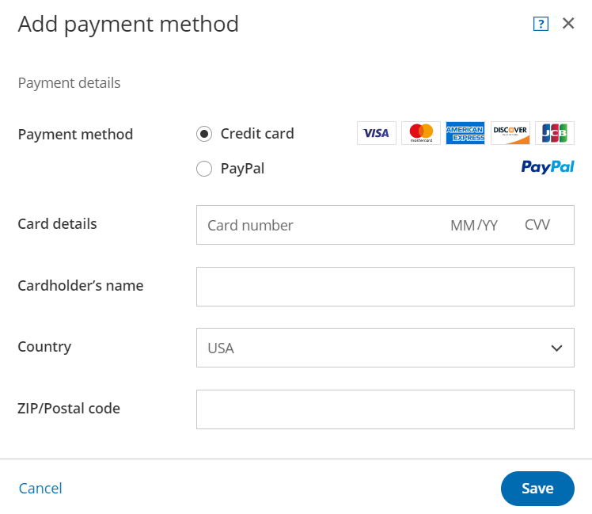
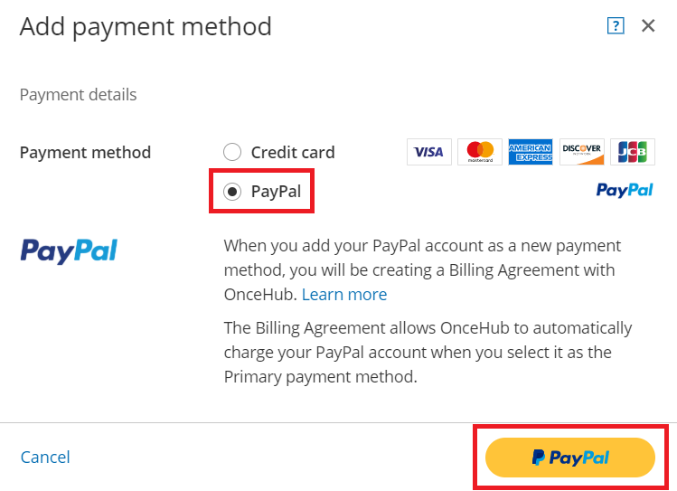
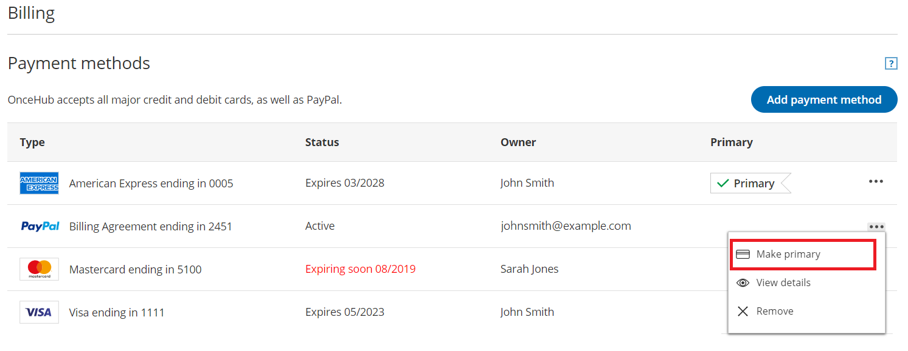
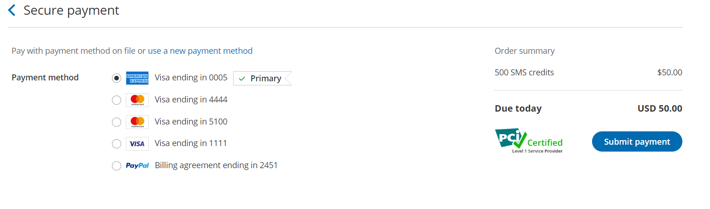

import { Aside } from '@astrojs/starlight/components';

The Billing section stores your primary payment method and secondary payment methods.

*   OnceHub supports debit cards, credit cards, and PayPal. 
*   The primary payment method is automatically used for all your transactions.
*   You can also store secondary payment methods in your account. These are used if your primary payment method fails. Storing secondary payment methods allows you to conveniently switch payment methods when you make a purchase. It also ensure that your account stays active when there's an issue with your primary payment method by automatically charging the secondary method. 

#### Managing payment methods

Primary payment methods and secondary payment methods are stored in your OnceHub Account in the **Billing**  → **Payment methods** section. You can add or remove payment methods at any time. You can also change the primary payment method as needed.

Read on to learn about managing payment methods in your OnceHub Account.

# Requirements

To manage payment methods, you must be a [OnceHub Administrator](/user-type-member-vs-admin/ "Differences between Administrator and Member").

# 

OnceHub supports all major credit cards and debit cards. Supported cards include Visa, Mastercard, American Express, Discover, and JCB. OnceHub also supports PayPal.

## Primary payment method

When you purchase a product for the first time, the payment method you use is stored as the primary payment method in the **Billing** → **Payment methods** section of your OnceHub Account. You can only have one primary payment method at a time. 

You can also add an additional payment method and then set it as your primary payment method in the **Billing** → **Payment methods** section.

## Secondary payment methods

Secondary payment methods are stored in your OnceHub Account and are only used automatically as a backup method when your primary payment method doesn't work. 

Storing secondary payment methods allows you to switch payment methods when making one-off purchases, resume payment after a failed recurring payment, or change the payment method used for recurring payments. You can store as many additional payment methods in your OnceHub Account as you need.

# 

#### Adding a payment method in the Payment methods section

If you've already purchased a OnceHub product subscription, you can add a payment method at any time.

1.  Sign in to your OnceHub Account. 
2.  Select the gear icon in the top navigation menu → **Billing** → **Payment methods**._Figure 1: Payment methods section_
3.  Click the **Add payment method** button.
4.  The **Add payment method** pop-up will appear. 

You can now decide if you want to add a credit card or a PayPal account. 

#### Adding a credit card

#### 

## Supported cards

OnceHub supports all major credit cards and debit cards. Supported cards include Visa, Mastercard, American Express, Discover, and JCB.

Primary payment methods and additional payment methods are stored in your OnceHub Account in the **Billing** → **Payment methods** section. You can add or remove payment methods at any time. You can also change the primary payment method as needed.

You can only add a credit card as a payment method after your first purchase. In the case of a credit card nearing its expiration date, simply add your new card as the primary payment method.  Learn how to add a credit card in **Billing** → **Payment methods**.

## Compliance

OnceHub is a PCI DSS level 1 service provider. Our payment security is paramount, and has achieved certified compliance against all PCI DSS version 3.2 requirements. OnceHub strictly adheres to these standards to safeguard your payment data before, during and after purchase. Our ongoing commitment to payment protection includes regular validation by an independent PCI Qualified Security Assessor (QSA). You can rest assured, your organization's payment information is protected by the global standard in payment card security.

For more information, visit our Trust Center.

      1. In the **Payment method** section, select **Credit card** (Figure 2).  
  
_Figure 2: Selecting credit card as the payment method_

    2. Enter your card information. 

    3. Click **Add payment method**. 

The credit card is added to your OnceHub Account as an additional payment method. 

## 

#### Adding a PayPal Account

# 

The Billing Agreement is an agreement between you and OnceHub which allows OnceHub to automatically charge your PayPal account for purchases made in your OnceHub Account. The Billing Agreement is handled entirely by PayPal.

     1. In the **Payment method** section, select **PayPal** (Figure 3).  
  
_Figure 3: Selecting PayPal as the payment method_

      2. Click the **PayPal** button (Figure 2). 

       3. On the PayPal login page, enter your PayPal login details and click **Log In**. 

       4. Select the card you want to use or add a new card. 

5.  Click **Continue**.
6.  Click **Agree & Continue** to authorize the creation of a Billing agreement between OnceHub and your PayPal account.  
    If authorization is successful, the Billing agreement with PayPal is created and added as a payment method.
7.  Click **Close** to return to the **Payment methods** section. 

The PayPal payment method is added to your OnceHub Account as an additional payment method.

**Note**

To remove a payment method, click the action button (three dots) in the row of the specific payment method you want to remove. Then, click **Remove**.

## 

#### Setting an additional payment method as the primary payment method

1.  #### In your OnceHub Account, go to the **Billing** → **Payment methods** section.
    
2.  Click on the action menu (three dots) in the row of the card that you want to set as your primary payment method. 
3.  Select **Make primary** from the drop-down menu. _Figure 4: Payment methods action menu_

**Note**

The previous primary payment method will become an additional payment method.

# 

#### Changing payment methods

# Changing the payment method used for recurring payments

Recurring monthly or annual subscription payments are automatically charged to the primary payment method. 

We will select the previously-selected payment method as the default payment method. To use a different payment method for recurring payments, you'll need to add it as an additional payment method and then set it as the primary payment method.

# Using a payment method on file to make a one-off purchase

When you make a one-off purchase on your OnceHub Account, such as purchasing SMS credits, you can choose to pay with a payment method you have already added or pay with a new payment method (Figure 4). 

*   If you choose to pay using an existing additional payment method, the additional payment method automatically becomes your primary payment method. The previous primary payment method will become an additional payment method.
*   If you choose to **use a new payment method**, the new payment method will be stored in the **Payment methods** section and become your primary payment method. The previous primary payment method will become an additional payment method.

_Figure 5: Selecting a payment method when making a one-off purchase_

#### Recovering from a failed recurring payment

If we are unable to process your payment at the start of your billing cycle, you will be prompted to establish a new recurring payment method to settle the outstanding payment and resume your subscription. 

The new payment method will be stored in the **Payment methods** section and become your primary payment method. The previous primary payment method will become an additional payment method.

#### 

You are charged a recurring monthly or yearly fee for your OnceHub seat subscription(s), always billed in advance. If we are unable to process your payment at the start of your billing cycle, you will immediately receive an email notification. You can define who receives this notification in your billing notification settings.

## What happens when my payment cannot be processed?

When your payment cannot be processed, your secondary payment method will be charged automatically. If neither can be charged, or you don't have a secondary payment method, you will have a 7-day grace period to update your payment details. During this time, you can continue to use the application as normal. Customers can still make bookings and chat live with you. 

If you do not renew your payment after 7 days, your account will move to account suspension status. This means you will not be able to access your configuration or utilize any features, including scheduling, live chat, or instant calls. You will be able to update your payment information when you sign in. 

If you fail to update your payment method within 14 days, your account's seats will be suspended permanently. 

All your account's chatbots, booking pages, booking calendars, and forms will be saved. If you would like to resume your account in future, you can repurchase your subscription and reconfigure assignment for live engagements and scheduled meetings.

We'll send you email notifications when your payment cannot be processed, when the account goes into account suspension status, and again once your seats are suspended permanently. 

# 

## How can I resume payment?

1.  Sign in to your OnceHub Account as an Administrator. 
2.  In the banner below the top navigation bar, click the Resume **payment** link (Figure 1).Figure 1: Payment failure notice
3.  You will be prompted to establish a new recurring payment method for your account. Enter your payment details and click **Submit payment**.

Once your payment has been processed successfully, you'll receive your regular recurring payment email notification, as per your billing notification settings. 

**Note**

Your billing date doesn't change when you resume payment for your subscription. For example, let's say you purchased a monthly subscription and are billed on the 10th of each month. If you resume payment on the 15th of the month, your next billing date will still be the 10th of the following month.

#### Billing notifications

OnceHub provides billing notifications that alert Users to events throughout the billing lifecycle. Billing notifications are managed in your OnceHub Account in the **Billing** → **Notifications** section. You have complete control over which billing notifications are sent and who receives them. 

In this article, you'll learn about the different types of billing notifications and how to control which notifications are sent to each User.

## Who receives billing notifications?

Any User in your OnceHub Account can receive billing notifications. They do not need an assigned product seats. [Learn more](/your-account-user-management/ "User management and licensing")

[OnceHub Administrators](/user-type-member-vs-admin/ "Differences between Administrator and Member") can select which Users in the account should receive billing notifications and decide which billing notifications each User will receive. By default, the OnceHub Administrator who made the first purchase on the account will receive all billing notifications.

**Important**

At least one User must receive payment failure notifications.

## Types of billing notifications

OnceHub provides billing notifications that cover key events throughout the billing lifecycle:

*   **Advance billing notice**: Sent 7 days before a recurring subscription payment is due.
*   **Payment and invoicing**: Sent when a subscription payment has been completed successfully or when an invoice has been issued.
*   **Payment failure notice:**Sent when a recurring subscription payment cannot be processed. 
    *   The first payment failure notice is sent when your card cannot be processed. 
    *   The second notice is sent 7 days after your payment could not be processed. 
    *   The third and final notice is sent 3 days before your account is deleted.
*   **Card expiration notice:** Sent 21 days, 11 days, and 1 day before the card used to pay for your OnceHub subscription expires.

## Requirements for managing billing notifications

You must be a [OnceHub Administrator](/user-type-member-vs-admin/ "Differences between Administrator and Member") to manage billing notifications.

## Managing billing notifications

1.  Sign in to your OnceHub Account. 
2.  In the top navigation menu, select the gear icon **→ Billing → Notifications** (Figure 1).Figure 1: Billing Notifications section
3.  To select Users who should receive billing notifications, click the **Select Users** drop-down.
4.  You can decide which billing notifications each User will receive. To opt out of receiving a notification, simply toggle the specific notification **OFF**. To opt in, toggle the notification **ON**.
5.  Click **Save**. 

#### Transactions and invoicing

OnceHub provides full access to all of your account’s transactions and invoices. You can generate invoices and view your account’s paid and pending transactions in your OnceHub Account in the **Transactions** section. 

You do not need an assigned product seat to access billing, though you do need to be an Administrator. [Learn more](/your-account-user-management/ "User management and licensing")

# 

To access the **transactions** section, sign in to your OnceHub Account. In the top navigation menu, select the gear icon → **Billing** → **Transactions**.

# Transactions

Each transaction listed includes the following information: 

*   The date.
*   The amount charged on your card.
*   The type of the transaction.
*   A link to the invoice.

All invoices can be downloaded in PDF. To download an invoice in PDF, click the download icon in the row of the invoice you'd like to download.

**Important**

All billing dates and times for transactions and invoices are shown in Coordinated Universal Time (UTC).

There are three types of transaction that generate invoices: 

1.  **Transactions initiated by a User:** These transactions include first-time product purchases, and SMS credit purchases. These transactions are paid for immediately and are therefore displayed in the transaction history. When you make a first time product purchase or SMS credit purchase, you'll receive an email with an invoice right away. 
2.  **Recurring transactions initiated by the system:** These are automatic renewal transactions that occur in monthly cycles. These transactions will be displayed both in the **Next payment** box (future recurring transactions yet to be completed) and in the transaction history (past recurring transactions that have already been completed). 
3.  **OnceHub payment integration transaction fees:** These transactions are only applicable if you are using our Payment integration via OnceHub. OnceHub charges a 1% transaction fee for each payment made via OnceHub, in addition to the fees charged by PayPal. Transaction fees are charged instantly when you collect a payment from your Customers via OnceHub.

# Buyer details on invoice

To edit the buyer details on invoices, click the action menu (three dots) next to the Transactions heading. Then, select **Buyer details on invoice.**

Here, you can customize the buyer's details on the invoice. For example, you can add your company name, company address, tax number, or other data. The changes you make will be dynamically added to all future invoices.

**Note**

This field is limited to 200 characters.

#### OnceHub Payment integration transaction fee invoice

**Note**

The information in this article only applies if you are using payment integration with OnceHub.

The Payment integration and transaction fee invoice includes all Payment integration transaction fees incurred by your OnceHub Account for one month. As per the terms agreed, OnceHub charges your PayPal account a 1% transaction fee for accepting payments through OnceHub.

By default, all [OnceHub Administrators](/user-type-member-vs-admin/ "Differences between Administrator and Member") receive the OnceHub Payment integration transactions fee invoice. You can add additional billing contacts who will be copied on to this invoice. For example, you may wish to add your company’s accountant or bookkeeper as an additional billing contact.

## When is this invoice issued?

If you received payments via OnceHub during the prior month, the transactions fee invoice will be issued on the first day of the following month. This will include all transaction fees paid for in the previous month. Please note that the Payment integration transaction fee invoice is not related to the monthly or yearly cycle of your Account.

Transaction fees are charged instantly when a payment is collected via OnceHub. The invoice therefore provides a summary of retrospective charges and will always appear in your Transaction history.

If you delete your OnceHub account, an email with the transaction fee invoice attached will be sent to you immediately upon deletion, instead of on the first day of the following month.

## What’s included in this invoice?

Transaction items are classified by the Event type name and are grouped by the amount paid. The amount paid can either be the Event type price or the reschedule fee. The transactions table consists of four columns (see Figure 1):

1.  **Description:** This column provides information about the Event type name and the type of transaction. There are two transaction types: transactions related to scheduling a booking (collection of service fee) and transactions related to rescheduling a booking (collection of reschedule fee).
    
2.  **Transaction fee:** This column specifies the value of the 1% transaction fee for the specific transaction item. For example, if the transaction item is a consultation with a service price of $100, the transaction fee specified will be $1.
    
3.  **Transactions:** This column specifies the number of transaction items comprised per itemized transaction row.
    
4.  **Total:** This column presents the sum of transaction fees paid for each transaction item (the transaction fee multiplied by the number of transactions). For example, for 500 scheduling transactions with a service price of $100, the transaction fee will be $500 (500\*($100\*1%).
    

**Note**

If you are receiving payments via OnceHub in multiple currencies, there will be a separate transaction table for each currency. All transactions tables will be displayed one under the other in the monthly invoice.

#### Refund policy

We aim to give you ample notice for managing your subscription:

*   We will send an advance billing notification one week before your next scheduled payment, allowing you the opportunity to end your subscription before the next billing cycle begins.
*   You can cancel your subscription at any time.
*   If you miss the advance notification and wish to end your recently renewed subscription, please [contact us](https://www.oncehub.com/contact) immediately to request a refund.

For the full details concerning our refund policies, including specific refund windows and eligibility criteria, please refer to our [Master Services Agreement (MSA)](https://www.oncehub.com/trustcenter/legal/msa).

#### Your business contact details in OnceHub

#### 

When you pay for your account, OnceHub asks for the following business contact details: 

*   **Business name**
*   **Country**
*   **Street address**
*   **City**
*   **State**
*   **ZIP/Postal code**

Depending on your address, you may be charged a sales tax according to regional law. 

**Note**

Is your organization tax-exempt? [Submit your certificate](/purchasing-and-upgrading-your-scheduleonce-account/)

## Updating your business contact details

If you change your residing address, you can update this for accuracy. 

In your OnceHub account, go to **Billing** → **Transactions**. Above the listed invoices, you can see your current business contact details. Select **Edit** to update your account with new contact details.

#### Payment FAQs

# When is a Billing Agreement created?

A Billing Agreement is created between OnceHub and PayPal in the following scenarios:

*   When you use PayPal to purchase your first OnceHub product.
*   When you make a one-off purchase using a new PayPal payment method (for example, when purchasing SMS credits).
*   When you add a new PayPal payment method to your account.
*   When your account goes into payment hold and you use a new PayPal payment method to settle the outstanding payment.

Once the Billing Agreement is created, the PayPal account is added as a payment method. To manage your payment methods, go to **Billing** → **Payment methods.**

# Do I need to add my credit card details to PayPal?

In order to have an active billing agreement with OnceHub, PayPal requires that you have a valid debit or credit card in your PayPal account.  If your PayPal account has a balance available, it will be charged first.  If your PayPal balance is insufficient, the balance will be deducted from your active payment card.

# How can I cancel a PayPal Billing Agreement with OnceHub? 

When you remove a PayPal payment method from your OnceHub Account, the Billing Agreement is automatically canceled.

You can also cancel a Billing Agreement at any time in your PayPal account. However, if you cancel a Billing Agreement, OnceHub will no longer be able to charge this payment method.

**Note**

When you cancel a Billing Agreement, OnceHub will no longer be able to charge this payment method. To avoid issues with your recurring payments, we recommend changing your primary payment method before canceling the Billing Agreement.