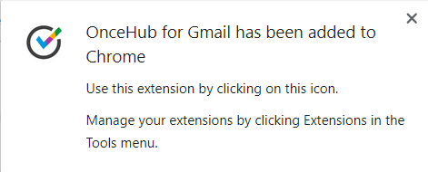
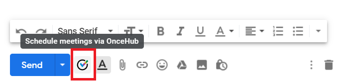

import { Aside } from "@astrojs/starlight/components";
import YouTubeEmbed from "~/components/YouTubeEmbed.astro";

<YouTubeEmbed id="-fpZhHvMfB0" title="Installing OnceHub for Gmail" />

The [OnceHub for Gmail extension](/user-integrations/browser-extension/introduction-to-oncehub-for-gmail "Introduction to OnceHub for Gmail") enables you to schedule meetings directly from your Gmail account. OnceHub for Gmail gives you instant access to all of your booking links without the need to change apps. You can create personalized links or one-time links, copy them in a single click, and send them in an email.

In this article, you'll learn how to install OnceHub for Gmail.

## Installing OnceHub for Gmail

<Aside type="note">

OnceHub for Gmail is only available for Chrome.

</Aside>

1. Go to the [Chrome Web Store listing for OnceHub for Gmail](https://chrome.google.com/webstore/detail/oncehub-for-gmail/ijlpmpplkkhpkhgpingckadmlohkgddg).
2. Click **Add to Chrome** (Figure 1). **\***Figure 1: Add to Chrome\*
3. The installation permissions pop-up will appear.
4. Click **Add Extension** (Figure 2).

_Figure 2: Add Extension_

5\. Once installed, you will see the OnceHub for Gmail confirmation screen. **(Figure 3)**

**\***Figure 3: Confirmation\*

## Activating OnceHub for Gmail

1\. To activate OnceHub for Gmail, you will need to close and re-open Chrome.

2\. Sign in to your Gmail account and compose a new email. You will see that the OnceHub for Gmail icon now appears on the bottom menu of your new email **(Figure 4).** Click on the icon.

_Figure 4: OnceHub for Gmail icon in your email_

3\. Once you have clicked on the OnceHub for Gmail icon, a pop-up screen will appear on the left-hand side of your screen instructing you to sign into your OnceHub account or start a free account.

4\. Sign in to your OnceHub account.

You're all set! You can now have access to your booking links inside Gmail and can create personalized links or one-time links.

[Learn more about sending Personalized links using OnceHub for Gmail](/user-integrations/browser-extension/sending-personalized-links-using-oncehub-for-gmail "Sending Personalized links using OnceHub for Gmail")

[Learn more about sending one-time links using OnceHub for Gmail](/user-integrations/browser-extension/sending-one-time-links-using-oncehub-for-gmail "Sending one-time links using OnceHub for Gmail")
