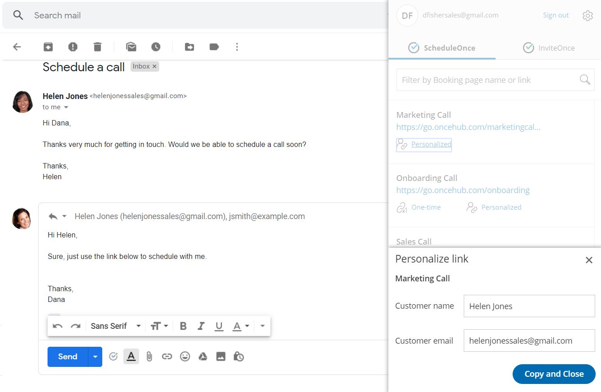
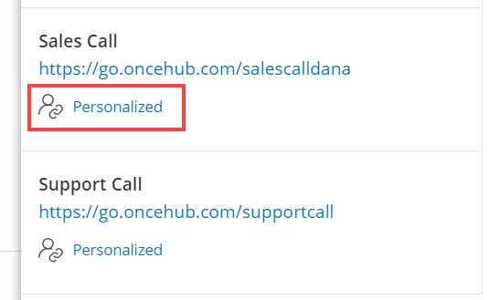
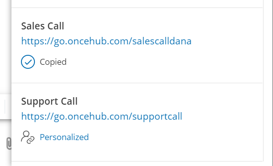
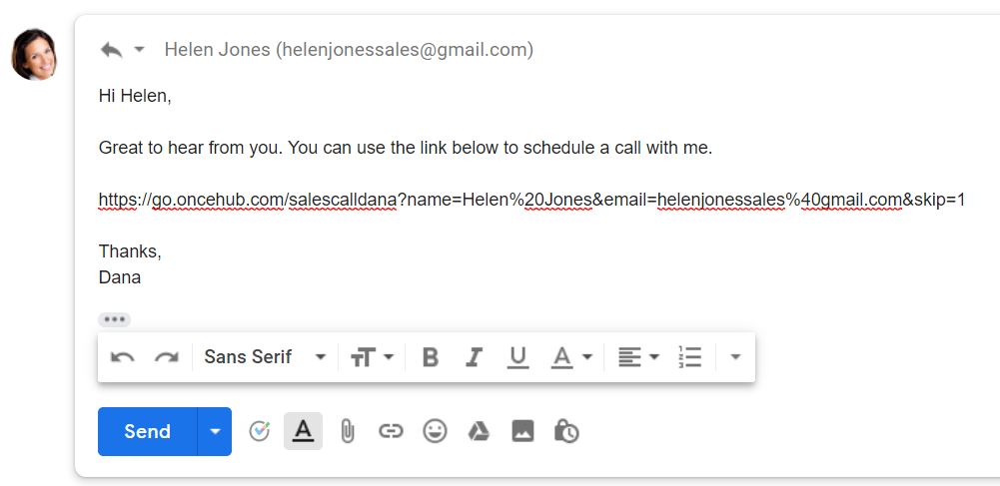
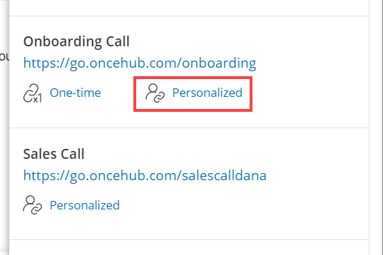
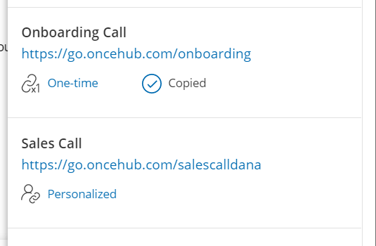
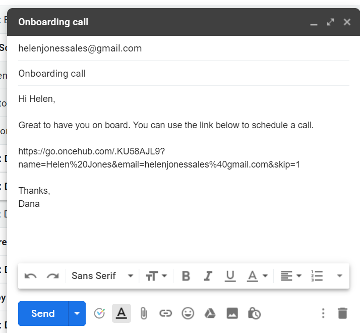

import { Aside } from "@astrojs/starlight/components";

The [OnceHub for Gmail extension](/user-integrations/browser-extension/introduction-to-oncehub-for-gmail "Introduction to OnceHub for Gmail") enables you to schedule meetings directly from your Gmail account. OnceHub for Gmail gives you instant access to all of your booking links without the need to change apps.

In this article, you'll learn about sending Personalized links using OnceHub for Gmail.

## Understanding Personalized links

When you personalize the scheduling experience for your prospects and Customers, they only have to pick a time without having to provide information that you already have.

When you create a Personalized link using OnceHub for Gmail, the Customer's name and email address is automatically taken from the email. When the Customer uses the Personalized link to schedule a meeting, they only need to choose a date and time, then confirm the meeting. The Booking form is skipped and they will not have to provide their name and email address.

<Aside type="note">

&#x20;You can also send one-time links using OnceHub for Gmail.

[Learn more about sending one-time links using OnceHub for Gmail](/user-integrations/browser-extension/sending-one-time-links-using-oncehub-for-gmail "Sending one-time links using OnceHub for Gmail")

</Aside>

## Requirements

To send Personalized links using OnceHub for Gmail, you must:

- [Install OnceHub for Gmail](/user-integrations/browser-extension/installing-oncehub-for-gmail "Installing OnceHub for Gmail").
- Have a scheduled meetings User license.
- Have an active booking link in your OnceHub account.

## Sending Personalized links using OnceHub for Gmail

When you generate a Personalized link using OnceHub for Gmail, the link is automatically personalized using the "To" field in the email you are composing.

If you have more than one email address in the "To" field, OnceHub for Gmail lets you confirm the details of the Personalized link before you copy it (Figure 1). By default, the **Customer name** and **Customer email** are taken from the first email address in the "To" field.

Figure 1: Confirming the details of a Personalized link

### When replying to an email

1. Sign in to your Gmail account.
2. Open the email that would like to reply to.
3. Click **Reply**.
4. Click the OnceHub for Gmail icon (Figure 2). 

   Figure 2: OnceHub for Gmail icon

5. The OnceHub for Gmail extension window will open (Figure 3). 

   Figure 3: OnceHub for Gmail extension window

6. Click **Personalized** next to the Booking page you want to share (Figure 4). 

   Figure 4: Generating a Personalized link

7. You will see the **Copied** confirmation when the link has been generated and copied to your clipboard (Figure 5). 

   Figure 5: Personalized link copied

8. Paste the Personalized link into your email (Figure 6). 

   Figure 6: Pasting the Personalized link into your email

9. To turn your booking link into a customized html link, click the Insert Link button on the bottom email menu. (Figure 7).

_Figure 7: Insert Link button in Gmail._

10\. A window will appear (Figure 8). Insert your booking link and the text you would like to display. Click OK.

_Figure 8: Insert Link window_

11\. Your booking link now will now appear as an html link. (Figure 9).

_Figure 9: Html link in your email._

### When composing a new email

1. Sign in to your Gmail account.

2. Click **Compose** to create a new email.

3. In the **To** field, enter the email address of the person you want to share your Booking page link with.

   <Aside type="note">

   **Note** If you do not enter an email address, you will need to enter the **Customer name** and **Customer email** in the OnceHub for Gmail extension window when you generate a Personalized link.

   </Aside>

4. Click the OnceHub for Gmail icon (Figure 10). 

   Figure 10: OnceHub for Gmail icon

5. The OnceHub for Gmail extension window will open (Figure 11). 

   Figure 11: OnceHub for Gmail extension window

6. Click **Personalized** next to the Booking page you want to share (Figure 12). 

   Figure 12: Generating a Personalized link

7. You will see the **Copied** confirmation when the link has been generated and copied to your clipboard (Figure 10). 

   Figure 13: Personalized link copied

8. Paste the Personalized link into your email (Figure 14). 

   Figure 14: Pasting the Personalized link into your email

9\. To turn your booking link into a customized html link, click the Insert Link button on the bottom email menu. (Figure 15).

_Figure 15: Insert Link button in Gmail._

10\. A window will appear (Figure 16). Insert your booking link and the text you would like to display. Click OK.

_Figure 16: Insert Link window_

11\. Your booking link now will now appear as an html link. (Figure 17).

_Figure 17: Html link in your email._
