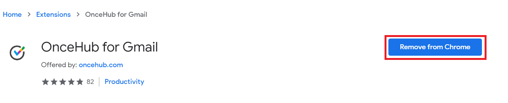

import { Aside } from "@astrojs/starlight/components";

The [OnceHub for Gmail extension](/user-integrations/browser-extension/introduction-to-oncehub-for-gmail "Introduction to OnceHub for Gmail") enables you to schedule meetings directly from your Gmail account. OnceHub for Gmail gives you instant access to all of your booking links without the need to change apps.

In this article, you'll learn how to uninstall OnceHub for Gmail.

## Uninstalling OnceHub for Gmail

### From your Chrome browser settings

1. In your Chrome browser, click the three dots (action menu) in the top right corner (Figure 1). Figure 1: Chrome browser three dots (action menu)
2. In the drop-down menu, select **More tools → Extensions**.
3. In the **OnceHub for Gmail** box, click **Remove** (Figure 2). _Figure 2: OnceHub for Gmail options in extensions menu._
4. Once you click **Remove**, you will see a confirmation screen (Figure 3). Click **Remove.** _Figure 3: Removal confirmation._

### From Chrome Web Store

1. Go to the [Chrome Web Store listing for OnceHub for Gmail](https://chrome.google.com/webstore/detail/oncehub-for-gmail/ijlpmpplkkhpkhgpingckadmlohkgddg).
2. Click **Remove from Chrome** (Figure 4). 

_Figure 4: Removing OnceHub for Chrome in Chrome Web Store._
