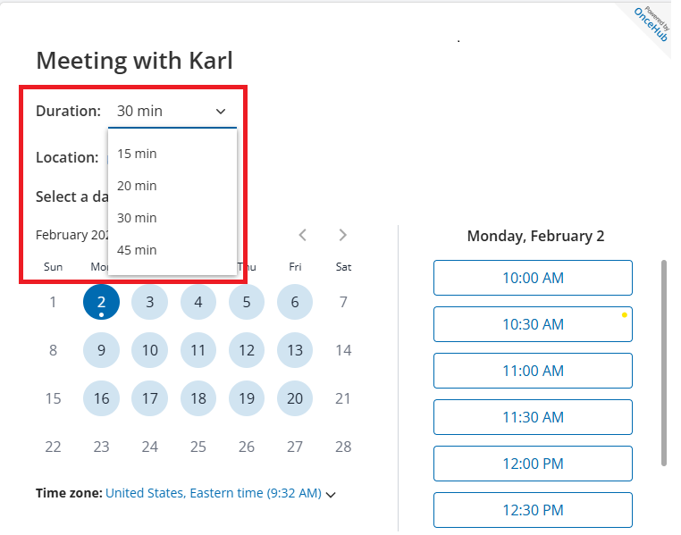
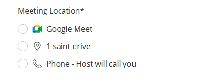

import { Aside } from "@astrojs/starlight/components";

## Booking Without an Email Address

OnceHub is **expanding its data collection options** to offer even more flexibility. You can now set the email field to optional or remove it from your Booking Form entirely, enabling visitors to schedule meetings without providing an email address.

**Why It Matters**

This enhancement is ideal for **Phone Bookings** and **phone-first identification scenarios**, where requiring an email can create unnecessary friction and increase drop-off rates. **By using the Phone number as the identifier**, you can speed up interactions and provide a smooth phone-first experience on phone and web channels.

**Key capabilities of this new configurations include:**

- **Channel-Specific Rules (Web vs. Phone)** You can now maintain distinct rules on a single Booking Calendar. By default, the setting **_Do not ask the caller for the email in phone booking_&#x20;**&#x69;s on to ensure a natural phone conversation flow, while still requiring email address for web-based (GUI) bookings.
- **Phone-First Identification** Prioritize the mobile phone number as the primary identifier on your Booking Form. OnceHub will recognize returning customers via their mobile phone number and link new meetings to their existing record, allowing guests to book without providing an email address

**Who Can Access It**

**Plan:** Available on **Schedule** plan and above.

For more information read our [**Collecting Email and Mobile Phone Number: What You Need To Know**](/human-engagement/booking-calendars/booking-forms/collecting-email-and-mobile-phone-number-what-you-need-to-know) article.

---

## Offering Multiple Meeting Durations in a Single Booking Calendar

We are making it simpler than ever to offer guests multiple meeting durations to choose from, requiring less configuration from you. Previously, if you wanted to offer different appointment lengths, such as a quick **15-minute Check-in** versus a deep-dive **60-minute Strategy Session**, you had to create **multiple Booking Calendars and add them to a Booking Hub**.

With this update, if the only difference between the meeting options you want to offer is the duration, you can offer **multiple meeting durations** within a single Booking Calendar. When a visitor opens your Booking Calendar, they will see a simple dropdown menu where they can select their preferred duration. 

**Why It Matters**

This update is designed to eliminate the administrative complexity faced by growing teams.

- **Simplified Management:** Instead of needing to create multiple similar Booking Calendars where only the duration is different, you only need one, making your setup more organized and manageable.
- **Chatbots and Routing Forms:** Offer visitors multiple meeting durations within a single flow to improve the user experience and conversion rates.

**Who Can Access It**

**Plan:** Available on **Schedule** plan and higher.

To learn more about meeting durations, take a look at our [**Booking Calendar Meeting Durations**](/human-engagement/booking-calendars/booking-settings/booking-calendar-meeting-durations) article.

---

## Direct Availability Configuration for Member Users in Team Scheduling Scenarios

Members can now **customize their availability and meeting locations** directly in the team scheduling Booking Calendar, allowing them to manage their own schedules without needing to involve an Administrator.

---

## Change to Default Meeting Location Behavior During Scheduling

Booking Links with multiple locations **now** require a **manual location selection**. Once a timeslot is chosen, guests must deliberately select their preferred location using the radio button. This requirement ensures the meeting location is intentionally confirmed by the guest. 
