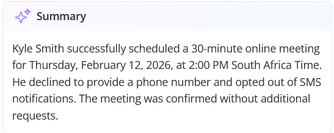

import { Aside } from "@astrojs/starlight/components";

## Group Sessions

**Group Sessions** allow multiple guests to book seats in the same time slot with the same host for a meeting held at a single, **shared** **location** (such as a unified video link or physical address) until a defined capacity is reached. Unlike single sessions where a single booking makes a time slot unavailable, **Group Sessions remain open for additional guests** until your maximum guest limit is reached.

### When to Use Group Sessions

Use Group Sessions to host multiple guests in a single time slot for the following scenarios:

- **Webinars:** Host large-scale presentations or company announcements using a single shared video link.
- **Workshops:** Deliver structured training sessions with a pre-defined guest capacity per slot.
- **Group Interviews:** Streamline recruitment by conducting briefings or _meet the team_ events for multiple candidates simultaneously.
- **Customer Onboarding:** Maximize efficiency by replacing repetitive individual calls with shared orientation sessions for new customers.

### Who Can Access It

**Plan:** Available on **Schedule plan** and higher.

To know more, please read the [**Booking Calendar Group Sessions**](/human-engagement/booking-calendars/booking-settings/booking-calendar-group-sessions) article.

---

## Phone Booking Conversation Summary and Recordings

We have enhanced the way you review your recorded **Phone Booking** conversations. Your **Phone Call activity** now includes a detailed summary and the recorded call audio.

This allows you to review the recorded conversations with these enhanced capabilities:

- **Transcript Summary:** A high level summary of the call’s outcome, including its success status and details on scheduling results or messages left. 
- **Recording Playback:** A two-channel recording with a visual display of the phone call audio that distinguishes between the AI and the caller. 
- **Transcript Sync:** As you play the recording, the activity pane highlights the corresponding transcript text in real-time.
- **.OGG Export:** You can download any recording in a standard .ogg format for external review or training purposes.

### Who Can Access It

**Plan:** Available on **all** plans.

**Users:**

- **Account Owner and Administrators:** Can see all phone call activities in the account.
- **Members and Team Managers:** Can only see phone call activities owned by them.

For more information, please see our [**Phone Booking Conversation Summary and Recording**](/activities-analytics/activity-management/phone-booking-conversation-summary-and-recording) article.

---

## Automatic Time Zone Detection in Phone Bookings

We have automated how OnceHub handles discrepancies between the time zone detected for a caller and the one used by the Booking Calendar. The AI automatically detects the caller's time zone based on their phone number and determines the most suitable time zone for the booking based on the specific meeting type.

<Aside type="note">

&#x20;**The AI will always verbally confirm** the detected time zone during the conversation to guarantee accuracy in phone-based time zone detection, particularly when callers retain mobile numbers from different geographic regions.

</Aside>

---

## Upgrading Field Library to Objects and Properties

We’ve streamlined how OnceHub handles customer data by transitioning from the Field Library to a more intuitive system of Objects and Properties.

What this means is that you can now interact with customer data in the following ways by default:

- View captured data for all Bookings and Conversations in Activities.
- Prefill Booking Calendars and Routing Forms with known customer information.
- Include answers in the URL when redirecting to external webpages after bookings.
- Access data captured on Booking Calendars and Routings Forms through the API, Webhooks or Zapier.

Mapping to Object Properties is now only required when you need to capture information across multiple Booking Calendars, Routing Forms and Chatbots; and need it to be persistent or accessible by other parts of your workflow.

Furthermore, new structure organizes data into three distinct **Objects:**

- **Contact:** Data related to the individual.
- **Meeting:** Details specific to the scheduled event.
- **Conversation:** Information regarding the interaction.

This new structure makes it easier to manage and scale how information is utilized across different platforms. To learn more about **Objects and Properties**, see our [**Introduction to Objects and Properties**](/account-administration/objects-properties/introduction-to-objects-and-properties) article.
