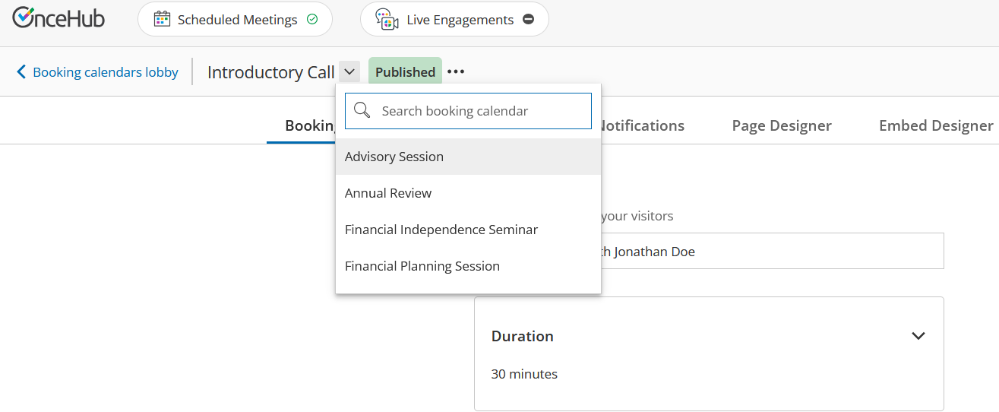

import { Aside } from "@astrojs/starlight/components";

## Phone Agent for Your Routing Forms

We are excited to launch our **Phone Agent**, a no-setup feature that transforms the way your clients interact with your **Routing Forms**.

This powerful new feature allows clients to **speak directly** with an **AI Agent** over a phone call using natural language, turning your existing Routing Forms into an automated, voice-based experience.

After assigning a dedicated phone number to a Routing Form, callers can speak with an agent that **follows the specific routing logic** and questions defined in your form. If you have included a **Booking Calendar**, your clients can even complete a booking directly over the phone.

### Key Use Cases:

- **Screening and Qualification:** Instantly qualify callers against your criteria based on their verbal responses, and offer them a booking directly over the phone if they qualify.
- **Routing Callers for Scheduling:** Automatically route callers to schedule with the most suitable host, team, or meeting type to ensure their specific requirements are met.

### Who Can Access It

**Plan:** Available on the **Route plan** and above.

**Users:**

- **Account Owner and Administrators:** Can generate and assign phone numbers for all Routing Forms on the account.
- **Team Managers:** Can generate and assign phone numbers for their team’s Routing Forms.
- **Members:** Can generate and assign phone numbers for their own Routing Forms.

To learn more about how you can start using this powerful feature today, please read our [**Phone Screening Agent**](/human-engagement/routing-forms/phone-screening/phone-screening-agent) article.

---

## Hide Prefilled Questions from Guests

We have added the option to hide prefilled questions from guests during the scheduling process to minimize the number of questions your guests need to answer.

For information on prefilling questions for your guests, see our [**Prefilling Guest Information in Your Booking Calendar** ](/human-engagement/booking-calendars/sharing-embedding/prefilling-guest-information-in-your-booking-calendar#prefilling-the-booking-form-for-a-specific-guest)article.

---

## Skip the Booking Form for Prefilled Guests

You can now allow guests to automatically skip the **Booking Form** if all required questions are prefilled. This update streamlines the process, ensuring a faster and more efficient scheduling experience for your guests.

For information on this, see our [**Prefilling Guest Information in Your Booking Calendar** ](/human-engagement/booking-calendars/sharing-embedding/prefilling-guest-information-in-your-booking-calendar#prefilling-the-booking-form-for-a-specific-guest)article.

---

## Expanded iPaaS Integrations: Keragon, Make and viaSocket

OnceHub has launched three new powerful integrations with leading Integration Platforms as a Service (iPaaS): **Keragon**, **Make** and **viaSocket**. These integrations allow you to automate the flow of scheduling data between OnceHub and thousands of other tools. Using a simple Trigger and Action framework, you can now build sophisticated workflows across your entire tech stack. To learn more, see the articles listed below:

- [**Integrating OnceHub With Keragon Platform**](/account-integrations/automation/integrating-oncehub-with-keragon)
- **[Integrating OnceHub With Make Platform](/account-integrations/automation/integrating-oncehub-with-make)**
- **[Integrating OnceHub With viaSocket Platform](/account-integrations/automation/integrating-oncehub-with-viasocket)**

**<iframe src="https://www.youtube.com/embed/OT-mWihn-Bg?wmode=opaque&rel=0" width="100%" height="400" frameborder="0" allowfullscreen></iframe>&#x20;**

---

## Microsoft Copilot Studio Integration

You can now integrate OnceHub with **Microsoft Copilot Studio**, empowering you to create **AI Agents** that check real-time availability and book meetings directly within the Microsoft ecosystem. For more information, please see our [**Integrating OnceHub with Microsoft Copilot Studio**](/account-integrations/automation/integrating-oncehub-with-microsoft-copilot-studio) article.

---

## Mark Meetings as No-Show with Zapier

A new Zapier Action is now available. This update allows you to automate the process of marking a meeting as no-show, eliminating the need to log into OnceHub to perform this action.

## Salesforce and HubSpot: Enhanced Contact Identification

OnceHub has updated its native Salesforce and HubSpot integrations with an intelligent contact identification hierarchy. This update eliminates duplicate records and maintains data integrity across all engagement channels, including Booking Calendars, Routing Forms, and Chatbots.

The new matching logic ensures your CRM records stay updated and accurate by automatically identifying existing contacts even when guests provide different sets of contact information.

To learn more, see our updated articles on [**Integrating with Salesforce**](/account-integrations/crm/integrating-oncehub-with-salesforce) and [**Integrating with HubSpot**](/account-integrations/crm/integrating-oncehub-with-hubspot).

---

## Integrate OnceHub with Your Salesforce Sandbox

You can now connect OnceHub to a **Salesforce sandbox** before going live. This allows you to test your booking workflows and data mapping in a safe environment without impacting your Salesforce data.

To learn more, see our [**Integrating OnceHub with Your Salesforce Sandbox Environment**](/account-integrations/crm/integrating-oncehub-with-your-salesforce-sandbox-environment) article.

---

## Multiple Duration Support for Phone Booking

If you have set multiple duration options for your Booking Calendars, guests scheduling via Phone Booking will now be able to choose from those available durations on the call while scheduling.

For steps on how to set multiple duration options, please see our **[Booking Calendar Meeting Duration](/human-engagement/booking-calendars/booking-settings/booking-calendar-meeting-durations)** article.

---

## Quickly Navigate Between Booking Calendars

You can now quickly switch between your **Booking Calendars** using a new dropdown menu located in the top navigation. This eliminates the need to return to the Booking Calendars lobby.

---

## OnceHub API: Reassign Bookings via API

You can now programmatically transfer ownership of a booking to a new host on your account using the OnceHub API. Reassigning via the API follows the same rules as reassignment through the OnceHub GUI interface.

Go to our [**developer center**](https://developers.oncehub.com/reference/booking-calendars/#tag/bookings/POST/bookings/%7Bid%7D/reassign) to try it out.

---

## OnceHub API: Expanded Chatbot Event Triggers

The _`oncehub.chatbot.button_clicked`_ client-side event now triggers for all visitor interactions, including text answers sent via the Enter key or send button. The updated payload now captures richer data, including _`question_text`_, _`answer`_, and _`booking_calendar_name`_, providing comprehensive tracking for every step of the chatbot conversation. View the updated payload example in our [**developer center**](https://developers.oncehub.com/docs/client-side-api/embedded-chatbot-events/#oncehubchatbotbutton_clicked).

---

## Extended the Validity of the User Invitation Email

The validity period for User invitation emails has been extended from 24 hours to 72 hours, giving new Users more time to accept their invite and join the account.
