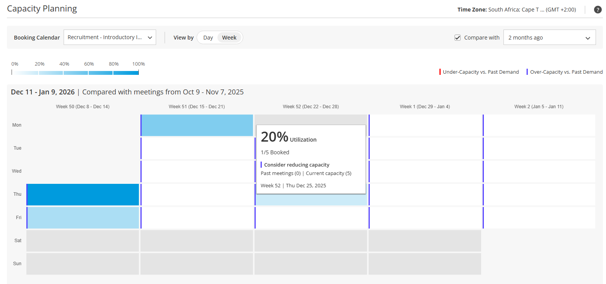

import { Aside } from '@astrojs/starlight/components';

## 

## Capacity Planning for Optimizing Staffing Levels

The new Capacity Planning Report provides **predictive insights** to help you manage resources more effectively. It offers a **clear view of future availability** and highlights **potential discrepancies**. It delivers three essential perspectives:

1.  **Estimated Future Capacity:** View daily or weekly projected capacity that shows how much capacity each Booking Calendar is expected to have.
2.  **Real-Time Utilization:** Track current usage compared to estimated capacity to understand how your resources are performing right now.
3.  **Historical Benchmark:** Compare current utilization against past booking demand to establish a reliable baseline and spot trends.

### Why It Matters

This report delivers the highest value in complex team environments where accurately tracking and forecasting capacity is essential. It is particularly beneficial for:

*   **Managing Aggregated Team Availability:** Optimize large, **pooled teams** (e.g. Sales Development or Customer Support) by analyzing the combined availability and utilization of the entire group.
*   **Coordinating Limited & Specialized Resources:** Safely coordinate high-value, specialized staff (e.g., multi-host recruiting panels, consulting experts) to prevent overcommitting critical resources.
*   **Preventing Service Gaps:** Detect and address the **capacity shortfalls or overages** that could directly impact service delivery or breach SLAs.

### Who Can Access It

**Plan:** Available on **Schedule** plan and higher.

**Permissions:** Users can analyze any Booking Calendars they have access to.

To explore this new report take a look at our [**Capacity Planning for Optimizing Staffing Levels**](/capacity-planning-for-optimizing-staff-allocation/) article.

* * *

## Instantly Create Ad Hoc Multi-Host Meetings 

Need to include an additional colleague for a once-off meeting? 

You can now quickly add co-hosts without configuring or creating an entirely new Booking Calendar, simply by modifying your existing Booking Calendar link. 

For example, imagine you are a hiring manager who needs to quickly add a senior team member to a technical interview. You can now instantly create a once-off panel booking link that includes both the host and the required co-host, **instead of setting up a separate Booking Calendar**.

### How It Works

To add co-hosts instantly, simply append the **?oh_cohosts=** parameter to the end of your standard booking link, followed by one or more co-host email addresses (separated by commas).

**Example:** 

https://oncehub.com/\[example\]?oh_cohosts=stacy@example.com

### Who Can Access It

**Plan:** Available on **Schedule** plan and higher.

**Permissions:** You can add any user on your OnceHub account who has an assigned seat/ license.

See our article on [**How to Add Co-Hosts to Meetings Using the Booking Link**](/how-to-quickly-create-ad-hoc-multi-host-meetings/) to learn more.

## 

* * *

Introducing the All-New Developer Center

Our completely redesigned OnceHub **Developer Center** is now live. Built to give developers a faster, clearer, and more intuitive experience for all their integration and automation needs.

### Why the New Developer Center is Better

*   **Open API Standard Adoption:** Our documentation now adheres to the OpenAPI standard, improving compatibility with modern tools and providing clearer request/ response definitions aligned with industry best practices.
*   **Improved Performance:** Built on optimized static web pages, the new Developer Center loads significantly faster, offering a smoother and more responsive browsing experience.
*   **Cleaner API Navigation:** We have reorganized our API documentation for better navigation. Use the **API Reference dropdown** in our [**Developer Center**](https://developers.oncehub.com/) to easily switch between the documentation for [**Booking Calendar APIs**](https://developers.oncehub.com/reference/booking-calendars/#tag/authentication) and [**Booking Pages APIs**](https://developers.oncehub.com/reference/booking-pages/#tag/authentication), ensuring instant access to the correct resource.

This is just the beginning, we are continuously enhancing our [**Developer Center**](https://developers.oncehub.com/) with more features, improved tools and richer documentation. Watch this space for what’s coming next.

* * *

### OnceHub API: Update Existing Contact Details Directly via API

*   You can now update existing contact details using the OnceHub API, including fields like name and custom fields.  
    Previously, contact details could only be updated when triggered by system actions (such as scheduling a meeting) or edited manually in the OnceHub interface. With this new capability, you can **programmatically update** most contact fields, **except email address and mobile phone** (support for updating these fields is coming soon), making it easier to keep customer data consistent across your systems.

### Stripe Integration Improvements

*   We now support all currencies available in your Stripe account, based on your business's registered country.
*   Payment transaction data is now included in the Booking event payloads for our API and Zapier.