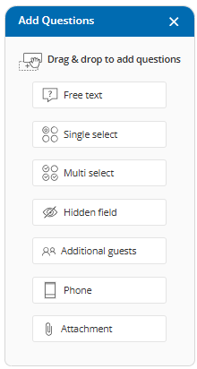

import { Aside } from '@astrojs/starlight/components';

##   
Enhanced Email Integration Error Notifications

We have strengthened our email integration to make this loved feature even more robust, ensuring your guest notifications are delivered without interruption. These improvements also highlight the value of the feature by giving you clear reassurance:

*   You will immediately know if something goes wrong.
*   Your meetings will still be created as expected.
*   Your communication flow and compliance will remain intact.

### What's Improved:

*   **Faster Detection:** You can now quickly detect and resolve any connection issues with Gmail or Microsoft 365.
*   **Actionable Alerts:** You will immediately receive clear, actionable notifications whenever your email integration requires attention.

### Troubleshooting and Support

*   **For Gmail errors:** See our [**Troubleshooting Guide: Gmail Service Disabled by Administrator**](/troubleshooting-gmail-integration-and-notification-issues/) article.
*   **For Microsoft 365 errors:** See our [**Troubleshooting Microsoft 365 Integration & Notification Issues**](/troubleshooting-microsoft-365-integration-and-notification-issues/) article.

* * *

## Hidden Field is Now a Dedicated Question

We've given a powerful, often overlooked feature new visibility!  
A **Hidden Field** works like an invisible note attached to every booking. **Guests never see it**. You can use it to quietly store details such as campaign source or lead tags. This helps keep your workflows organized and your data consistent.  
  
The **Hidden Field** is now implemented as its own dedicated question type on the Booking Form, making it easier to find and configure when you need to capture internal data discreetly.  
  
To learn how Hidden Fields can be mapped and passed to your downstream integrations, please see our [**How to Pass Booking Data using Hidden Fields**](/using-hidden-fields-to-pass-data-to-booking-calendars/) article.

### How to Use it:

Simply select the new **Hidden Field** option from the **+Add Questions** pane to add an invisible field to your Booking Form.

### 

## Sort By Meeting Time

We have given you more precise control over how your meetings are displayed!  
With this enhancement, you can now quickly focus on what matters most with our new sorting options:

*   **Updated (Newest First)**
*   **Updated (Oldest First)**
*   **Meeting Time (Newest First)**
*   **Meeting Time (Oldest First)**

These new options make it easier to review upcoming meetings, revisit past appointments, and maintain a clearer, chronological view across all filters.

### How to Use it:

To use this feature, navigate to the **Scheduled Meetings** button, in the top left navigation bar, and click the sorting dropdown menu located above the meeting list.

* * *

## Booking Form Design Improvements \[New\]

We have updated the **Booking Form interface** to deliver a clearer, consistent and more intuitive experience.   
  
The redesigned layout separates the **\+ Add Questions pane** from the configuration settings. This separation provides you with a clean, dedicated view for adding and editing questions, greatly enhancing overall usability and workflow efficiency for the **Booking Calendar's Booking Form**.